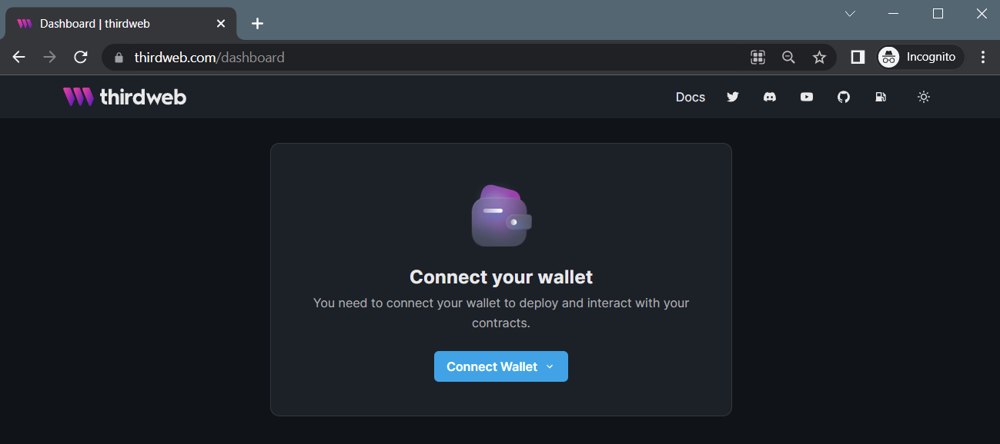
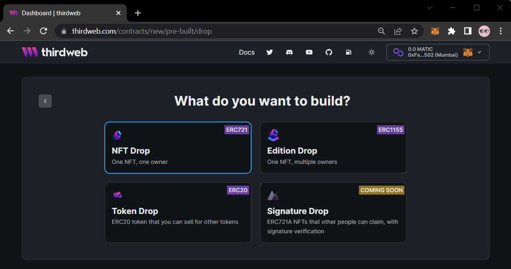

import DeployingContractsCodeTabs from "../../../src/components/DeployingContractsCodeTabs";
import DeployThisContractButton from "../../../src/components/DeployThisContractButton";

# Deploying Pre-built contracts

You can deploy pre-built contracts using either the [dashboard](https://www.thirdweb.com/dashboard) or the SDK.

## SDK Contract Deployments

Any of our pre-built contracts can be deployed via the SDK.

This enables use-cases where you can have users deploy their own contracts after connecting their wallet to your application,
or simply as an alternative to deploying via the dashboard.

_For example, to create an NFT Drop contract:_

<DeployingContractsCodeTabs />

:::tip ContractDeployer Class

Learn how to deploy all of our pre-built contracts from the [SDK's Contract Deployer](/typescript/sdk.contractdeployer)

:::

## Dashboard Contract Deployments

The dashboard is the easiest way to deploy contracts and doesn't require any code.

Below is a guide on how to deploy an NFT Drop contract using the thirdweb dashboard.

<DeployThisContractButton
  link={"https://thirdweb.com/contracts/new/pre-built/drop/nft-drop"}
/>

### Connect Your Wallet

The first step is to visit the [thirdweb dashboard](https://thirdweb.com/dashboard) and connect your wallet.

:::tip Creating a Wallet

Learn how to create a wallet here: [Create a MetaMask Wallet Guide](/guides/create-a-metamask-wallet).

:::

### Choosing your Contract

Next, we'll pick which contract we want to deploy!

To deploy an [NFT Drop](/pre-built-contracts/nft-drop), select **Pre-built contracts**.

From here, we can select which kind of pre-built contract we want to deploy.

To learn more about the different kinds of contracts you can deploy with thirdweb, check out the [pre-built contracts](/pre-built-contracts) page.
There, you'll find detailed explanations and example use-cases for each of them.

An [NFT Drop](/pre-built-contracts/nft-drop) is a "drop" contract, which means other wallets mint NFTs from your collection.

Click **Release a drop** and then **NFT Drop**.

### Configuring Contract Metadata

You can configure the [metadata](/advanced-features/contract-settings#contract-metadata)
of your smart before you deploy it.

Metadata includes information such as:

- Image, name, symbol and description.
- The wallet address that will receive the funds from the contract's mints/sales.
- The royalty percentage fee on secondary sales and the wallet that will receive them.
- The blockchain & network that the contract will be deployed to.

:::info Blockchains & Networks

Not sure which blockchain and network you want to deploy to?

Learn more about testnets, and the blockchains that thirdweb supports here: [Blockchains & Networks Guide](/guides/which-network-should-you-use).
:::

To deploy a contract, you need to have enough funds in your wallet to cover the gas cost of the deployment.

If you're deploying to a testnet, you can get test funds for free, using our [Faucet Guide](guides/get-matic-on-polygon-mumbai-testnet-faucet).

To deploy your contract, click the **Deploy Now** button!

:::tip Deployment Tip

We recommend deploying to a testnet first, to make sure your contract is working as expected.

:::
