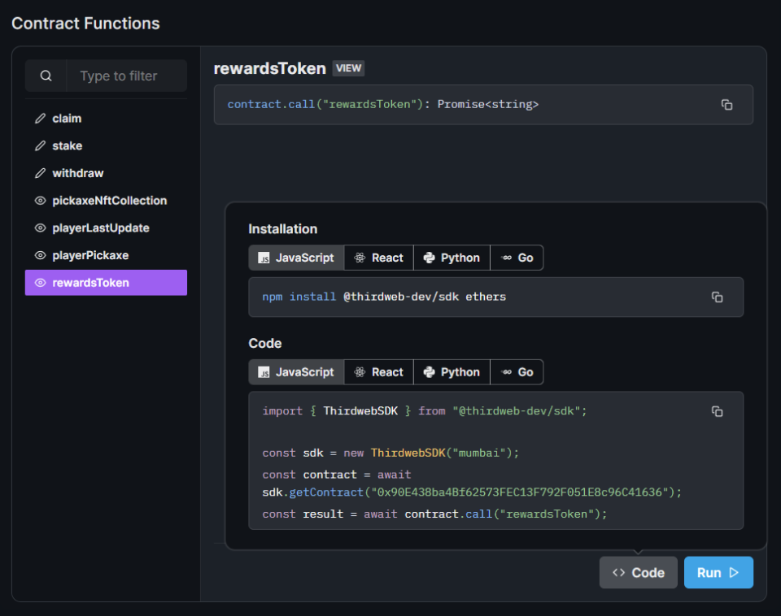

The SDK can read `views`, `mappings`, and call `functions` on your smart contract from the connected wallet.

You can view all of the available functions on your contract and how to use them from the [dashboard](https://thirdweb.com/dashboard):



## Read Contract Functions

Use the name of the function in the contract along with any required arguments to read data from your smart contract.

<!-- TODO: Snippets component rather than this manual stuff here -->

**React:**

```jsx
// Data is available in the "data" variable when it is loaded.
const { data, isLoading, error } = useContractData(
  contract, // contract instance
  "functionName", // The name of the function on the contract
  arg1, // The arguments to pass to the function (if you have any)
  arg2,
);

// View the data returned by the contract
console.log(data);
```

**TypeScript**:

```javascript
const result = await contract.call(
  "functionName",
  arg1, // The arguments to pass to the function (if you have any)
  arg2,
);

// View the data returned by the contract
console.log(result);
```

## Write Transactions

Transactions are made using the connected wallet if you have the [ThirdwebProvider](/building-web3-apps/setting-up-the-sdk/frontend#manual-installation) component configured.

<!-- TODO: Snippets component rather than this manual stuff here -->

**React:**

```jsx
const { contract } = useContract("{{contract_address}}");
const { mutate: myFunction, isLoading, error } = useContractCall(contract, "myFunction");

// Now you can call the function with the arguments you want.
myFunction(
  arg1, // The arguments to pass to the function (if you have any)
  arg2,
  // Optional overrides for the transaction
  {
    gasLimit: 1000000, // override default gas limit
    value: ethers.utils.parseEther("0.1"), // send 0.1 ether with the contract call (msg.value)
  };
);
```

**TypeScript:**

```javascript
const result = await contract.call(
  "functionName",
  argumentName,
  // Optional overrides for the transaction
  {
    gasLimit: 1000000, // override default gas limit
    value: ethers.utils.parseEther("0.1"), // send 0.1 ether with the contract call (msg.value)
  };
);
```
