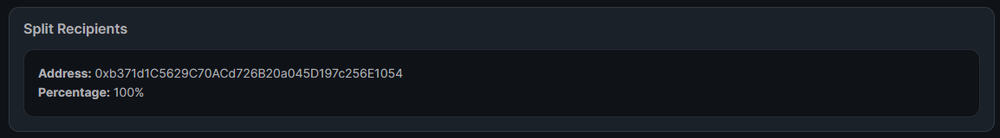

import ThirdwebCodeSnippet from "../../../../../src/components/ThirdwebCodeSnippet";
import DeployThisContractButton from "../../../../../src/components/DeployThisContractButton";

# Split

<DeployThisContractButton
  link={"https://thirdweb.com/contracts/new/pre-built/governance/split"}
  contractType="split"
/>

The Split contract lets you specify multiple wallet addresses that are recipients of any revenue or royalty split.
You define what percentage of funds that are sent to this address to each recipient you specify.

For example, you could define 0x1 and 0x2 and configure them to receive 50% of the funds to this wallet.
The split contract will store the funds and will split the funds between the two recipients when a user
calls the `distribute` function.

This contract can also hold native currencies (ETH and MATIC) and any ERC-20 tokens.

The Split contract is a way to quickly create a royalty split to hold and distribute funds securely.
You can use it to store funds by sending them directly to the contract,
using its address as the recipient address of other contracts,
or sending funds to a standard wallet.

You could use the Split contract to:

- Use as a "team wallet", where funds are distributed between the members of your team with set percentages.
- Share revenue from your primary minting in an NFT drop
- Share revenue from our royalty sales with members of your team, such as an artist
- Any programmatic split of revenue

## Create a Split Contract

Learn how to create any of thirdweb's pre-built contracts via the [Deploying Contracts page](/getting-started/deploying-contracts).

<ThirdwebCodeSnippet contract={"ContractDeployer"} name={"deploySplit"} />

## Getting the contract in your application

To start using your Split contract inside your application, you'll need to use its contract address. You can get the contract address from the [dashboard](https://thirdweb.com/dashboard).

<ThirdwebCodeSnippet
  contract={"Split"}
  name={"initializing the SDK"}
  isGetContractCode
/>

## View Recipients

### Using the dashboard

You can view the recipients of your Split contract in the **Overview** button on the dashboard.

### Using the SDK

<ThirdwebCodeSnippet contract={"Split"} name={"getAllRecipients"} />

## View Balance

In the **Overview** tab of your split in the dashboard, you can see **your** (the wallet you're currently connected with) split of the funds in this contract.

### Native Token Balance

Use this if you have been tokens native to the network (e.g., `Ether` on the Ethereum network).

<ThirdwebCodeSnippet contract={"Split"} name={"balanceOf"} />

### Non-Native Token Balance

Use this if you have been sent custom tokens to the address.

<ThirdwebCodeSnippet contract={"Split"} name={"balanceOfToken"} />

## Distribute funds

This distributes funds held by the contract to **all recipients**.

### Native Token

<ThirdwebCodeSnippet contract={"Split"} name={"distribute"} />

### Non-Native Token

<ThirdwebCodeSnippet contract={"Split"} name={"distributeToken"} />

## Withdraw Funds

<ThirdwebCodeSnippet contract={"Split"} name={"withdraw"} />
