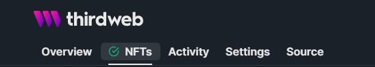
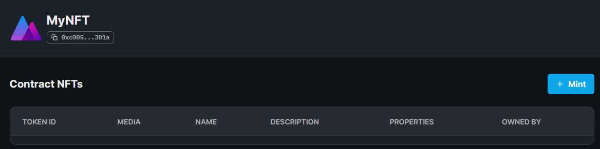
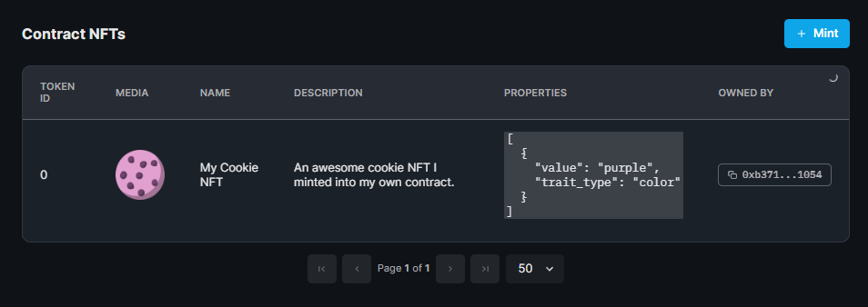

import QuickstartCard from "../../../../../src/components/QuickstartCard";

# Quick Start

Learn how to build a smart contract using contract extensions and deploy it using thirdweb deploy.

## Creating a Solidity Project

Run the `npx hardhat` command to create a basic project with a smart contract using [Hardhat](https://hardhat.org/).

```bash
npx hardhat
```

Select "Create a JavaScript project" from the menu to get started.


:::info Project Dependencies

Hardhat will ask you to install a list of packages at this point, you can do this by running:

```bash
  npm install --save-dev "hardhat@^2.10.0" "@nomicfoundation/hardhat-toolbox@^1.0.1"
```

:::

Now we have a simple project with a `Lock` smart contract, let's introduce our Contracts SDK!

## Installing the SDK

To use the SDK, install the [@thirdweb-dev/contracts package](/contracts).

```bash
npm install @thirdweb-dev/contracts
```

## Implementing a contract extension

Open the project in your text editor, and remove the existing contents of the `Lock.sol` file.

Let's rename this file to `MyNFT.sol`, since we'll
be creating our own custom [ERC721A](https://www.erc721a.org/) NFT contract in this file.

Let's first import the [ERC721Base](/contracts-sdk/base-contracts/erc-721/erc721base)
base contract from the thirdweb SDK.

```solidity
// SPDX-License-Identifier: MIT
pragma solidity ^0.8.9;

import "@thirdweb-dev/contracts/base/ERC721Base.sol";
```

Next, we need our contract to implement this interface, by saying our contract `is` the `ERC721Base` interface.

```solidity
contract MyNFT is ERC721Base {}
```

Now, all we need to do is implement the required functions to satisfy the `ERC721Base` contract extension!

## Writing contract functions

If we take a look at the [ERC721 Base Contract](/contracts-sdk/base-contracts/erc-721/erc721base#implementing-the-contract-extension) page on the portal,
we can see we need to implement the `constructor` to properly implement this contract extension.

```solidity
contract MyNFT is ERC721Base {
      constructor(
        string memory _name,
        string memory _symbol,
        address _royaltyRecipient,
        uint128 _royaltyBps
    )
        ERC721Base(
            _name,
            _symbol,
            _royaltyRecipient,
            _royaltyBps
        )
    {}
}
```

You just wrote your very own ERC721A NFT Collection contract!

Let's see what we can do with it!

## Detecting contract extensions

The [thirdweb CLI](/cli) provides a command to detect the implemented contract extensions.

```bash
npx thirdweb detect
```

This command:

- Compiles your contract
- Detects the extensions you have successfully implemented
- Shows you other extensions you might want to implement


As you can see, by using the base contract,
we have successfully implemented many of the contract extensions available in the SDK.

Now we're ready to deploy our contract to the blockchain.

## Deploying contracts

Run the following command to deploy your contract:

```bash
npx thirdweb deploy
```

This command:

- Detects any contract(s) in your project
- Compiles them
- Uploads the contract ABIs and bytecode to IPFS
- Generates a deploy link for you to deploy the contract onto the blockchain - no private keys required!


Open the link in your browser, and you'll be taken to the thirdweb dashboard where you can deploy your contract.


Select the network you want to deploy to, and click `Deploy`.

Once deployed, you'll have your very own contract dashboard where you can view and **execute** all of the available functions on your contract.


From here, you can easily interact with your contract, and see the state of the contract as it changes over time.

Let's check out the thirdweb features we unlocked by implementing contract extensions.

## Unlocked Features

As we discovered by running the `npx thirdweb detect` command, our
contract implements contract extensions such as `ERC721Supply` and `ERC721Mintable` among several others.

Each contract extension you implement unlocks features on the dashboard and in the SDK. For example:

- The `ERC721Supply` contract extension allows you to view all of the tokens that have been minted in your contract, and use the `nft.query.all()` function in the SDK.
- The `ERC721Mintable` contract extension allows you to mint new NFTs using a "Mint" button on the dashboard, and the `mintTo()` function in the SDK.

To view the NFT contract extensions, you can click the `NFTs` tab on the dashboard.

<div align='center'>



</div>

Let's go ahead and mint an NFT by clicking the **Mint** button on the dashboard.



This brings up a simple form where we can populate the metadata for the NFT we're going to mint.

<div align='center'>


</div>

When we mint an NFT using the dashboard or the SDK on this contract, we get to utilize all of the special features that thirdweb enables, including:

- Automatic uploading and [pinning](/guides/securing-pinning-your-nft-with-ipfs#what-is-pinning) of metadata to IPFS
- Detection of contract events (such as `TokensMinted`)
- Live updating admin view of the contract

After the `mintTo` transaction is confirmed, you can view all of the NFTs that have been minted on the dashboard:



Within the [SDK](/web3-sdk), you can also easily utilize these features, for example:

```javascript
// Minting an NFT (includes uploading metadata to IPFS automatically)
const contract = await sdk.getContract("{{contract_address}}");
await contract.nft.mint.to(walletAddress, nftMetadata);

// Viewing all NFTs (automatically resolves the metadata from IPFS for you)
const nfts = await contract.nft.query.all();
```

That's it! Now you're ready to start building applications on top of your contract using the [SDK](/web3-sdk)!
