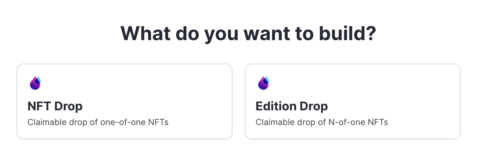
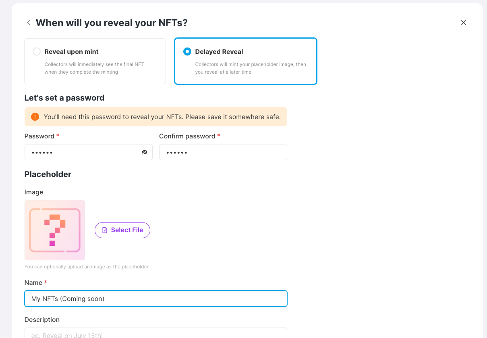

# NFT Drop

## In a nutshell

thirdweb's drop contracts lazy mints your NFT and makes it available to be claimed by your users. Lazy minting is when the creator defines conditions for a third party (your audience) to come in and mint the NFT. You choose what the underlying token is you want to distribute - it can be a 1-of-1 NFT or 1-of-many. Our **`NFT Drop`** contract gives you the mechanism to distribute your 1-of-1 NFT.


Click [here](/contracts) to learn more about contracts and how to create them.

## How it works

Make sure you choose the right contract. If you want your drop to include 1-of-1 NFTs, choose the **`NFT Drop`** contract. If you want to mint 1-of-many NFTs, choose the `Edition Drop` contract [here](/contracts/edition-drop).

To be clear, when you create a drop inside your `NFT Drop` contract, the NFT is not minted yet. We prepare everything for your audience, so that they can mint it. The user who claims an NFT, mints it and transfers it to their wallet. By default the user pays the gas fees.

You can create a drop via the dashboard or our SDK. Once you've created a drop with the `NFT Drop` contract, the NFT does not show up in your wallet, but in a null address. The NFT is now ready to be claimed.

The claim conditions determine the rules for claiming an NFT over a period of time. The claim conditions have a different scope depending on the underlying contract. If you use an `NFT Drop` contract, then the claim conditions you set, apply to every NFT (token ID) in that contract.

If you use the `Edition Drop` contract, you can set claim conditions **per NFT** (token ID).



### Claim Phases

You can set the condition in both the dashboard, inside your **`NFT Drop`** contract or via code. Some of the conditions you can set:

1. The currency, meaning what the NFT should be paid in if there's a price to mint.
2. Price to claim each NFT
3. The max number of NFTs that are available to be claimed. It's possible you created more NFTs than you want people to claim.
4. The wait time between claims - 'Unlimited' means a wallet can only claim once
5. Number of claims per transaction - decides how many NFTs you can claim per transaction
6. Snapshot will allow you to include a list of `Allow-list` wallet addresses
7. Phase start time and date.

You can also set multiple phases up front - for example, your first phase can be for allowlist only minting, while your second phase is for public minting.


## Use cases for NFT Drop

The following use cases are suited for the **`NFT Drop`** contract:

1. 10k pfp project to be minted by others
2. Add an allowlist for wallet addresses allowed to claim your NFTs
3. Hide your NFTs and metadata for minting (i.e. Delayed Reveal - check out this use case [here](/guides/nft-drop-with-delayed-reveal))
4. Restricted transfer (check out this use case [here](/guides/make-your-nft-non-transferable))
5. Once NFTs are claimed they can be listed for sale on a Marketplace (you would also need the `Marketplace` contract for this)

### Our Embed feature

thirdweb developed an UI component for minting your NFTs. All you need to do is include the 'Embed Code' in your website. You can find this 👇 feature inside the dashboard under the tab `Embed` .


### NFT delayed reveal feature

This feature lets you batch upload in an **`NFT Drop`** and hide your NFTs until your release day.
If you want to make use of this feature, these are the steps to follow:

- Do a batch upload
- Select Delayed Reveal
- Choose a password (save it, you'll need it to reveal your NFTs later!)
- Choose an image, name and description for the placeholder NFT
- Upload!
  Then, when you want to reveal your NFTs, just go back to your dashboard, click the "Reveal NFTs" button and write the password that you submitted previously.
  

## How to use the contract

You can use the **`NFT Drop`** contract with or without code:

1. TypeScript
2. Python
3. Dashboard Embed (our no-code solution)

### Setup your dev environment

To interact with your NFT Drop contract with code, you need to follow 3 steps:

1. Install the necessary packages on your (local) machine
2. Instantiate the SDK
3. Passing the address of the Contract inside your code

To install the necessary packages for TypeScript or Python on your (local) machine and instantiate the SDK in your code, check out [this](/learn-thirdweb/connect-to-blockchain) guide to help you with that. Note, you can instantiate the SDK in multiple ways, so make sure to check out that guide.

You can find the contract address in the thirdweb dashboardor inside the `NFT Drop` contract itself.


### Usage Examples

After you instantiate the SDK, you can use the `NFT Drop` contract with our SDK. Here's how to get the contract inside your code using typescript and claim one token.

```jsx
const nftDrop = sdk.getNFTDrop("<NFT_DROP_ADDRESS>");
const quantity = 1;

const claimNft = async () => {
  try {
    await nftDrop.claim(quantity);
  } catch (err) {
    console.log(err);
  }
};

claimNft();
```

Here's an example of setting the claim conditions with code:

```jsx
const nftDrop = sdk.getNFTDrop("<NFT_DROP_ADDRESS>");
const presaleStartTime = new Date();
const publicSaleStartTime = new Date(new Date() + 60 * 60 * 24 * 1000); // today's date + 24 hours
const allowList = ['0x...', '0x...'] // modify this with your allow list
const claimConditions = [
  {
    startTime: presaleStartTime, // start the presale now
    maxQuantity: 20, // limit how many mints for this presale
    price: 0.01, // presale price
    snapshot: allowList, // limit minting to only certain wallet addresses
  },
  {
    startTime: publicSaleStartTime, // 24h after presale, start public sale
    price: 0.08, // public sale price
  }
]);
const setClaimConditions = async () => {
  try {
    await nftDrop.claimConditions.set(claimConditions);
  } catch (err) {
    console.log(err)
  }
}
setClaimConditions();
```

## Code Guide

1. You can find the official TypeScript documentation [here](https://docs.thirdweb.com/typescript/sdk.nftdrop).
2. To check out guides for this contract click [here](/guides/nft-drop).
3. To setup your local dev environment, click [here](/guides/sdk-guide).

<MdxNavigation>
  <MdxNavigationItem
    href="/contracts/edition"
    title="Edition"
  />
  <MdxNavigationItem href="/contracts/edition-drop" title="Edition Drop" next />
</MdxNavigation>
