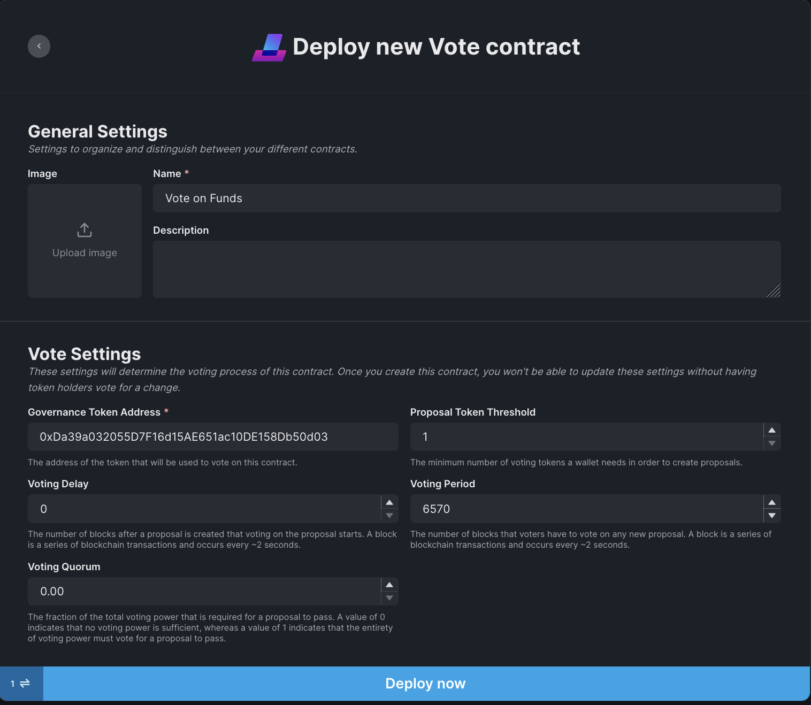
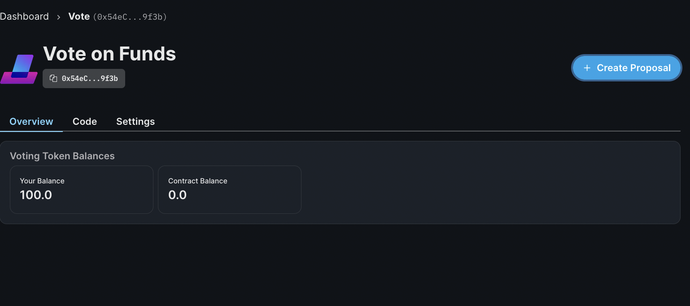

# Vote

## In a nutshell

The **Vote** contract is a governance contract. It's a smart contract that faciliates the decision-making process in a community.
The most common usecase is within a DAO, where proposals are made and DAO-members cast their **vote**. DAO means Decentralised Autonomous Organization.
It's an entity that's made up of several smart contracts (on-chain). A DAO is often used by a dedicated community that needs an infrastructure to operate the organization.
A DAO has several components, but the most prominent component is the treasury, which is managed and used by the whole community.

## How it works

In order to allow members to vote, they need to hold a so-called `governance token`. A `governance token` is an ERC-20 token.
The **Vote** contract needs an ERC-20 contract to function. With thirdweb you can also deploy your very own ERC-20 contract, the **Token** contract.
You can find more about the **Token** contract [here](/contracts/token).

## What can you do with our contract?

The following use cases are suited for the Vote contract:

1. You are working with a team and need to decide on organizational changes
2. Voting on managing and distributing funds in a treasury
3. Vote on any other proposal in an organization, such as a DAO.

## Setting up your Vote contract

You can create a **Vote** contract from the thirdweb dashboard. Go ahead and click on `Create new contract`.

The **Vote** contract can be found under Governance.

### Configure settings

A **Vote** contract allows you to configure the following settings:

1. `Governance Token Address` is an ERC-20 contract to work with the **Vote** contract. This can be either our [Token](/contracts/token) or any other ERC-20 contract that implements IVotes interface.
2. `Proposal Token Threshold` is the minimum number of tokens a wallet needs to hold in order to make a proposal.
3. `Voting Delay` is the time period after the proposal is created and before members can begin voting. This needs to be specified in numbers of blocks. For Ethereum, there are approximately 6570 blocks in a day - about one block every 14 seconds. Different blockchains have different block frequencies, so depending on the blockchain you choose this number will vary. When entering your voting delay, make sure you check block time on your chain of choice.
4. `Voting Period` is the time period defining how long members can vote on a proposal. This is also defined in blocks and relative to block time on your chain of choice.
5. `Voting Quorum` determines the minimum percentage of votes needed for the proposal to pass. This needs to be a number between 1 and 100.
   

### Delegate tokens

Next you need to delegate the tokens in the `Governance Token Address` to the **Vote** contract, which basically authorising the vote contract for the tokens in the token contract.

That's it! Now you can make proposals using the **Vote** contract.

If you want to know more on setting up proposals, check out [this](/guides/build-treasury-and-governance-for-your-dao) guide.

## Code Guide

1. You can find the official TypeScript documentation [here](https://docs.thirdweb.com/typescript/sdk.vote).
2. To check out guides for this contract click [here](/guides/vote).
3. To setup your local dev environment, click [here](/guides/sdk-guide).
