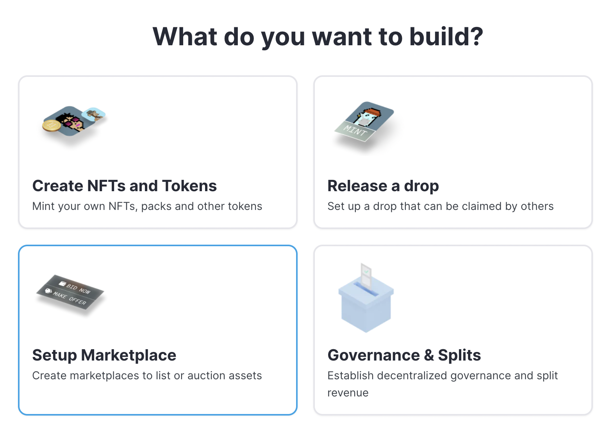
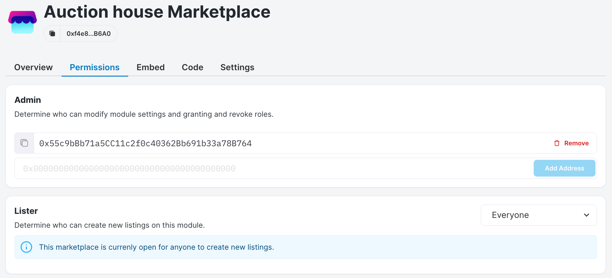
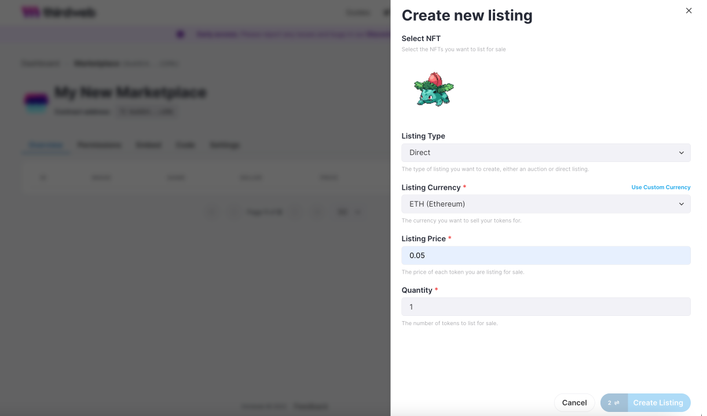
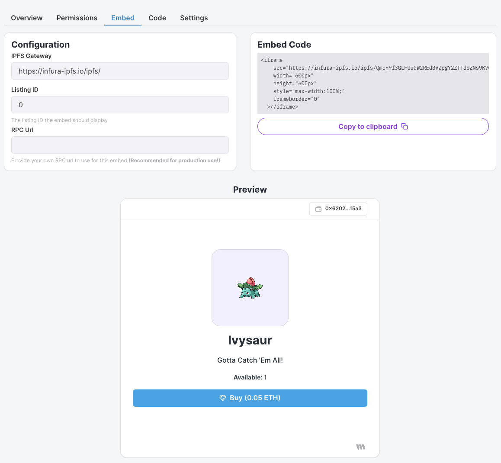

# Marketplace

## In a nutshell

In a **`Marketplace`** you can sell or buy NFTs. Platforms like Opensea or Rarible are examples of marketplaces. thirdweb let's you create your own **`Marketplace`**, which allows you to sell NFTs both exclusively on your own marketplace or on multiple marketplaces. That is up to you!

If you want to know more about creating contracts, click [here](/contracts).



## How it works

The **`Marketplace`** is used to **list** NFTs. Listing NFTs is the process of making your NFT available to users for sale. Our marketplace gives you two ways to sell your NFT:

1. Direct Listing: Sell it for a fixed price.
2. Auction Listing: Let buyers bid on the NFT, under the constraints you set for your auction.

In both choices, you are also given the option to list your NFT in the native currency, like `MATIC` on Polygon or your own tokens. If you're wondering how to create your own token, click [here](/contracts/token).

### Direct Listing

An NFT owner (or 'lister') can list their NFTs for sale at a fixed price. A potential buyer can buy the NFT for the specified price, or make an offer to buy the listed NFTs at a different price, which the lister can choose to accept. A sale is executed when either a buyer pays the fixed price, or the seller accepts an offer made to the listing.

### Auction Listing

An NFT owner (or 'lister') can auction their NFTs. Potential buyers make bids in the auction. At the closing of the auction, the buyer with the wining bid gets the auctioned NFTs, and the lister gets the winning bid amount.

The lister can cancel an auction at any moment as long as no bids have been placed on the auction.

## Setting up your Marketplace

Depending on how you configure your **`Marketplace`**, there are different pre-requisites.

If you want to run a **public** `Marketplace` i.e. anyone can list an NFT for sale on your marketplace, then you need to configure the `Permissions` properly.

Make sure you configure the contract in the `Permission` tab to allow **Everyone** to list an NFT on your `Marketplace`.



You can choose to make your `Marketplace` available to either **Everyone** or change it to specific wallets at any given time. Please note that if you change these settings, you will have to pay gas fees.

To make use of the `Marketplace` yourself, you need to have NFTs! Make sure you have your NFTs minted and ready, so that you can list them on the `Marketplace`. If you want to mint NFTs, check out this page to learn about our `NFT Contract`.

## Create a listing

You can use the `Marketplace` by using code or no-code. Head over to our dashboard to make use of the no-code solution. To use the code solution, you need to install our packages and instantiate our SDK first. Check out [this](/learn-thirdweb/connect-to-blockchain) page on how to do that. You'll also need the address of your `Marketplace` contract. You can find that on the dashboard in your `Marketplace` contract.


### Code example

Here's an example on how to list an NFT in TypeScript:

```tsx
const marketplaceAddress = "<MARKETPLACE_ADDRESS>";
const marketplace = sdk.getMarketplace(marketplaceAddress);

// the listingId of the listing you want to create a listing for
const tokenId = "0";
const listing = {
  // address of the contract the asset you want to list is on
  assetContractAddress: nftCollectionAddress,
  // token ID of the asset you want to list
  tokenId: tokenId,
  // in how many seconds with the listing open up
  startTimeInSeconds: 0,
  // how long the listing will be open for
  listingDurationInSeconds: 86400,
  // how many of the asset you want to list
  // For ERC721s, this value should always be 1
  // (and will be forced internally regardless of what is passed here).
  quantity: 1,
  // address of the currency contract that will be used to pay for the listing
  currencyContractAddress: tokenAddress,
  // how much the asset will be sold for
  buyoutPricePerToken: "1.5",
};

const createListing = async () => {
  try {
    await marketplace.direct.createListing(listing);
  } catch (err) {
    console.log(err);
  }
};
createListing();
```

Here's an example how to buy an NFT in TypeScript:

```jsx
const buyoutListing = async (listingId, quantityDesired) => {
  try {
    await marketplace.direct.buyoutListing(listingId, quantityDesired);
  } catch (err) {
    console.log(err);
  }
};
buyoutListing(listingId, quantityDesired);
```

### No-code example

Here's an example on how to list an NFT in the dashboard. After creating your marketplace, go to your **`Marketplace`** contract and create **New Listing** for the NFT you want👇



To list your first NFT for sale, you will need to confirm two transactions.

## Our Embed feature

thirdweb developed a UI component for selling your NFTs. All you need to do is include the 'Embed Code' for each listing your are looking to include in your website. You can find this 👇 feature inside the dashboard under the tab Embed.



## Further reading

If you want to know more about the nitty gritty details, well you're in luck. Head over to to [this](https://github.com/thirdweb-dev/contracts/blob/main/contracts/marketplace/marketplace.md) page, where you can find out more on how things work under the hood.

## Code Guide

1. You can find the official TypeScript documentation [here](https://docs.thirdweb.com/typescript/sdk.marketplace).
2. To check out guides for this contract click [here](/guides/marketplace).
3. To setup your local dev environment, click [here](/guides/sdk-guide).
