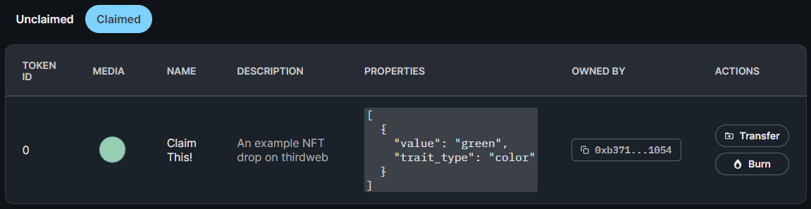

import ThirdwebCodeSnippet from "../../../src/components/ThirdwebCodeSnippet";

# Edition Drop

thirdweb's drop contracts **lazy mint** your NFT and makes it available to be claimed by your users.

The **Edition Drop** contract is best used when you want to release many NFTs based on the same asset, and uses the [ERC1155 Standard](https://eips.ethereum.org/EIPS/eip-1155), also known as "Semi-Fungible Tokens".

The Edition Drop contract allows you to define the conditions for when and how your users can mint an NFT, including whitelists, release dates, claim limits and delayed reveals.

You could use the Edition Drop contract to:

- Create NFT Memberships such as our [Early Access Cards](https://opensea.io/collection/thirdweb-community) that you want your users to claim
- Release an item in your game for a limited-time
- Create 100 NFTs based on one art-piece, and allow users to claim one per wallet

:::tip Learn more

[How thirdweb pre-built contracts work and how to create one](/pre-built-contracts)

:::

## Create an Edition Drop Contract

Learn how to create any of thirdweb's pre-built contracts in the [Deploying Contracts page](/getting-started/deploying-contracts).

## Getting the contract in your application

To start using your Edition Drop contract inside your application, you'll need to use it's contract address. You can get the contract address from the [dashboard](https://thirdweb.com/dashboard).

<ThirdwebCodeSnippet contract={"EditionDrop"} name={"base"} isGetContractCode />

## Lazy Minting Your NFTs

### Using the dashboard

You can batch upload NFTs through the dashboard by uploading a `.csv` file or a `.json` file that contains the metadata of all your NFTs, alongside the assets (images, videos, etc).

- You must include a `name` column for each NFT in the `.csv` or `json` file
- Asset file names must be sequential. E.g. `0.png`, `1.png`, `2.png`.

You can use our examples to get started:

- [Example CSV File](https://thirdweb.com/example.csv)
- [Example JSON File](https://nightly.thirdweb.com/example.json)

For a more in-depth guide on how to create your NFTs in the Edition Drop contract, check out our guide [Create an early access NFT](/guides/early-access-nft-with-typescript).

### Using the thirdweb SDK

<ThirdwebCodeSnippet contract={"EditionDrop"} name={"createBatch"} />

## Setting Claim Phases

A claim phase is a set of conditions that define when and how your users can mint an NFT.

You can have multiple claim phases that occur in sequence.

For each claim phase, you can define:

- When the claim phase will start
- How many NFTs you want to drop
- How much you want to charge per NFT
- What currency you want to use
- Which wallet addreses are allowed to mint (whitelist/allowlist)
- How many NFTs can be claimed per transaction
- How many seconds wallets have to wait between claims

### Using the dashboard

For a more in-depth guide on how to set-up your Edition Drop with multiple claim phases and an allowlist, check out our guide [Release an NFT Drop with an allowlist and multiple claim phases](https://portal.thirdweb.com/guides/create-nft-drop-with-claim-phases).

### Using the thirdweb SDK

<ThirdwebCodeSnippet contract={"EditionDrop"} name={"claimConditions"} />

## Setting Royalty Fees

Royalty fees are fees you earn on secondary sales of your NFTs. For example, if somebody mints an NFT from your drop and then sells it to another user, you will earn a royalty fee.

### Using the dashboard

From the dashboard, in the **Settings** tab you can set the royalty **percentage** and the **address** that should receive the revenue from royalties earned from secondary sales of the assets.

### Using the thirdweb SDK

<ThirdwebCodeSnippet contract={"EditionDrop"} name={"royalty"} />

## Minting / Claiming NFTs

With an Edition Drop contract, users claim NFTs by minting them into their wallet.
You can have a "mint" button that your users can click on each NFT in your edition.

### Using the dashboard

We have a pre-built embed that you can use to display your Edition Drop within your website.

You can access your Edition Drop's embed URL from the [dashboard](https://thirdweb.com/dashboard).

### Using the thirdweb SDK

<ThirdwebCodeSnippet contract={"EditionDrop"} name={"claimTo"} />

## Airdrop NFTs

Airdropping means you send a wallet or a list of wallets a configurable quantity of your NFT.

### Using the dashboard

Using the thirdweb dashboard, you can upload a `.csv` file containing a list of addresses you want to airdrop NFTs to.

You can download our example `.csv` file for airdrops [here](https://thirdweb.com/airdrop.csv).

In the `csv` file you must specify an `address` column and a `quantity` column; representing the address you want to send the NFTs to, and how many you wish to send.

### Using the thirdweb SDK

<ThirdwebCodeSnippet contract={"EditionDrop"} name={"airdrop"} />

## Viewing NFTs

Our SDKs provide helpful ways to view the NFTs in your collection.

### One NFT

<ThirdwebCodeSnippet contract={"EditionDrop"} name={"get"} />

### All NFTs

<ThirdwebCodeSnippet contract={"EditionDrop"} name={"getAll"} />

### NFTs owned by a specific wallet

<ThirdwebCodeSnippet contract={"EditionDrop"} name={"getOwned"} />

### Amount of tokens owned by a specific wallet

<ThirdwebCodeSnippet contract={"EditionDrop"} name={"balanceOf"} />

## Transferring NFTs

Transferring NFTs means you can send this NFT to another wallet. You must be the owner of the NFT you're trying to transfer in order for this to be successful.

<ThirdwebCodeSnippet contract={"EditionDrop"} name={"transfer"} />

## Burning NFTs

Burning is the process of removing the token from circulation by sending it to an inaccessible address. It does **not** delete the token from the blockchain.

### Using the dashboard

### Using the SDK

<ThirdwebCodeSnippet contract={"EditionDrop"} name={"burn"} />
