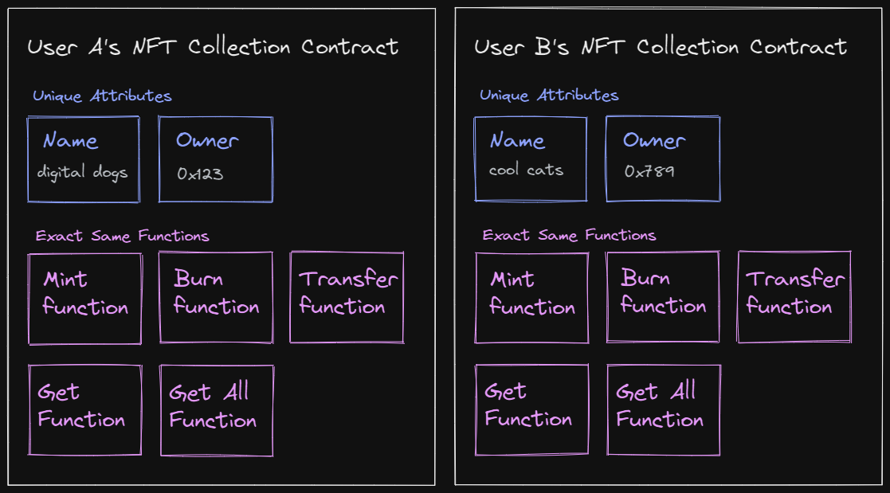
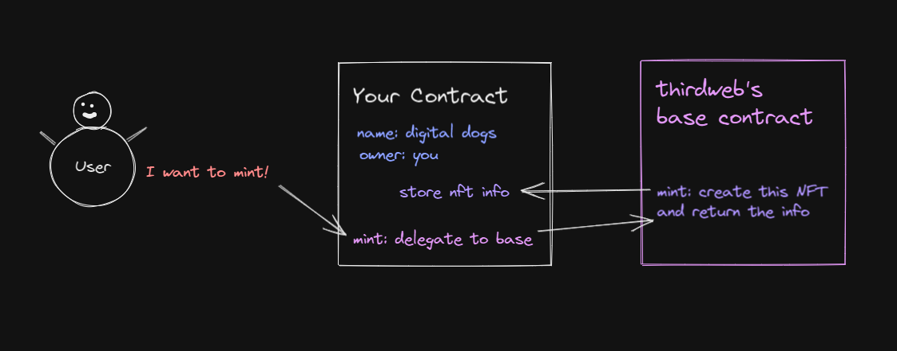

# Pre-Built Contracts

thirdweb offers pre-built contracts for all the most common use cases in modern web3 applications, including NFT Drops, creating your own ERC20 token, and creating your own NFT marketplace.

Currently, thirdweb has pre-built smart contracts for the following use cases:

| Contract       | Description                       | EIP Standard   |
| -------------- | --------------------------------- | -------------- |
| NFT Drop       | Claimable drop of one-of-one NFTs | `ERC721`       |
| NFT Collection | A collection of one-of-one NFTs   | `ERC721`       |
| Edition Drop   | Claimable drop of N-of-one NFTs   | `ERC1155`      |
| Edition        | A collection of N-of-one NFTs     | `ERC1155`      |
| Token Drop     | Claimable drop of ERC20 tokens    | `ERC20`        |
| Token          | Your own token                    | `ERC20`        |
| Vote           | Token based voting                | Not Applicable |
| Split          | Fee splitting for your revenue    | Not Applicable |
| Marketplace    | Your very own NFT marketplace     | Not Applicable |
| Pack           | Randomized rewards                | Not Applicable |

## How thirdweb pre-built contracts work

When you deploy any thirdweb contract, it’s important to know that you are still the **owner** of this contract; thirdweb has no control over what you do with it, and cannot modify, delete, or prevent you from using your contract once it’s deployed.

When you deploy one of our pre-built contracts using thirdweb, it’s essentially creating a copy or an instance of our contract’s code, and deploying it for yourself.

If that’s confusing, imagine that we’re building smart contract **templates**, and you’re taking that template, customizing it to how you like it, (giving it a name, specifying the parameters) and then using this template to deploy a fully audited, optimized smart contract that is specifically tailored and 100% owned and by you.

That’s a really big deal. Right out of the gate, we’ve done the heavy lifting for you when it comes to building a trusted web3 application; including contract development, gas optimizations, auditing, and testing.

Not only that, we use proxy contracts so that you don’t have to deploy “all” of the code, only the parts that you need to differentiate your contract from other contracts made from our base templates. This is why it’s around **10 times cheaper** to deploy one of our pre-built smart contracts than it is to deploy a smart contract on your own.

### How thirdweb’s Proxy Contracts Work

If you’re unsure how we can make deploying contracts so cheap while still having you as the owner, we’ll dive deeper into how our proxy contracts are designed, and what’s happening behind the scenes when you deploy one of our pre-built contracts.

Smart contracts for common use cases such as NFT Collections mostly operate the same way. There are standards in place such as the **ERC721** standard which specify the behaviour contracts must follow to be compliant as an ERC721 Non-Fungible Token contract.

When you think about NFTs, you might be familiar with some common functions like:

- Minting
- Burning
- Transferring

When thirdweb v2 was released, we realized our user’s were spending full price on gas fees deploying the exact same code for these common functions, and realized we could do it better.

Let’s look at an example WITHOUT thirdweb’s proxy contracts.

**User A** deploys their own **\*\***NFT Collection called “digital dogs”**_._** They configure the name and royalty fees, and deploy the entire contract, including all of the code for the mint function, burn function, transfer function, etc.

**User B** also deploys the exact same NFT Collection, except theirs is called _cool cats._ The name and the owner of this contract is different, but this user ALSO deploys the entire contract, including all of the code for minting, burning and transferring.

Hypothetically, let’s say the contract costs **1000 total gas** to deploy. Only a very small portion of that comes from the unique attributes, such as the **name** and **owner**. The rest of the gas fee, let’s say 90% (or 900 gas) comes from deploying all of these functions.

In total, both user A and user B have deployed their NFT Collection smart contracts for 1000 gas each, but only 10% of the contract is actually different. They’ve both deployed the exact same functions twice, wasting gas and losing money in the process.

What if these users could avoid deploying the same code, and only pay for deploying the parts that are different?

**Enter, thirdweb’s proxy contracts.** We’ve paid the gas to deploy all of the common “base” functionality on our contracts, meaning you pay a small fraction of the fee to deploy your smart contracts, with your unique differences like name, royalty fees, and description.

When you deploy a contract with thirdweb, what you’re actually deploying is a **proxy contract**. Your contract stores information unique to your smart contract, and delegates the function calls to our base contracts to handle them.

Since your proxy contract delegates function calls to our base contracts, you gain the full functionality of the smart contract without having to deploy the entire thing, and still have full control over the contract.

In our NFT Collection example, a user might try call the `mint` function on your NFT Collection proxy smart contract. In this case, your contract receives this request, then asks our base NFT Collection contract to handle the request and do the heavy lifting; and sends it the data of the request.

Our base contract handles the logic of minting the NFT, and sends the resulting information back to your contract to store it. Your proxy smart contract would then manage the information it received from the base contract, since that is unique to your NFT collection. For example, after the `mint` function comes back from the base contract, your contract will store the information of this NFT so it can remember it for later.

