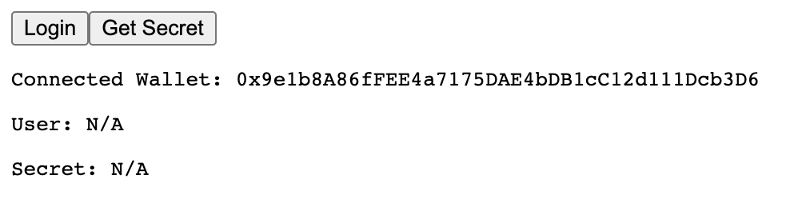

import QuickstartCard from "@components/QuickstartCard";

In this guide, we'll walk through the process of adding Auth to a simple full-stack application to enable wallet-based authentication (in this case, we'll allow EVM wallets to authenticate, but setting it up for Solana wallets is also an option).

Specifically, we'll be integrating Auth with a [Next.js](https://nextjs.org) app, which has it's own build in API, as well as a [React](https://reactjs.org) frontend. With this setup we can add [Auth API](/auth/how-auth-works/auth-api) endpoints to our app to handle authentication and authorization, and then we can build a simple frontend to login, display the user, and logout.

If you want to see the follow along with the full code for this guide, we'll be using the following example repository:

<div>
  <div className="col col--12" style={{ padding: 8 }}>
    <QuickstartCard
      name="Auth + Next.js Example"
      link="https://github.com/thirdweb-example/thirdweb-auth-next"
      image="/assets/languages/nextjs.png"
    />
  </div>
</div>

## Installation & Setup

We can get started by cloning the example repository using the `npx thirdweb create` command:

```bash
npx thirdweb create --template thirdweb-auth-next
```

This will use the [Thirdweb CLI](/cli) to clone the example repository and install the necessary dependencies for us automatically.

Once the repository is cloned, we'll need to set it up by adding a few environment variables. Create a new `.env.local` file in the root directory of the repository, and copy the format of the `.env.example` file. We'll need to add a private key and auth domain for our Auth API.

:::tip

If you don't want to use your own private key for this example, you can create a new one easily by running the following snippet:

```js
const ethers = require("ethers");
console.log(ethers.Wallet.createRandom().privateKey);
```

:::

```bash title=".env.local"
NEXT_PUBLIC_THIRDWEB_AUTH_DOMAIN=example.com # your domain here
THIRDWEB_AUTH_PRIVATE_KEY=... # your private key here
```

Now that we have the repository setup, we can continue to looking through and understanding the relevant code.

## Backend

Let's first take a look at the backend code for our app. If you look into the `pages/api` folder, you'll see two files: `pages/api/secret.ts` and `pages/api/auth/[...thirdweb].ts`.

`pages/api/auth/[...thirdweb].ts` is where the core of our Auth API setup lives, so we can look at it first. In the example project, there's a bit of extra configuration you can explore later that shows you how to use some of the more advanced features of Auth, but for now let's just take a look at what the core configuration of this file looks like (note that this code snippet is simplified to exclude the advanced configuration):

```ts title="pages/api/auth/[...thirdweb].ts"
import { ThirdwebAuth } from "@thirdweb-dev/auth/next";
import { PrivateKeyWallet } from "@thirdweb-dev/auth/evm";

// Here we configure thirdweb auth with a domain and wallet
export const { ThirdwebAuthHandler, getUser } = ThirdwebAuth({
  domain: process.env.NEXT_PUBLIC_THIRDWEB_AUTH_DOMAIN || "",
  wallet: new PrivateKeyWallet(process.env.THIRDWEB_AUTH_PRIVATE_KEY || ""),
});

// Use the ThirdwebAuthHandler as the default export to handle all requests to /api/auth/*
export default ThirdwebAuthHandler();
```

This file is a Next.js catch all route, which will catch any requests to `/api/auth/*` endpoints. The `ThirdwebAuth` function takes in configuration for your Auth API. It has many optional parameters that aren't used here (you can read more about them on the [Auth Next.js page](/auth/server-frameworks/next)), but the two mandatory parameters are `domain` and `wallet`.

`domain` is used to prevent phishing attacks on your users - you can learn more about it in the [how auth works section](/auth/how-auth-works/sign-in-with-wallet), but the important thing is that this `domain` matches the `domain` we will later configure on the frontend.

`wallet` lets you configure the admin wallet that will issue and verify JWTs for your users. In this example, we're using a simple private key wallet, but you can also use more advanced wallets, as laid out in the wallet configuration section:

<div>
  <div className="col col--12" style={{ padding: 8 }}>
    <QuickstartCard
      name="Wallet Configuration"
      link="/auth/wallet-configuration"
      image="/assets/icons/edition.png"
    />
  </div>
</div>

The `ThirdwebAuth` function returns us a `ThirdwebAuthHandler`, which automatically sets up multiple authentication endpoints for us to use that handle logins, authentication, and logouts (as laid out in the [Auth API overview](/auth/how-auth-works/auth-api)). It also returns a `getUser` function, which we can use on other endpoints to authenticate the user that sent a request.

This is exactly what we'll use on the `/api/secret` endpoint, which is a simple endpoint that returns a secret message if the user is authenticated. We can see that we use the `getUser` function to get the user from the request, and then return the secret message if the user is authenticated:

```ts title="pages/api/secret.ts"
import { getUser } from "./auth/[...thirdweb]";
import { NextApiRequest, NextApiResponse } from "next";

const handler = async (req: NextApiRequest, res: NextApiResponse) => {
  // Get the user off the request
  const user = await getUser(req);

  // Check if the user is authenticated
  if (!user) {
    return res.status(401).json({
      message: "Not authorized.",
    });
  }

  // Return the secret message to the authenticated user
  return res.status(200).json({
    message: `This is a secret for ${user.address}.`,
  });
};

export default handler;
```

## Frontend

Now we can take a look at the frontend that interacts with these endpoints. The frontend also only has two important files.

First, let's look at the `pages/_app.tsx` file. Here, we want to setup the [`@thirdweb-dev/react`](/react) SDK to use with the Auth package. To do this, we need to wrap our app with the `ThirdwebProvider` component and add `authConfig` to it so that our frontend knows that we have an Auth backend setup.

```tsx title="pages/_app.tsx"
function MyApp({ Component, pageProps }: AppProps) {
  return (
    <ThirdwebProvider
      activeChain="ethereum"
      authConfig={{
        // This domain should match the backend
        domain: process.env.NEXT_PUBLIC_THIRDWEB_AUTH_DOMAIN || "",
        // Pass the URL of the auth endpoints
        authUrl: "/api/auth",
      }}
    >
      <Component {...pageProps} />
    </ThirdwebProvider>
  );
}
```

Here, we ensure that the `domain` used for anti-phishing matches the one we configured on our backend, and we also set the `authUrl` to the URL where we setup our Auth API endpoints.

Now, the last step is to build our actual Auth UI that allows us to connect our wallet, login, and logout, which we do in the `pages/index.tsx` file.

```tsx title="pages/index.tsx"
const Home: NextPage = () => {
  const address = useAddress();
  const connect = useMetamask();
  const { login } = useLogin();
  const { logout } = useLogout();
  const { user, isLoggedIn } = useUser();
  const [secret, setSecret] = useState();

  const getSecret = async () => {
    const res = await fetch("/api/secret");
    const data = await res.json();
    setSecret(data.message);
  };

  return (
    <div>
      {isLoggedIn ? (
        <button onClick={() => logout()}>Logout</button>
      ) : address ? (
        <button onClick={() => login()}>Login</button>
      ) : (
        <button onClick={() => connect()}>Connect</button>
      )}
      <button onClick={getSecret}>Get Secret</button>

      <pre>Connected Wallet: {address}</pre>
      <pre>User: {JSON.stringify(user, undefined, 2) || "N/A"}</pre>
      <pre>Secret: {secret || "N/A"}</pre>
    </div>
  );
};
```

This looks like there's a few things going on, so let's break down into a few simple components:

1. First, we add the ability for users to connect their wallets with MetaMask, and login to our app using the `useMetaMask` and `useLogin` hooks from the `@thirdweb-dev/react` package. We use the `useAddress` hook to check if the user is currently connected with their wallet by getting their connected wallet address, and we display the `address` of the connected wallet.
2. Next, we use the `useUser` hook to check if the user is logged in to our backend, and we display the `user?.address` on our page. We also us the `useLogout` hook to let the user logout of our backend.
3. Finally, we use the `getSecret` function to make an authenticated request to our `/api/secret` endpoint, and we display the API response on our page.

## Running the App

Now that we've looked through all the relevant code, we can run our app and see it in action, by running the following command:

```bash npm2yarn
npm run dev
```

If your run the app and navigate to [`localhost:3000`](http://localhost:3000), or wherever the app is running for you locally, you should see a simple connect wallet button. If you click on it an connect your MetaMask, you'll see a screen like this:



So you can see that we've connected our wallet but there's no logged in user. If you try getting the secret, you'll see that you aren't yet authorized to access the backend:


However, if we click login and sign the message that pops up, we can then login to the backend. Now if we click the get secret button, we can see that we are authorized to access the backend:


Finally, if you logout and get the secret again, you should see that you're no longer logged in.


So at this point, we've implemented a fully functional authentication system using Auth! We can login, access protected endpoints, and logout, just like a traditional authentication flow, but using just our wallet!
