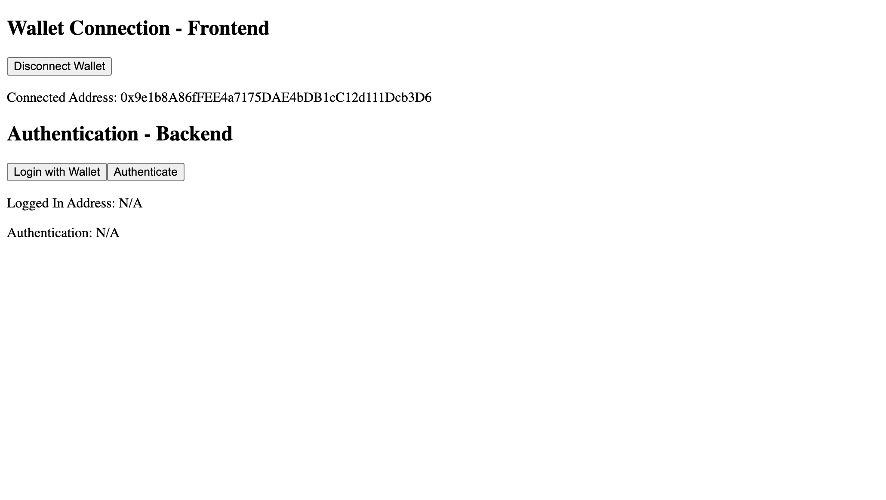

Let's take a look at a quick example of how to use the authentication SDK to allow users on a frontend application to log in with just their wallets to a backend and make authenticated requests.

## Setup the Project

We'll start by cloning the [Basic Authentication](https://github.com/thirdweb-example/login-with-wallet) example project using the [thirdweb CLI](/cli)

```bash
npx thirdweb create --template login-with-wallet
```

We also need to set up our backend with an admin private key (we'll explore what this means later).
To do this, we need to create a new file at the top level of our project called `.env.local` and add our private key to the file:

```
PRIVATE_KEY=your-private-key-here
```

:::info How to export your private key

Learn how to [export your private key](/guides/create-a-metamask-wallet#export-your-private-key) from your wallet.

:::

This is your "admin" wallet, which you can use to generate authentication tokens.

:::warning

Ensure you store and access your private key securely.

- **Never** commit any file that may contain your private key to your source control.

:::

### Trying the Demo

To run the project locally, run one of the following commands:

```bash
npm run dev
# or
yarn dev
```

You can navigate to [http://localhost:3000](http://localhost:3000) and you should see a page that looks like the following (assuming your wallet isn't already connected to the page).


The first thing to do is to connect your MetaMask wallet to the page by clicking the `Connect Wallet` button.

:::tip Getting A Wallet

If you don't already have one, you can follow our guide on [creating a MetaMask wallet](/guides/create-a-metamask-wallet)!

:::

Once you connect your wallet, the page should update to the following, and show you your wallet address in the `Connect Address` section.



## Why do we need authentication?

At this point, we've simply connected our wallet to the page, so the browser knows what our wallet address is.

What if a user wanted to make an API request to the back-end to access their sensitive account information?

We could restrict access based on their wallet address, but what if somebody else knew that address?
That person could then make an API request pretending to be the user, and get the account information, even if they didn't own the wallet; which would be a security risk!

We need to **prove** to the backend that we own the wallet address, rather than simply sending the wallet address.

Let's explore how this is possible with the authentication SDK.

### Generating an Authentication Token

We can prove that we are connected to a wallet to the backend by signing a specific login message with our private key,
which the backend will then use to verify that we do in fact own the address we claim to have.

You can do this step by clicking the `Login with Wallet` button, and you should be prompted to sign a message that looks something like the following (with different addresses, times, and nonce).

```
thirdweb.com wants you to sign in with your account:
0x9e1b8A86fFEE4a7175DAE4bDB1cC12d111Dcb3D6

Make sure that the requesting domain above matches the URL of the current website.

Nonce: f44b81a7-2547-40a4-8583-59f9be41e9f3
Expiration Time: 2022-07-06T15:22:54.829Z
```

Once you sign the message, it will get sent to the backend where the backend will verify your address and generate an authentication token to send to you.

:::tip

For those curious, you can actually see the authentication token by clicking `Inspect` > `Application` > `Cookies` and you'll see it under the `access_token` cookie in this case.

:::

Now that you're logged in, your page should update to the following with the correct `Logged In Address`.


Our authentication token is now stored securely on the frontend, so if we make any future requests to the backend, the backend will still know the wallet address that we are logged in as.

You can try this out by clicking the `Authenticate` button, which just makes a request to the backend and returns `true` if your wallet address is still authenticated.

Finally, if you try clicking the `Logout` button, the authentication token will be removed from the frontend, which means you will no longer be able to make authenticated requests. If try the `Authenticate` button, it should now show `false` for the `Authenticated` value, reflecting that you are no longer logged in.

So just like that, we have a **full login-flow where you can login to a backend with just a wallet!**

### Understanding the Code

Now that we've seen the basics of what this login flow can do, let's take a look at the important code to try to understand what's going on.

The first file we can take a look at is the `hooks/useAuthenticate.ts` file, which will have functions called `login`, `authenticate`, and `logout`. Notice that all of these functions are simply making API requests to the backend, which we'll take a look at soon. However,
if we take a closer look at the `login` function, you'll notice that's it's also doing something else:

```typescript
async function login() {
  // Here, we call the authentication SDK login method to generate a payload we can send to the backend
  const payload = await sdk?.auth.login(domain);
  await fetch("/api/login", {
    method: "POST",
    headers: {
      "Content-Type": "application/json",
    },
    body: JSON.stringify({ payload }),
  });
}
```

In this function, we importantly call the `sdk.auth.login()` function which is what prompts the connected wallet to sign a message, which is then used to generate a payload to send to the backend.

Now we can take a look at all the API functions which enable these flows. First, let's look at `pages/api/login.tsx`, which is where the login request is made. The most crucial line in this function is the following:

```typescript
const token = await sdk.auth.generateAuthToken(domain, payload);
```

Here, we take the payload generated and send from the frontend and use it to create an authentication token that the frontend can use to make authenticated requests. We then send this token back to the frontend as a secure cookie with the following code:

```typescript
res.setHeader(
  "Set-Cookie",
  serialize("access_token", token, {
    path: "/",
    httpOnly: true,
    secure: true,
    sameSite: "strict",
  }),
);
```

Next, let's look at the `pages/api/authenticate.tsx` file, which showcases a separate API endpoint where we can verify is a user is logged in or not. The most important code here is the following:

```typescript
// Get access token off cookies
const token = req.cookies.access_token;
if (!token) {
  res.status(401).json({
    error: "Must provide an access token to authenticate",
  });
}

const sdk = ThirdwebSDK.fromPrivateKey(
  process.env.ADMIN_PRIVATE_KEY as string,
  "mainnet",
);

// Authenticate token with the SDK
const domain = "thirdweb.com";
const address = await sdk.auth.authenticate(domain, token);
```

Here, we extract the authentication token of the request cookies and verify it with the `sdk.auth.authenticate` method. If the authentication token is valid, the function will return us the address of the authenticated wallet, otherwise this function will throw an error.

Finally, let's look at the `pages/api/logout.tsx` file, which demonstrates how to logout a user. All we have to do is remove the cookie with the authentication token from the frontend (which we can specify on the request with the following):

```typescript
// Set the access token to 'none' and expire in 5 seconds
res.setHeader(
  "Set-Cookie",
  serialize("access_token", "none", {
    path: "/",
    expires: new Date(Date.now() + 5 * 1000),
  }),
);
```

And with this, the user will be logged out after 5 seconds.

And just like that, user authentication with the authentication SDK is made possible!
