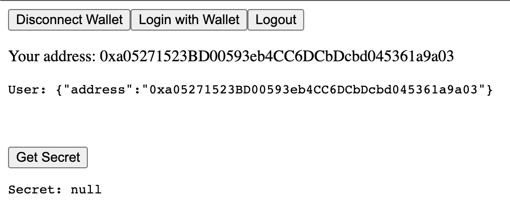

import QuickstartCard from "@components/QuickstartCard";

In this quickstart, you'll learn how to allow users to sign in with their wallets
and then have them make authenticated requests to an API route using Next.js.

## Setup the Project

We'll start by cloning the [Thirdweb Auth Next](https://github.com/thirdweb-example/thirdweb-auth-next) example project using the [thirdweb CLI](https://github.com/thirdweb-dev/thirdweb-cli)

```bash
npx thirdweb create --template thirdweb-auth-next
```

This creates a starter project with the SDKs installed and auth configured.

We have two API routes in this project:

1. `/api/auth/[...thirdweb].ts`: A catch-all route that handles `/login`, `/logout`, and `/user` requests.
2. `/api/secret.ts`: Checks if the user is authenticated and returns a secret message if they are.

We'll let the user sign in, and access a secret message if they are authenticated.

## Exploring the Code

In the `_app.tsx` file, we have our application wrapped in the `ThirdwebProvider` with an `authConfig` option.

In this file, we configure:

- `authUrl`: the relative URL of our Auth API (which we setup at `/api/auth` in this case).
- `domain`: the domain of our website (used to prevent phishing attacks).
- `loginRedirect`: the route we redirect users to after a successful login (optional).

```jsx
<ThirdwebProvider
  desiredChainId={activeChainId}
  authConfig={{
    domain: "localhost:3000",
    authUrl: "/api/auth",
    loginRedirect: "/",
  }}
>
  <Component {...pageProps} />
</ThirdwebProvider>
```

### Setting up the API Route

The SDK handles the logic for us under the hood, by making requests to the below endpoints:

- [`/api/auth/login`](https://github.com/thirdweb-dev/js/blob/main/packages/auth/src/next/routes/login.ts): Verifies the user's signature and generates an auth token that gets set in the user's cookies.
- [`/api/auth/logout`](https://github.com/thirdweb-dev/js/blob/main/packages/auth/src/next/routes/logout.ts): Deletes the cookie containing the auth token.
- [`/api/auth/user`](https://github.com/thirdweb-dev/js/blob/main/packages/auth/src/next/routes/user.ts): Reads the user's cookie, authenticates its integrity and returns the user's wallet address.

All we need to do is configure the catch-all API route that handles these requests.

```ts title="/api/auth/[...thirdweb].ts"
import { ThirdwebAuth } from "@thirdweb-dev/auth/next";

export const { ThirdwebAuthHandler, getUser } = ThirdwebAuth({
  // Using environment variables to secure your private key is a security vulnerability.
  // Learn how to store your private key securely:
  // https://portal.thirdweb.com/sdk/set-up-the-sdk/securing-your-private-key
  privateKey: process.env.ADMIN_PRIVATE_KEY,
  // Set this to your domain to prevent signature malleability attacks.
  domain: "http://localhost:3000",
});

export default ThirdwebAuthHandler();
```

By exporting the `ThirdwebAuthHandler`, we tell the SDK to handle requests to any `/api/auth/...` route.

:::warning Security vulnerability warning
This guide uses environment variables to store the private key which is **not** best practice.

[Learn how to store your private key securely](/sdk/set-up-the-sdk/securing-your-private-key).

For **test purposes**, you can use environment variables by creating a `.env.local` file at the root of your project containing:

```
ADMIN_PRIVATE_KEY=your-private-key-here
```

:::

### Sign In

Now that we have our API route set up, we can let users sign in on the client.

```jsx title="pages/index.tsx"
import { useAddress, useLogin, ConnectWallet } from "@thirdweb-dev/react";

export default function Home() {
  const address = useAddress();
  const login = useLogin();

  return (
    <div>
      {address ? (
        <>
          <button onClick={() => login()}>Login with Wallet</button>
        </>
      ) : (
        <ConnectWallet />
      )}
    </div>
  );
}
```

This detects if the user has connected their wallet to our app; and if they have,
it displays a button that lets them sign in.

Under the hood, the `login` function first asks the user to sign a message that follows the
[sign in with Ethereum](https://eips.ethereum.org/EIPS/eip-4361) standard. This signed message is then sent to the `/api/auth/login` route, which
verifies the user's signature and generates an auth token that gets set in the user's cookies.

The message looks like this:

```
thirdweb.com wants you to sign in with your account:
0x9e1b8A86fFEE4a7175DAE4bDB1cC12d111Dcb3D6

Make sure that the requesting domain above matches the URL of the current website.

Nonce: f44b81a7-2547-40a4-8583-59f9be41e9f3
Expiration Time: 2022-07-06T15:22:54.829Z
```

After the user successfully logs in, they are redirected to the route we specified in the
`loginRedirect` option in the `ThirdwebProvider`; and are now authenticated!

:::tip

For those curious, you can view the authentication token by right-clicking the page > `Inspect` > `Application` tab > `Cookies` and you'll see it under the `thirdweb_auth_token` cookie in this case.

:::

### View Current Authenticated User

Now that the user is logged in, we can get the authenticated user on any of our pages wrapped
in the `ThirdwebProvider` using the `useUser` hook:

```jsx title="pages/index.tsx"
const { user } = useUser();
```

In our example, the page should update to the following with the correct address in the `User` object displayed.



### Authenticated API Requests

Our authentication token is now stored securely on the client in a cookie,
so if we make any future requests to the server,
it will still know the wallet address that we are authenticated as.

For example, we can make an authenticated request to our `/api/secret` route:

```jsx title="pages/index.tsx"
const [secret, setSecret] = useState();

const getSecret = async () => {
  const res = await fetch("/api/secret");
  const data = await res.json();
  setSecret(data);
};

// ...
<button onClick={getSecret}>Get Secret</button>;
```

On the `/api/secret` route, we can use the `getUser` function to get the authenticated user:

```ts title="/api/secret.ts"
import { getUser } from "./auth/[...thirdweb]";

const handler = async (req, res) => {
  // Get the authenticated user
  const user = await getUser(req);

  // Return a 401 unauthorized error if the user is not authenticated
  if (!user) {
    return res.status(401).json({
      message: "Not authorized.",
    });
  }

  // Return data that requires authentication
  return res.status(200).json({
    message: "This is a secret... don't tell anyone.",
  });
};

export default handler;
```

You can try this out by clicking the `Get Secret` button, which makes a request to the backend for some secret content that can only be accessed by authenticated users. You should receive a secret back as below:


### Sign Out

Finally, if you try clicking the `Logout` button, the authentication token will be removed from the frontend, which means the `User` on the frontend should update to be empty again.

```jsx title="pages/index.tsx"
const logout = useLogout();

// ...
<button onClick={logout}>Logout</button>;
```

Additionally, if you try clicking the `Get Secret` button, it will return you an unauthorized error.

So just like that, we have a **full login-flow where you can login to a backend with just a wallet!**

### Next Steps

Now that you've seen how easy it is to use Auth, get started with one of our templates:

<div className="row" style={{ marginTop: 24 }}>
  <div className="col col--6" style={{ padding: 8 }}>
    <QuickstartCard
      name="NFT Gated Website"
      link="https://github.com/thirdweb-example/nft-gated-website"
      description="Restrict access to content to NFT holders"
      image="/assets/icons/nft.png"
    />
  </div>
  <div className="col col--6" style={{ padding: 8 }}>
    <QuickstartCard
      name="Stripe Subscription Payments"
      link="https://github.com/thirdweb-example/thirdweb-stripe"
      description="Accept payments for a subscription service"
      image="/assets/icons/token.png"
    />
  </div>
</div>