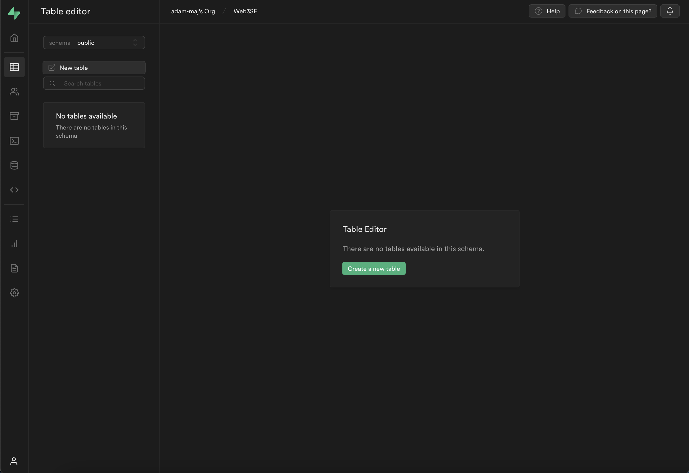
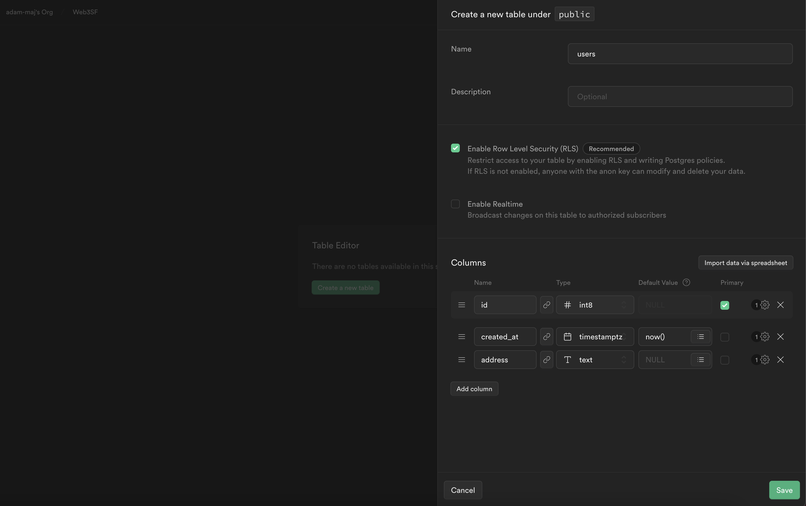
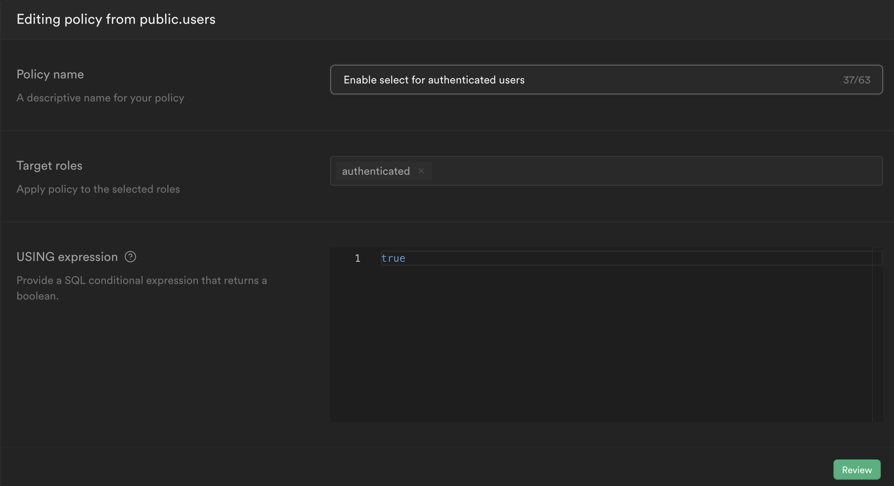

import QuickstartCard from "../../../../src/components/QuickstartCard";

Auth can be integrated with [Supabase](https://supabase.com/) to manage authenticated user within a database.

We'll go over the necessary setup in order to store users that logged in with their wallets in your Supabase database below. We'll be using Next.js as an example.

:::tip

You can explore a working example here:

<div className="col col--6" style={{ padding: 8 }}>
  <QuickstartCard
    name="Auth + Supabase"
    link="https://github.com/thirdweb-example/thirdweb-auth-supabase"
    description="Implement thirdweb Auth with Supabase"
    image="/assets/icons/drop.png"
  />
</div>

:::

## Installation

First, we need to install the `@thirdweb-dev/auth` and `@supabase/supabase-js` packages as follows:

```bash npm2yarn
npm install @thirdweb-dev/auth @supabase/supabase-js
```

## Setup

### Supabase

Before we dive into the code, we'll need to setup a Supabase database so that we can store our user data.

If you don't already have a Supabase account, you can set one up [here](https://app.supabase.com/).

We'll need to create a new table on the Supabase dashboard to hold our user data, so navigate to the `Table Editor`, make sure you're on the `public` schema and `Create a new table`.



Call the table `users`, make sure `Row Level Security` is enabled. There should already be an `id` and `created_at` column - you'll want to add an `address` column as well, make sure the type is set to text, and the value is non-nullable and unique. Once you have this setup, you can create the table.



Next, you'll need to create a [Row Level Security policy](https://supabase.com/docs/learn/auth-deep-dive/auth-row-level-security) to make sure thatn only authenticated users can access the data from our database. You can achieve this by navigating to `Authentication` > `Policies` > `New policy` for the table we just created, and creating a policy that looks like the following:



Finally, we'll need to get the `SUPABASE_SERVICE_ROLE` and `SUPABASE_URL` from the Supabase dashboard and add them to our `.env.local` file in the top level of our project:

```
SUPABASE_URL=your-url-here
SUPABASE_SERVICE_ROLE=your-service-role-here
```

### App

Now that Supabase is setup, we can dive into the actual app setup to integrate Auth.

First, we need to setup an admin private key used to secure our authentication. We can do this by creating a new `.env.local` file at the top level of the project and adding a private key to the file:

```
ADMIN_PRIVATE_KEY=your-private-key-here
```

:::warning Private Key Best Practices

It is not secure to store your private key in an environment variable.

[Learn how to use a secret manager as we recommend here](/sdk/set-up-the-sdk/securing-your-private-key)

:::

We'll start with the basic Next.js setup for Auth in the `/pages/api/auth/[...thirdweb].js` file - you can learn more about it in the [Auth + Next.js Documentation](/auth/frameworks/next):

```javascript file=/pages/api/auth/[...thirdweb].js
import { ThirdwebAuth } from "@thirdweb-dev/auth/next";

export const { ThirdwebAuthHandler, getUser } = ThirdwebAuth({
  privateKey: process.env.ADMIN_PRIVATE_KEY || "",
  domain: "localhost:3000",
});

// Export the handler to setup all your endpoints
export default ThirdwebAuthHandler();
```

Then, we'll add callback functions for the `login` and `user` callbacks so that we can do the following:

- Create a user in our Supabase database whenever a user logs in with their wallet
- Get the user data from Supabase associated with the wallet address whenever user data is requested

First, we'll need to instantiate the Supabase SDK in our project as follows:

```javascript
import { createClient } from "@supabase/supabase-js";

const supabase = createClient(
  process.env.SUPABASE_URL || "",
  process.env.SUPABASE_SERVICE_ROLE || "",
);
```

Now, we need to define a login callback function that creates a user in our database when someone logs in:

```javascript
const login = async (address: string) => {
  // Check if there's already a user in our DB with the specified address
  const { data: user } = await supabase
    .from("users")
    .select("*")
    .eq("address", address.toLowerCase())
    .single();

  // If not, create a user in the database
  if (!user) {
    const res = await supabase
      .from("users")
      .insert({ address: address.toLowerCase() })
      .single();

    if (res.error) {
      throw new Error("Failed to create user!");
    }
  }
};
```

And we can also define a user callback to fill in the user data whenver someone requests a user:

```javascript
const user = async (address: string) => {
  // Fetch the user data in our DB associated with the specified address
  const { data: user } = await supabase
    .from("users")
    .select("*")
    .eq("address", address.toLowerCase())
    .single();

  return user;
};
```

And finally, we can pass these callback functions into our Auth config as follows:

```javascript
export const { ThirdwebAuthHandler, getUser } = ThirdwebAuth({
  privateKey: process.env.ADMIN_PRIVATE_KEY || "",
  domain: "localhost:3000",
  callbacks: { login, user },
});
```

Now our backend should be setup and ready-to-go with Supabase - it will create a new user everytime someone new logs in with their wallet, and will fill in user data on request.

:::tip

To see and interact with a full working example, checkout this example project:

<div className="col col--6" style={{ padding: 8 }}>
  <QuickstartCard
    name="Auth + Supabase"
    link="https://github.com/thirdweb-example/thirdweb-auth-supabase"
    description="Implement thirdweb Auth with Supabase"
    image="/assets/icons/drop.png"
  />
</div>

:::
