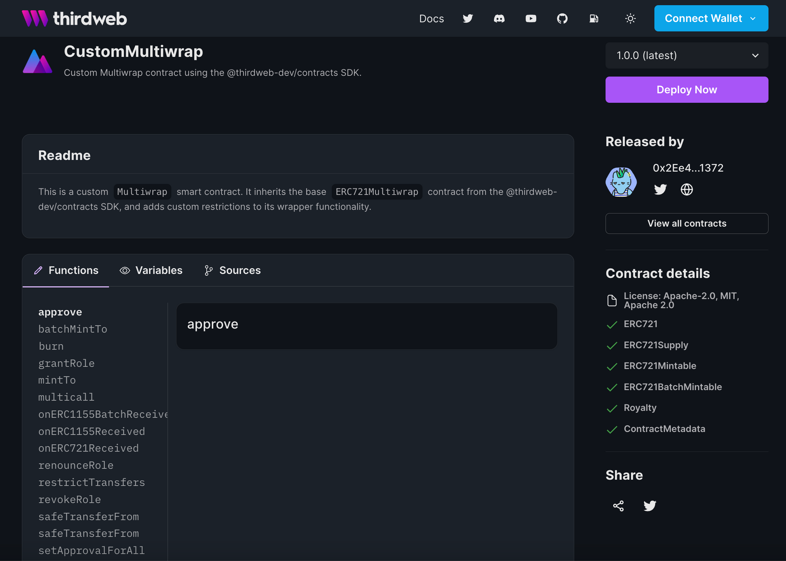

import QuickstartCard from "../../src/components/QuickstartCard";

# Release

Using the [CLI](/cli),
run the following command to publish a new version of your smart contract to our **on-chain registry**,
where anyone can view and deploy it from the [dashboard](https://thirdweb.com/dashboard).

```bash
npx thirdweb release
```

<div className="row" style={{ marginBottom: 24 }}>
  <div className="col col--12" style={{ marginTop: 8 }}>
    <QuickstartCard
      name="Quickstart: Release & Deploy Your Own Contract"
      link="/getting-started/releasing-custom-contracts"
      image="/assets/icons/education.png"
    />
  </div>
</div>

:::tip Solana Program Releases

You will soon be able to release Solana programs and let anyone deploy them in one click.

Join our [Discord](https://discord.gg/thirdweb) to be the first to know when it's shipped!

:::

## Releasing Contracts

By releasing your contract onto the thirdweb registry, you unlock a way of creating **versioned deployments**
of your contracts and have your contract source code stored on the blockchain.

When you publish a new version, you can easily deploy it to any of our [supported networks](https://blog.thirdweb.com/guides/which-network-should-you-use)
in one click, without exposing your private key at any point.

We also create a public landing page for both your **wallet** and your **smart contract**, where the metadata, author, release notes, and
source code is all publicly available and stored on-chain.

These pages are accessible by anyone and allow users who visit them to:

- View the author and the source of the contract
- View the functions, variables, and [extensions](/contractkit/features) in your contract
- Deploy a copy of the contract themselves



## Advanced Features

### Cheaper deploys using EIP-1967 Proxy contracts

When releasing a contract, you can choose to let others deploy a "proxy" of a pre-deployed contract. Since proxies are much lighter weight than the actual full contract, they are much cheaper to deploy. Proxy deploys only requiring a fraction of the gas of a normal deploy.

This feature has a requirement however, the "main" contract, referred to as the "implementation" needs to be deployed on chain already.

Here's the step by step flow to create a release with proxy deploys enabled:

1. Your contract needs to implement the [upgradeable pattern](https://docs.openzeppelin.com/upgrades-plugins/1.x/writing-upgradeable), generally means it has an "initialize" function instead of a regular constructo
2. Run `npx thirdweb release` from you project
3. On the create release page, check "Deployable via proxy"
4. This will reveal a new section, where you can deploy your implementations on any supported chain in one click.
5. Deploy your implementations on your desired chains (addresses are saved automatically)
6. Create your release

Now anyone can deploy proxies of your contract simply by clicking "deploy" on your release page.

### Factory deploys

Another way to let users deploy your contracts is by using a factory contract. This allows you to not only provide cheap deployments, but also to add extra logic that will be executed when others deploy your contracts.

To enable factory deploys, you will need to deploy a factory contract that implements the [IContractFactory interface](https://portal.thirdweb.com/contracts/IContractFactory). This is a simple interface with one function that you can implement to add deploy contracts any way you like, and add your custom logic on top. This is extremely useful when deploying a contract requires multiple steps, having the factory take care of the heavy lifting.

Here's the step by step flow to create a release with factory deploys enabled:

1. Follow steps 1 to 5
2. Check "Deployable via factory"
3. Fill in the addresses of your factory contracts on each chain
4. Create your release

That's it, now when people click deploy from your release page, your factory will be invoked instead.

---

We'd love to hear of other release use cases you need! Join our discord community and share your thoughts!
