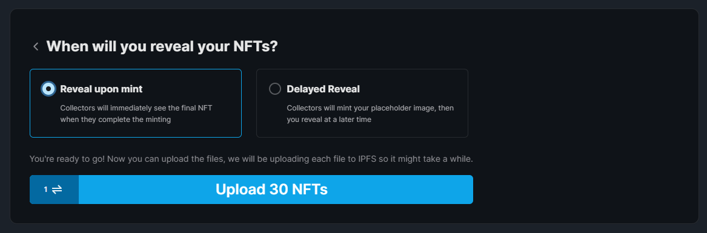

# Lazy Minting NFTs

Now that we've created and deployed our NFT Drop smart contract, the next step is
to **upload our NFTs**!

:::info

When you add NFTs to your drop contract, they are not minted at this point.
You prepare everything for your users so that they can mint the NFT(s). This means the user who claims the NFT is the one who mints it,
and it is minted into their wallet. By default, the user is the one who pays the gas fees.

This is known as **lazy minting**.

:::

You can choose to lazy mint individual NFTs, or lazy mint multiple NFTs at once, using the
[Batch Upload](https://portal.thirdweb.com/pre-built-contracts/nft-drop#lazy-minting-your-nfts) feature.

To get started, you can use our example `.csv` or `.json` file:

- [Example CSV File](https://thirdweb.com/example.csv)
- [Example JSON File](https://nightly.thirdweb.com/example.json)

Once you have your metadata file ready along with your assets, simply drag and drop the files into the upload area.

Our dashboard will show you a preview of your NFTs and their metadata like so:

Ensure you are happy with the metadata before you continue,
as you cannot edit your metadata after you upload your NFTs.

At this point, you'll be given the option to add a [Delayed Reveal](https://portal.thirdweb.com/guides/nft-drop-with-delayed-reveal),
which is up to you! For the purpose of this guide, I will choose **Reveal upon mint**.

Click **Upload NFTs** and confirm the `Lazy Mint` transaction.

Once the transaction is approved, you can see all of your NFTs in the **Overview** tab of the NFT Drop.

Now we're ready to setup a page where our users can mint the NFTs!
