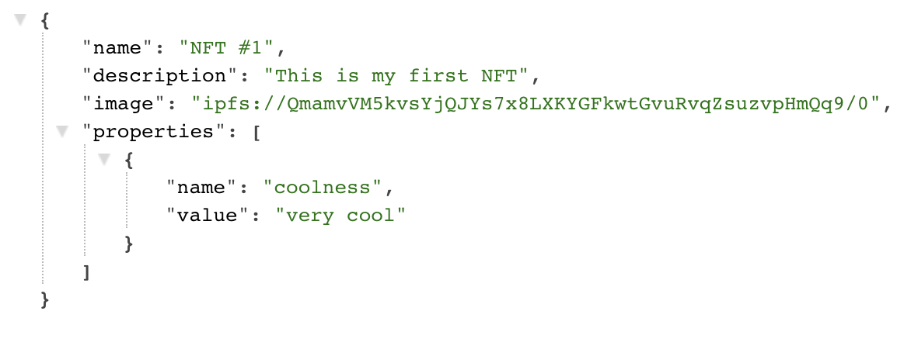

import QuickstartCard from "@components/QuickstartCard";

### Setup

The first step before we get started is to install the latest version of the SDK with the following command:

```bash npm2yarn
npm install @thirdweb-dev/storage
```

After we install the SDK, we can setup the SDK to use for uploads with the following code:

```jsx
import { ThirdwebStorage } from "@thirdweb-dev/storage";

// First, instantiate the SDK
const storage = new ThirdwebStorage();
```

## Upload

Now that we've setup the SDK, we can define some metadata (like NFT metadata for example) that we want to upload with the SDK:

```jsx
// We define metadata for an NFT
const metadata = {
  name: "NFT #1",
  description: "This is my first NFT",
  // Here we add a file into the image property of our metadata
  image: readFileSync("path/to/file.jpg"),
  properties: [
    {
      name: "coolness",
      value: "very cool",
    },
  ],
};
```

And now we can upload it to IPFS with the SDK with a single line of code:

```jsx
// Here we get the IPFS URI of where our metadata has been uploaded
const uri = await storage.upload(metadata);
// This will log a URL like ipfs://QmWgbcjKWCXhaLzMz4gNBxQpAHktQK6MkLvBkKXbsoWEEy/0
console.log(uri);
```

We can take a look at the actual data that get uploaded by accessing the IPFS URI through a gateway URL (gateway URLs let you access `ipfs://` files using ordinary browsers). We can get an accessible link for our files with the following code:

```jsx
// Here we a URL with a gateway that we can look at in the browser
const url = await storage.resolveScheme(uri);
// This will log a URL like https://gateway.ipfscdn.io/ipfs/QmWgbcjKWCXhaLzMz4gNBxQpAHktQK6MkLvBkKXbsoWEEy/0
console.log(url);
```

If you navigate to the URL with the resolved scheme, you'll see that the data will look something like the following (you can see an example metadata upload in the browser [here](https://gateway.ipfscdn.io/ipfs/QmWgbcjKWCXhaLzMz4gNBxQpAHktQK6MkLvBkKXbsoWEEy/0)):



Notice that in addition to uploading the metadata for us, the SDK has also automatically detected the image file within the object, uploaded it to its own IPFS URL, and linked the URL back in our object as well - you can take look at the image uploaded in the above metadata [here](https://gateway.ipfscdn.io/ipfs/QmamvVM5kvsYjQJYs7x8LXKYGFkwtGvuRvqZsuzvpHmQq9/0).

Now that this data is stored on IPFS, it will be available for other people to pin and replicate, increasing the decentralization of our file storage and preventing it from being taken down.

So just like that, with a few lines of code, we've uploaded our stored our first data on decentralized storage!

### Download

Since we've succesfully uploaded some data to IPFS, we can take a look at how to later download and access that data.

If we have the URI or URL of our JSON metadata, and we want to fetch it, we can simply use the `downloadJSON` function to retrieve our data:

```jsx
// Here, URLs with both ipfs:// and https:// schemes will work with the SDK
const data = await storage.downloadJSON(uri);
console.log(data);
```

And if we look at what the data looks like:

```
{
  name: 'NFT #1',
  description: 'This is my first NFT',
  image: 'https://gateway.ipfscdn.io/ipfs/QmamvVM5kvsYjQJYs7x8LXKYGFkwtGvuRvqZsuzvpHmQq9/0',
  properties: [ { name: 'coolness', value: 'very cool' } ]
}
```

We can see that the `ipfs://` link in the `image` property has automatically been resolved for us on download to a URL that we can actually retrieve (a URL that starts with `https://` instead of `ipfs://`).

Alternatively, if we wanted to get the raw response data from fetching a URL, we could do that with the following code:

```jsx
// Here we get the raw response object
const res = await storage.download(uri);
// And we can do anything with it like getting the raw text data
const data = await res.text();
```

With this simple interace, you can now easily upload and download data using decentralized storage!
