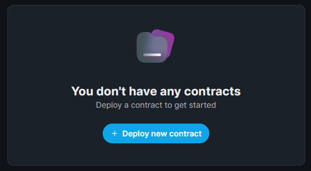
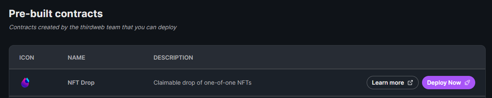
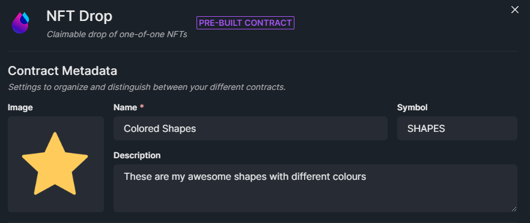
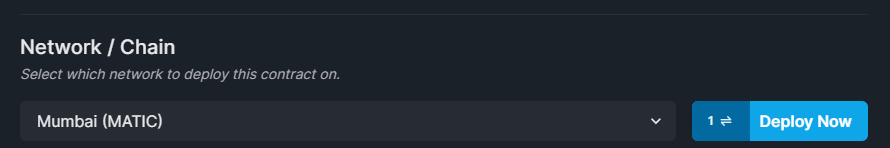
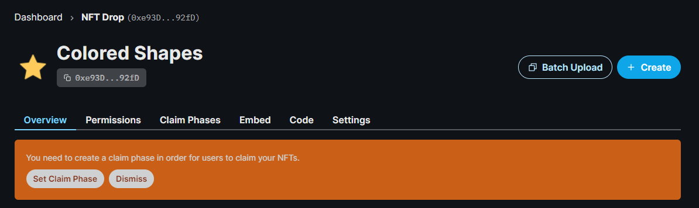
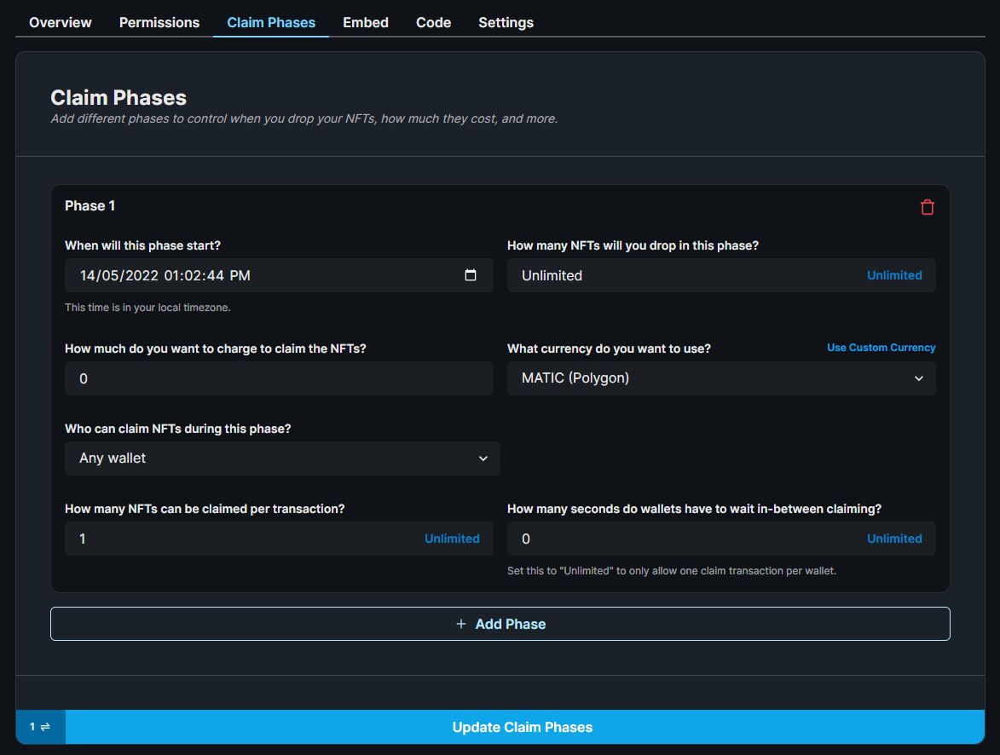

import ThirdwebCodeSnippet from "../../../../src/components/ThirdwebCodeSnippet";

# Creating an NFT Drop Contract

In this section, we'll show how to:

- Create the smart contract that will be used to store our NFTs.
- Configure the metadata such as the name, image, description, and royalty fees of the NFT Drop.
- Deploy the contract to a test network, and set up our [claim phases](https://portal.thirdweb.com/pre-built-contracts/nft-drop#setting-claim-phases).

## Creating an NFT Drop Contract

To create an [NFT Drop](https://portal.thirdweb.com/pre-built-contracts/nft-drop) contract,
head to the [thirdweb dashboard](https://thirdweb.com/dashboard) and connect your wallet.

Then click on the **Deploy New Contract** button.

Since we want to **lazy mint** our NFTs and make them available to be claimed by our users,
the **NFT Drop** contract is best suited for this.

Select **NFT Drop** from the list of contracts and click **Deploy Now**.

You can configure the **Name**, **Symbol**, **Description**, **Image**, and
[Royalty fees](https://portal.thirdweb.com/pre-built-contracts/nft-drop#setting-royalty-fees) in the settings before you deploy your NFT Drop.

I'll call my NFT Drop `Colored Shapes` and stick with the default values for the rest of the fields,
but feel free to go wild and configure this to your liking!

:::tip
You may have seen people use an asset that cycles through some of the images in the collection as the cover image.
You can do this too using a tool such as ezgif to achieve the same effect, and set this `.gif` file as the **Image** of the NFT Drop here.

:::

Once you're happy, let's deploy this NFT Drop onto the Mumbai (MATIC) Test network.

This will prompt you to accept a transaction in MetaMask (or whatever wallet you connected with),
and deploy your smart contract onto the Mumbai Test network!

You might notice that the transaction is requesting to Deploy a **Proxy**.

If you want to learn more about proxy contracts, check out our documentation on
[How thirdweb pre-built contracts work](https://portal.thirdweb.com/pre-built-contracts#how-thirdweb-pre-built-contracts-work).

## Configuring Claim Phases

[Claim Phases](https://portal.thirdweb.com/pre-built-contracts/nft-drop#setting-claim-phases) are conditions
we can configure to define **when** and **how** users can claim NFTs from our collection.

For example, a popular claim phase pattern is to have one claim phase where allow-listed wallets can claim,
then another claim phase after that, where _any_ wallet can claim.

From the thirdweb dashboard, let's click **Set Claim Phase** and configure a simple claim phase where anyone can mint/claim our NFTs.

Click on **Add Phase**, and configure it to your liking!

I'm going to change the `How many NFTs can be claimed per transaction?` to be `1` and accept the default values for the other fields.

Once you're happy with your claim phase(s), click **Update Claim Phases**

Now we're ready to upload our NFTs to our NFT Drop contract.

## Bonus Tip: SDK Deployments

You can do everything we just did in code using the SDK too!

**Deploy the NFT Drop contract:**

<ThirdwebCodeSnippet
  contract={"ContractDeployer"}
  name={"deployNFTDrop"}
  showHr={false}
/>

**Set Claim Conditions:**

<ThirdwebCodeSnippet
  contract={"NFTDrop"}
  name={"claimConditions"}
  showHr={false}
/>
