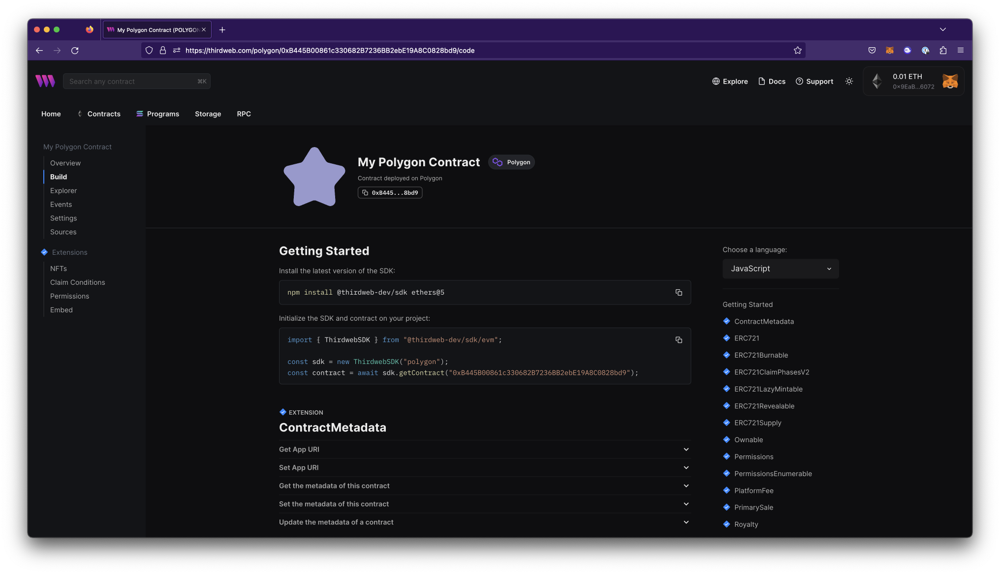

# Build

The build view provides code snippets to interact with your contract using thirdweb SDKs. Code snippets are generated automatically based on your contract's read/write functions and supported [extensions](/solidity/extensions).

### Languages

Build provides code snippets in all of the provided thirdweb SDKs: [JavaScript](https://portal.thirdweb.com/javascript), [React](https://portal.thirdweb.com/react), [React Native](https://portal.thirdweb.com/react-native),
[Python](https://portal.thirdweb.com/python), [Go](https://portal.thirdweb.com/go) and [Unity](https://portal.thirdweb.com/unity).

To change the language snippets, choose a language from the dropdown on the Build page (top right).

