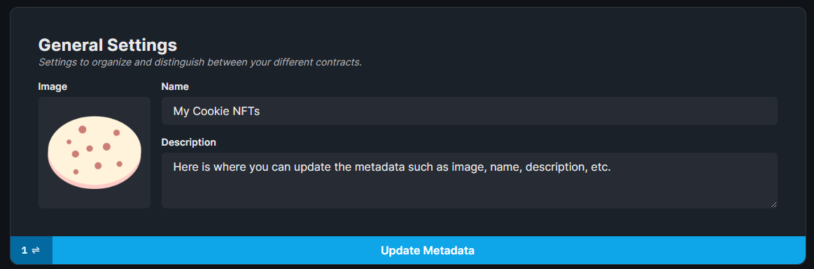
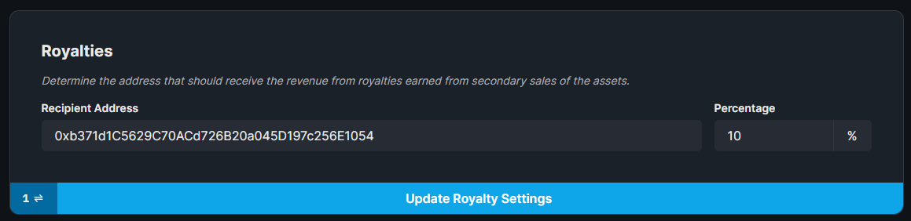
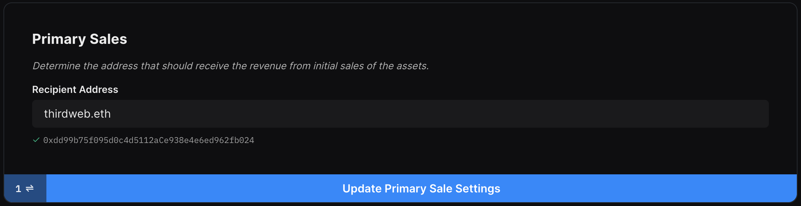
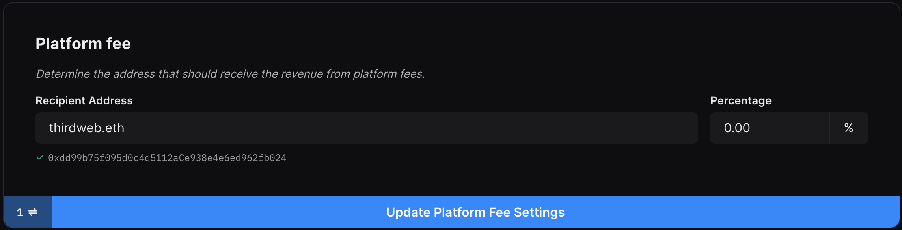

# Contract Settings

You can configure the settings of your contract in the **Settings** tab.

## Contract Metadata

You can modify the metadata of the contract itself.

This information shows up on pages such as the OpenSea collection page.

## Royalty Fees

Royalty fees are taken on secondary sales of your tokens.

For example, if someone mints an NFT from your drop contract, then sells it to another wallet, you take a royalty fee on that sale.

## Primary Sales Recipient

The primary sales recipient is the wallet address that receives the funds from the primary sales of the contract; such as minting NFTs from a drop.

## Platform Fees

Platform fees are taken on all primary sales that happen on the contract.

This is useful if you are deploying this contract for a 3rd party and want to take fees for your service.

