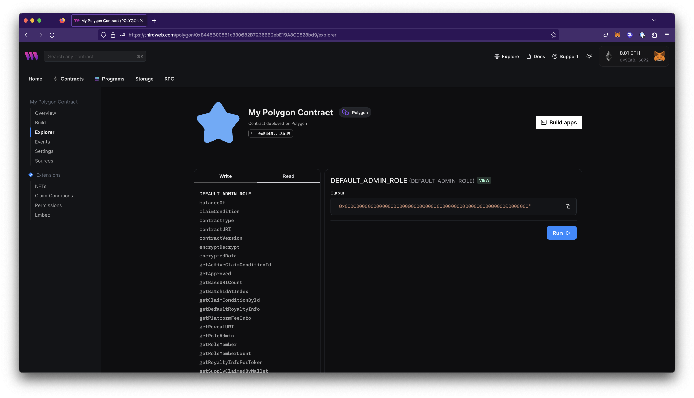

# Explorer

Explorer or Contract Explorer is a tool that allows any contract owner or end-user to easily view and call all the functions on the smart contract from their connected wallet through the dashboard. This tool also helps developers test function calls on their contract without writing code.

### Write functions

Write functions write new data to the blockchain through the contract. Therefore, write functions require gas fees to execute as they are updating the state of the blockchain.

### Read functions

Read functions read data from the blockchain. Read functions do not modify any data, therefore do not require gas fees to execute.
