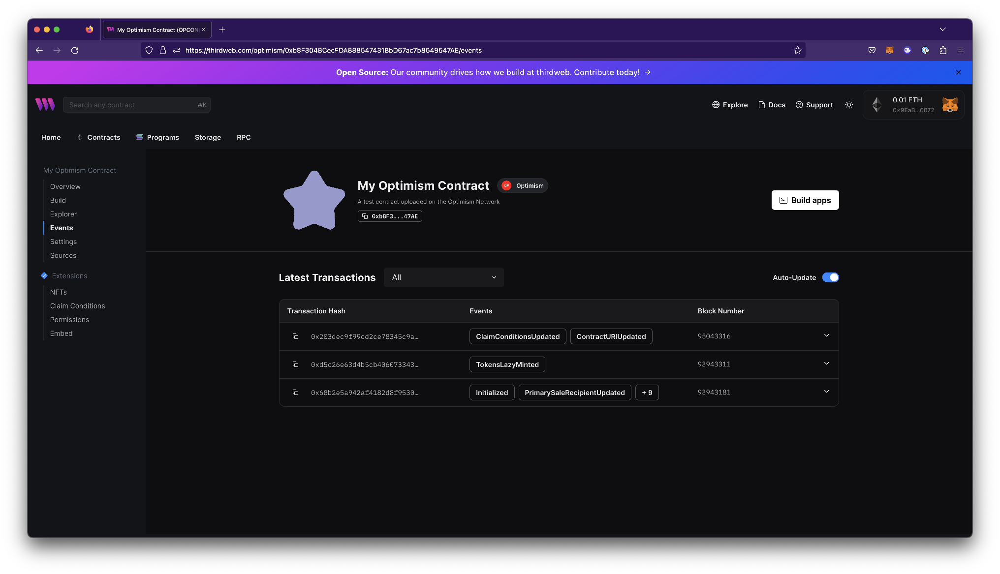

# Events

In the Events view, you can see an updated list of all the transactions emitted on the contract and their corresponding block number, and hash. The dropdowns provide a detailed view of the event data.

### Events List

| Event                       | Event Description                                                                                                                                                                                   |
| --------------------------- | --------------------------------------------------------------------------------------------------------------------------------------------------------------------------------------------------- |
| ClaimConditionsUpdated      | Emitted when Claim Conditions have been updated.                                                                                                                                                    |
| ContractURIUpdated          | Emitted when the Contract URI or metadata have been updated.                                                                                                                                        |
| TokensLazyMinted            | Emitted when tokens have been [lazy minted](/glossary/lazy-minting)                                                                                                                                 |
| Initialized                 | Emitted when the contract is initialized                                                                                                                                                            |
| PrimarySaleRecipientUpdated | Emitted when the [primary sale recipient](/solidity/extensions/primarysale) is updated                                                                                                              |
| DefaultRoyalty              | Emitted when the default [royalty](/solidity/extensions/royalty) recipient is updated                                                                                                               |
| PlatformFeeInfoUpdated      | Emitted when the [platform fee](/solidity/extensions/platformfee) information is updated                                                                                                            |
| RoleGranted                 | Emitted when a new role is granted (for contracts with the [permissions](/solidity/extensions/permissions) extension)                                                                               |
| OperatorRestriction         | Emitted when the operation (e.g. function call) is restricted (e.g. to a specific role). This is emitted by contracts which implement the [OperatorFilterer](/contracts/OperatorFilterer) extension |
| OwnerUpdated                | Emitted when the contract [owner](/solidity/extensions/ownable) is updated                                                                                                                          |
