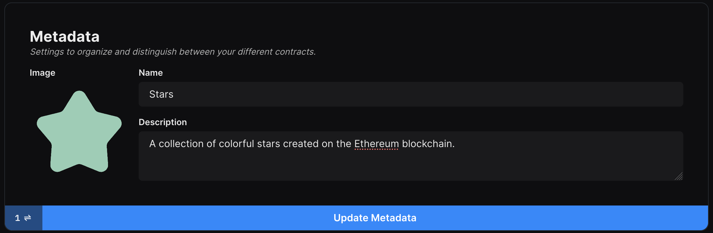
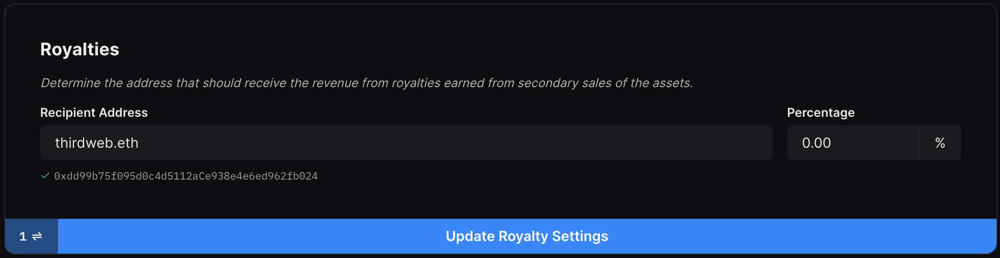

# Settings

In the settings view, you can change the fields you initially set when first deploying the contract such as Metadata, Primary Sales, Royalties, and Platform fees.

### Metadata

Metadata refers to the contract metadata which appears on the blockchain or pages such as the OpenSea collection page. To change the metadata, pass in an image, name, and description into the fields and
click 'Update Primary Sale Settings'. This will prompt a transaction in your wallet.

:::info
Symbol metadata cannot be modified after the contract has been deployed.
:::

### Primary Sales

Primary Sales are revenue received on the initial sale of assets. To change the primary sales address, pass in an address into the fields and
click 'Update Primary Sale Settings'. This will prompt a transaction in your wallet.

### Royalties

Royalty fees are received on secondary sales of assets. To change the royalty fees, pass in an address and a corresponding percentage into the fields and
click 'Update Royalty Settings'. This will prompt a transaction in your wallet.

### Platform Fee

Platform fees are the fees received by a platform. This is often used if you are deploying this contract for a third party and want to charge fees for services. To change the platform fees, pass in an address and a corresponding percentage into the fields and
click 'Update Platform Fee Settings'. This will prompt a transaction in your wallet.

