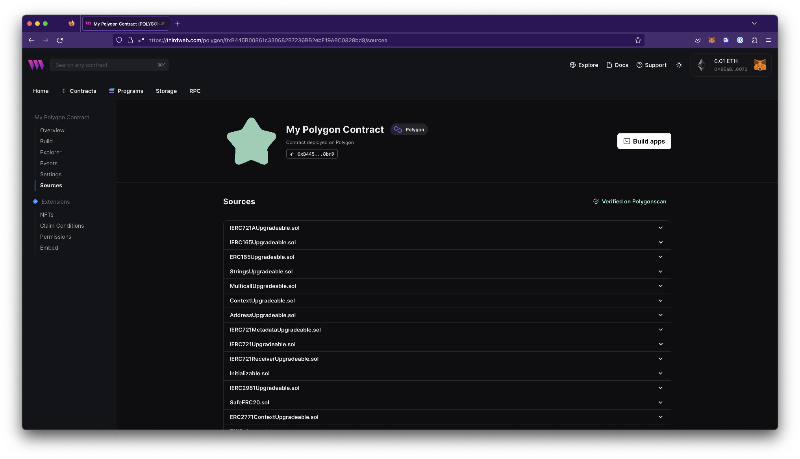

# Sources

In the sources view, you can check the compiled source code of your contract and verify it on sites like Etherscan.

### Verifying contracts

All contracts deployed on the following chains will be automatically verified via thirdweb:

- [Ethereum](https://thirdweb.com/ethereum)
- [Goerli](https://thirdweb.com/goerli)
- [Polygon](https://thirdweb.com/polygon)
- [Mumbai](https://thirdweb.com/mumbai)
- [Arbitrum One](https://thirdweb.com/arbitrum)
- [Arbitrum Goerli](https://thirdweb.com/arbitrum-goerli)
- [Optimism](https://thirdweb.com/optimism)
- [Optimism Goerli Testnet](https://thirdweb.com/optimism-goerli)
- [Binance SmartChain](https://thirdweb.com/binance)
- [Binance SmartChain Testnet](https://thirdweb.com/binance-testnet)
- [Fantom Opera](https://thirdweb.com/fantom)
- [Fantom Testnet](https://thirdweb.com/fantom-testnet)
- [Avalanche C Chain](https://thirdweb.com/avalanche)
- [Avalanche Fuji Testnet](https://thirdweb.com/avalanche-fuji)

:::info
To learn more about how we verify contracts, read our [Auto-verifying smart contracts using solc & IPFS](https://blog.thirdweb.com/verifying-smart-contracts-with-solc-and-ipfs-no-etherscan/) engineering blog.
:::
