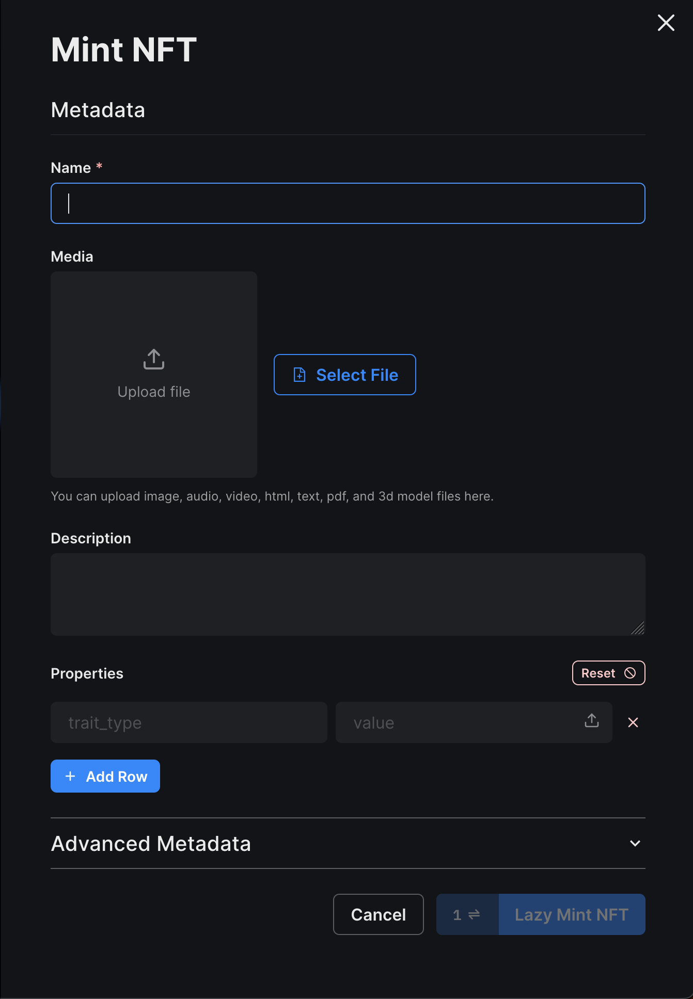
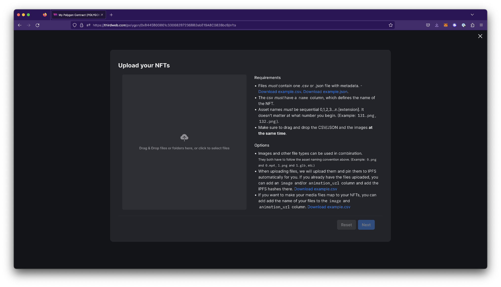
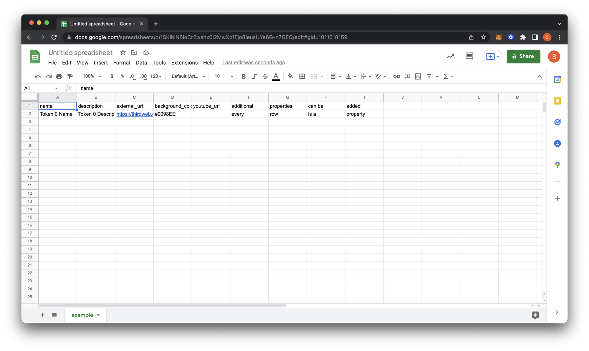
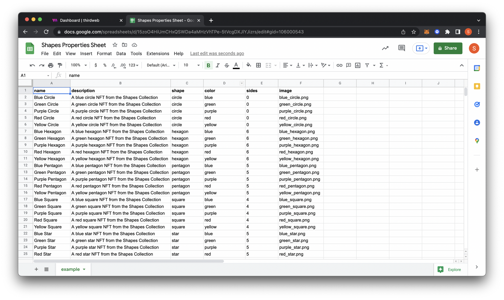
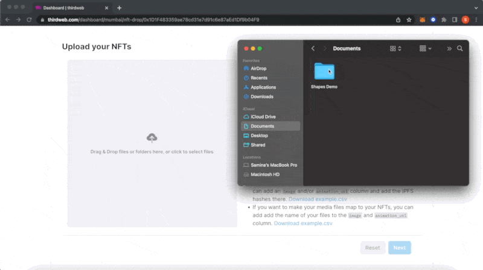
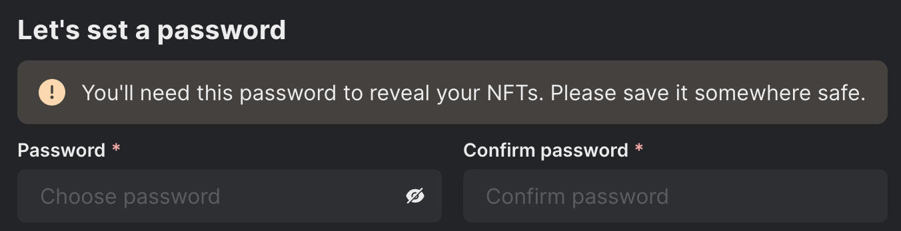
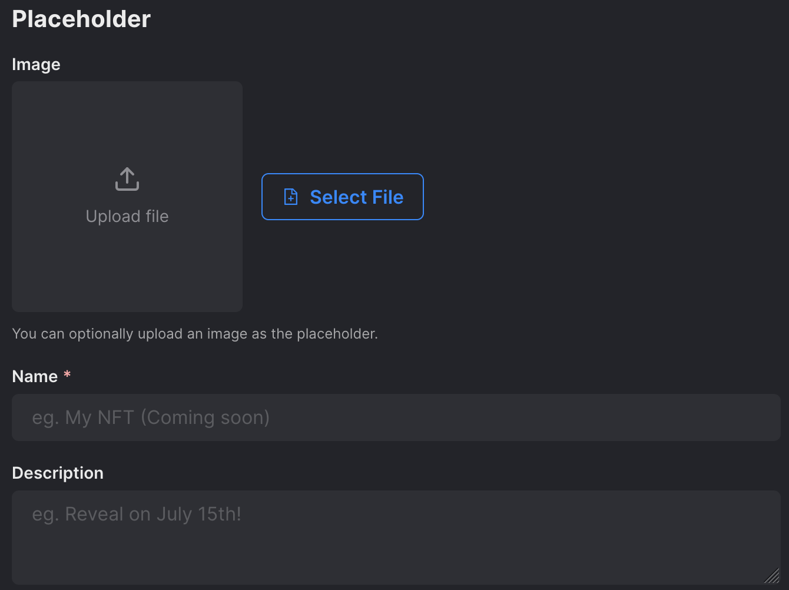
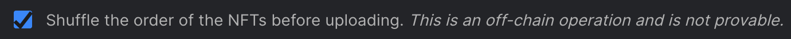

# NFTs

:::info
This feature is available on contracts that implement [erc-721](/solidity/extensions/erc721) or [erc-1155](/solidity/extensions/erc1155) extension (or industry standard).
:::

## Claim

To claim an NFT directly on your contract, follow these steps:

1. Click the `Claim` button on the NFT view

2. Paste in the address to claim the NFTs and the number of NFTs.

3. Click the `Claim NFT` button.

## Single Upload

Single uploading NFTs is a preferred method for uploading one-off NFTs or smaller amounts of NFTs.

Follow these steps to [lazy-mint](/glossary/lazy-mintable) a single NFT to your contract.

1. To upload single NFTs, navigate to the NFTs view and click the `Single Upload` button.

2. Fill in the corresponding NFT metadata fields including **Name**, **Media**, and **Description** on the modal.

3. (Optional) Add **Properties** or traits for the NFT.

4. (Optional) Configure advanced metadata options such as **Background Color** and **External URL**.

5. Click the `Lazy Mint` button when you are ready to mint. This action will prompt a transaction in your wallet.

   

## Batch Upload

Batch uploading NFTs is a preferred option for NFTs and corresponding metadata that need to be uploaded in bulk. It is currently only available for contracts that have the [Drop](/solidity/extensions/drop) or [Drop1155](/solidity/extensions/erc1155drop) extension.

#### CSV

1. Click the `Batch Upload` button in the NFTs view on the dashboard.

2. Download the sample CSV file (recommended) or JSON, which holds an example of the expected structure.

3. After downloading, open the sheet in a preferred CSV editor. You can use [Microsoft Excel](https://www.microsoft.com/en-us/microsoft-365/p/excel/), [Google Sheets](https://www.google.com/sheets/about/),
   or any other software or text editor that supports editing CSV files.

:::tip
[Google Sheets](https://www.google.com/sheets/about/) is a great beginner option if you are unfamiliar with using spreadsheet software. It is free to use with a Google account, and you can use it on any browser - no need to download software.
:::

4. On Google Sheets, you can click file > import to upload the sample CSV file for editing. When you open the sample file, you will find a couple of column headers with the first property row filled out.

Overview of different properties:

- **name:** The name of the NFT
- **description:** Description of the NFT
- **external_url:** This URL appears below the image on marketplaces like OpenSea and allows users to view the NFT from your site.
- **background_color:** An optional property available on OpenSea. Must use six-digit hex (#) format.
- **youtube_url:** Similar to the external URL, this will allow users to see the YouTube channel or video behind the NFT.

This option also allows you to upload a variety of different file types. The CSV file is used to add the NFT file next to the properties, which will parse.

- **image:** A link to the image or file to be uploaded. The link can be a local image or a URL of an uploaded NFT on a service, such as IPFS. Supported file types: png, jpg, jpeg, and gif
- **animation_url:** link to the animation that is to be uploaded. Supported file types: any file that is not an image such as mp4, audio files, pdf, CSV, 3d models, etc.

In addition to these specific properties, you can also add properties that may be unique to your collection. In the following example, we have a Shapes Collection NFT project with properties of shape, color, and sides.

5. Once you're done editing, export your file as a `.csv` and add it to a folder with all your assets.

6. Upload your assets to the dashboard, verify your collection is properly mapped, and click `Next` which will prompt you to configure more options.

   

#### JSON

Using JSON format is recommended when using an NFT generator that will generate NFTs and their corresponding metadata and output a JSON file.

:::tip
Some generators we recommend include [Hashlips](https://github.com/HashLips) and [niftygenerator](https://www.niftygenerator.xyz/). The upload feature is compatible with any generator.
:::

## Reveal NFTs

After batch uploading your NFTs, you may choose to instantly reveal them or choose delayed reveal if your contract implements the [delayed reveal](/solidity/extensions/delayedreveal) extension.

#### Reveal Upon Mint

Reveal Upon Mint instantly reveals your NFTs as normal. This option does not require any additional configuration.

You may optionally choose to shuffle your NFTs before uploading by enabling the checkbox.

#### Delayed Reveal

Delayed Reveal allows you to put placeholder metadata until you want to reveal the actual NFT. This option is currently only available for contracts which implement the [delayed reveal](/solidity/extensions/delayedreveal) extension.

To configure delayed reveal:

1. Set a password. You will use this password later to reveal the NFTs.

   

   :::warning
   The delayed reveal password is non-recoverable so please store it somewhere safe.
   :::

2. Add in your placeholder metadata: image, name, and description.

   

3. (Optional) Check the box at the bottom, if you want to shuffle the order of NFTs before uploading.

   

4. Click the `Upload NFTs` button at the bottom. This will prompt a transaction you need to confirm in your wallet.

:::info
If you experience any issues uploading your files, please check out our [Batch Upload Troubleshooting](https://support.thirdweb.com/dashboard/n5evQ4EfEjEifczEQaZ1hL/batch-upload-troubleshooting/5WMQFqfaUTU1C8NM8FtJ2X) article.
:::