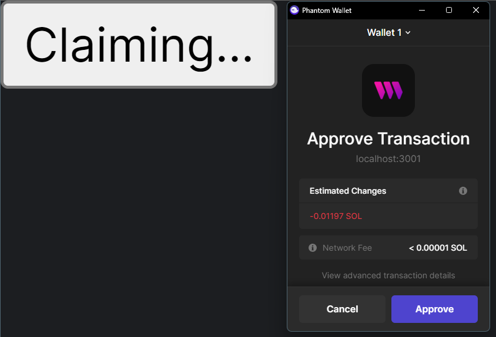

In this quickstart guide, we'll teach you all the fundamentals of our Solana SDK, including:

- Deploying a new program from a script
- Creating a web application to interact with the program

By the end, you'll create a new NFT Drop program and a simple minting app for it.

:::tip First time using Solana?

Follow our [Getting Started with Solana guide](https://blog.thirdweb.com/guides/getting-started-with-solana/) to create a wallet and get test funds!

:::

## Creating an NFT Drop Program

We'll start by creating a new NFT Drop program with the Solana SDK.

If you're starting from scratch, first create a new Node.js project:

```bash
npm init -y
```

Install the SDK with the following command:

```bash npm2yarn
npm install @thirdweb-dev/sdk
```

Now we're ready to deploy a new NFT Drop program and lazy mint some NFTs.

To do this, we'll first initialize the SDK with our private key
so we can send transactions to the blockchain.

:::warning

Ensure you store and access your private key securely.

[Learn how to securely store your private key using a secret manager](/sdk/set-up-the-sdk/securing-your-private-key).

If you are unsure how to securely store and access your private key, please do not proceed.

:::

Create a file called `index.mjs`, and create an instance of the SDK:

```jsx title="index.mjs"
import { ThirdwebSDK } from "@thirdweb-dev/sdk/solana";

// You can get this private key from your wallet, but it's important to store it securely
const privateKey = "...";
// Here we choose to setup the SDK on the Solana devnet network
const sdk = ThirdwebSDK.fromPrivateKey("devnet", privateKey);
```

### Deploying a Program

Now that we have our SDK setup, we can deploy a new NFT Drop program with a single line of code as follows:

```jsx title="index.mjs"
const address = await sdk.deployer.createNftDrop({
  name: "Cool Drop",
  description: "This is my first NFT Drop on Solana!",
  price: 0,
  itemsAvailable: 10,
});
// This will log out the address of our newly minted NFT Drop
console.log(address);
```

If you run the above code, it should log out the address of our newly deployed NFT Drop:

```bash
node index.mjs
# Prints out the address of the newly deployed NFT Drop!
```

### Interacting with the Program

Now that we've created a new NFT Drop program, we can interact with it using the SDK.

For example, we can lazy mint some NFTs to our drop so they're ready to be claimed/minted by other people!

Let's create another file called `lazyMint.mjs` and lazy mint 10 NFTs to our drop, by:

1. Initializing the SDK
2. Connecting to the program using it's address (which we got from the previous step)
3. Lazy minting the NFTs

```jsx title="lazyMint.mjs"
import { ThirdwebSDK } from "@thirdweb-dev/sdk/solana";
import { readFileSync } from "fs";

// Initialize the SDK
const privateKey = "...";
const sdk = ThirdwebSDK.fromPrivateKey("devnet", privateKey);

// Use the address of the NFT Drop program we just deployed to connect to the program
const programAddress = "...";
const program = await sdk.getNFTDrop(programAddress);

// Here we create the metadata for our NFTs
// Images can be URLs or relative paths to files
const metadatas = [
  {
    name: "NFT #1",
    description: "My first NFT!",
    image: readFileSync("./blue_square.png"),
  },
  {
    name: "NFT #2",
    description: "My second NFT!",
    image: readFileSync("./yellow_star.png"),
  },
];

// And now we can lazy mint with the metadata
await program.lazyMint(metadatas);

// Now let's view all of the NFTs in our drop:
const nfts = await program.getAll();
console.log(nfts);
```

:::tip Lazy Minting

To be able to claim NFTs from the drop, you must lazy mint the same amount of NFTs as the `itemsAvailable` you set when deploying the program.

:::

If we run the above code, it should log out the addresses of the newly minted NFTs:

```bash
node lazyMint.mjs
```

Let's see how we can build an application on top of this program!

## Building a Claiming Frontend

We can use the [CLI](/cli) to create a new React application with ready-to-go Solana support using the following command:

```bash
npx thirdweb create --template next-typescript-solana-starter
```

This will create a new project for us, which we can open up and setup for our drop.

The first thing we'll have to do is configure the project to work on Solana devnet, since we deployed our contract there.

We can do this by navigating to the `pages/_app.tsx` file where we can change the network to `devnet` as follows:

```jsx
// Here we make sure the network is set to devnet
const network: Network = "devnet";

function MyApp({ Component, pageProps }: AppProps) {
  return (
    <ThirdwebProvider endpoint={network}>
      <WalletModalProvider>
        <Component {...pageProps} />
      </WalletModalProvider>
    </ThirdwebProvider>
  );
}
```

Now our app is ready-to-go, and we can navigate to the `pages/index.tsx` where we can complete the final step of adding our claim button.

We want to display a button for users to connect their wallet if they aren't already connected - otherwise we'll display a button for them to claim an NFT from our collection:

```jsx
import { useWallet } from "@solana/wallet-adapter-react";
import { WalletMultiButton } from "@solana/wallet-adapter-react-ui";
import { useProgram, useClaimNFT } from "@thirdweb-dev/react/solana";

export default function NFTDrop() {
  const wallet = useWallet();
  const program = useProgram("your_nft_drop_address", "nft-drop");
  const claim = useClaimNFT(program.data);
  const quantityToClaim = 1;

  return (
    <div>
      {wallet.connected ? (
        <button onClick={() => claim.mutate(quantityToClaim)}>
          {claim.isLoading ? "Claiming..." : "Claim NFT"}
        </button>
      ) : (
        <WalletMultiButton />
      )}
    </div>
  );
}
```

We can run our project with `npm run dev` or `yarn dev` and navigate to [`localhost:3000`](http://localhost:300) to try it out!

And just like that, we've deployed a new NFT Drop to Solana, lazy-minted some NFTs, and created a claiming website, all with the thirdweb Solana SDK!


