import QuickstartCard from "@components/QuickstartCard";

Let's get started with our Unity SDK. On this page, we'll show you how to:

- Create a Unity project and install the SDK
- Allow users to connect their wallet to your game
- Read data from, and write transactions to smart contracts from C# scripts

## Creating A Unity Project

If this is your first time using Unity, you'll need to
[download and install the Unity Hub and Unity Editor](https://learn.unity.com/tutorial/install-the-unity-hub-and-editor).

:::tip Intellisense & Autocomplete

If you're using Visual Studio Code, follow the
[Using .NET in Visual Studio Code](https://code.visualstudio.com/docs/languages/dotnet) guide for Intellisense support.

:::

Once you're set up for success, open Unity Hub and click `Create New Project`:

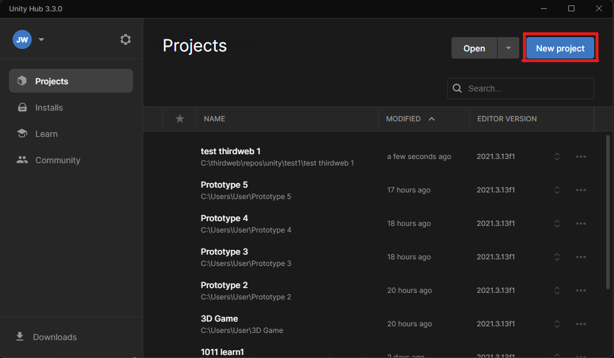

Next, select `3D`, give your project a name, and click `Create Project`:

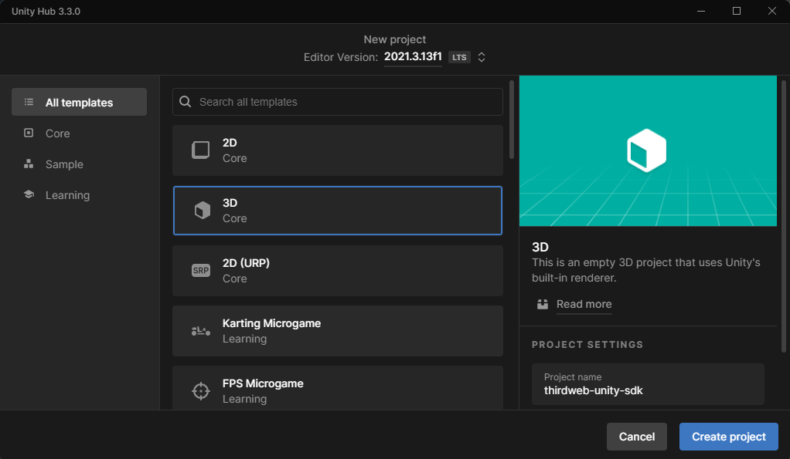

### Installing thirdweb SDK

Let's import the thirdweb SDK so we can add some web3 functionality!

First, head over to the [`thirdweb-dev/unity-sdk` releases page](https://github.com/thirdweb-dev/unity-sdk/releases) on GitHub.

Download the `.unitypackage` for the SDK version you want to use (usually you'll want the latest version):

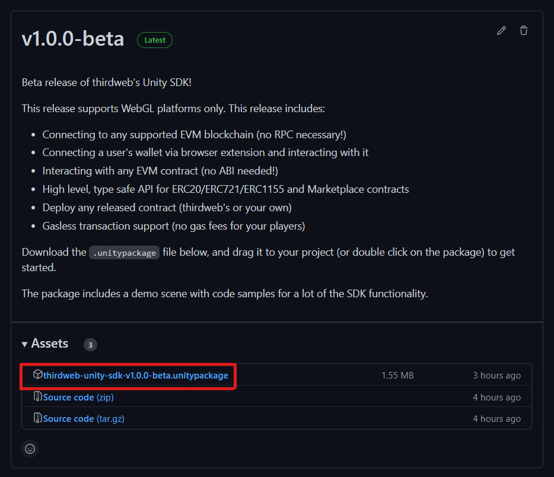

Now we've got the `.unitypackage`, we can add it to our Unity project by clicking `Assets` > `Import Package` > `Custom Package` like so:

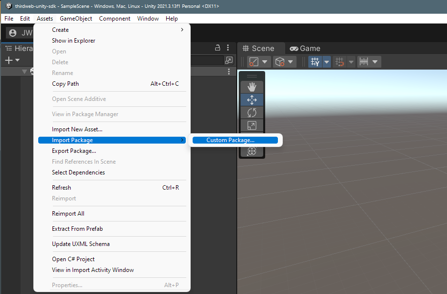

From here, select the file you just downloaded from GitHub, which will open the `Import Unity Package` menu:

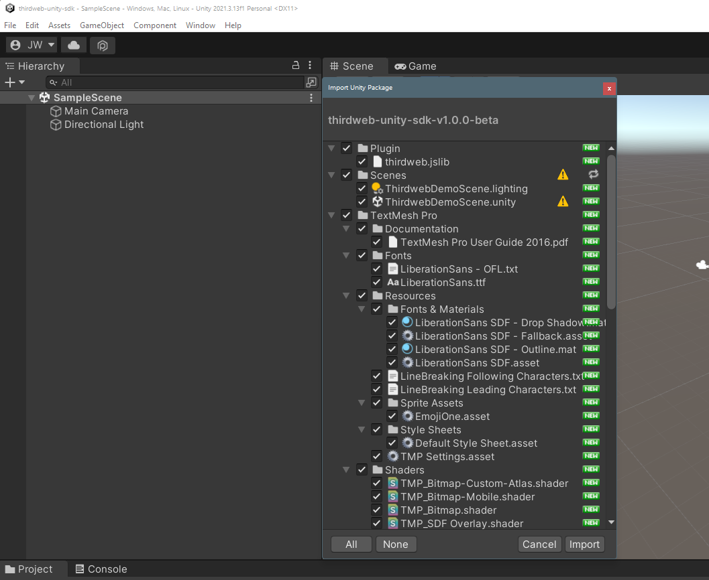

Leave everything selected, and click `Import`.

In your `Project` window now, you'll be able to see all of the resources we've imported:

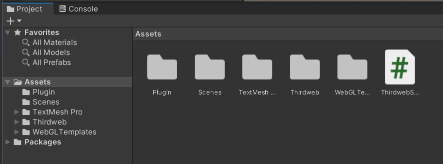

From the `Scenes` folder, double-click the `ThirdwebDemoScene.unity` file to open it. If you manoeuvre around the scene, you'll be able to see the `Canvas` that comes as part of the demo:

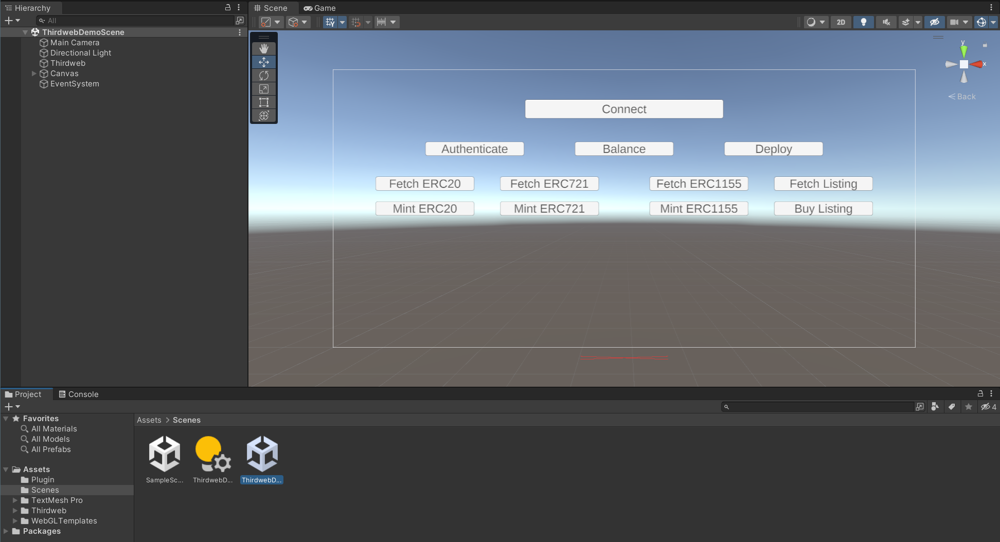

To view the code powering this demo and see what you can do with the SDK, open the `ThirdwebSDKDemos.cs` file by double-clicking it:

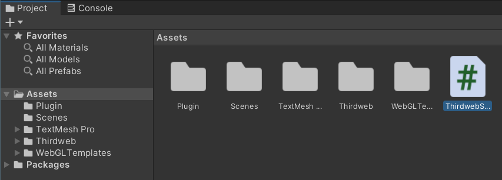

Within this file, you can see the basic functionality to initialize and start using the SDK.

For example, within the `Start` function (which gets called when the game starts), we can initialize a read-only instance of the SDK to read data from the blockchain:

```csharp
using UnityEngine;

// Import the Thirdweb SDK namespace
using Thirdweb;

public class ThirdwebSDKDemos : MonoBehaviour
{
    // Create a Thirdweb SDK instance for us to use throughout this class
    private ThirdwebSDK sdk;

    void Start()
    {
        // When the app starts, set up the Thirdweb SDK
        // Here, we're setting up a read-only instance on the "goerli" test network.
        sdk = new ThirdwebSDK("goerli");
    }
}
```

Within this file, you can explore some of the most common functionality our SDK provides, such as:

- `OnLoginClick`: Connect the user's wallet and set the SDK to read-write mode.
- `GetERC721`, `GetERC1155`, and `GetERC20`: **Read** information about various kinds of tokens from a smart contract.
- `MintERC721`, `MintERC1155`, and `MintERC20`: **Write** transactions to the blockchain from the connected wallet (mint new tokens).
- `Deploy`: Deploy a new smart contract directly from the SDK.

Familiarize yourself with the code and customize anything that catches your interest!

**Read data from smart contract**:

```csharp
public async void GetERC721() {
  var contract = sdk.GetContract("<smart-contract-address>"); // NFT Drop
  NFT result = await contract.ERC721.Get(count.ToString());
}
```

**Write transactions to the smart contract**

```csharp
public async void MintERC20() {
  var contract = sdk.GetContract("<smart-contract-address>"); // Token
  var result = await contract.ERC20.Mint("1.2");
}
```

Now let's see how we can build the game.

## Building the Game

> Currently, the built-in Unity preview isn't supported out of the box, as our game needs to be run in a browser.

To test our changes, let's `Build and Run` our game.

Open up your build settings by clicking `File` > `Build Settings`.

From the `Platform` options, select `WebGL` and `Switch Platform`.

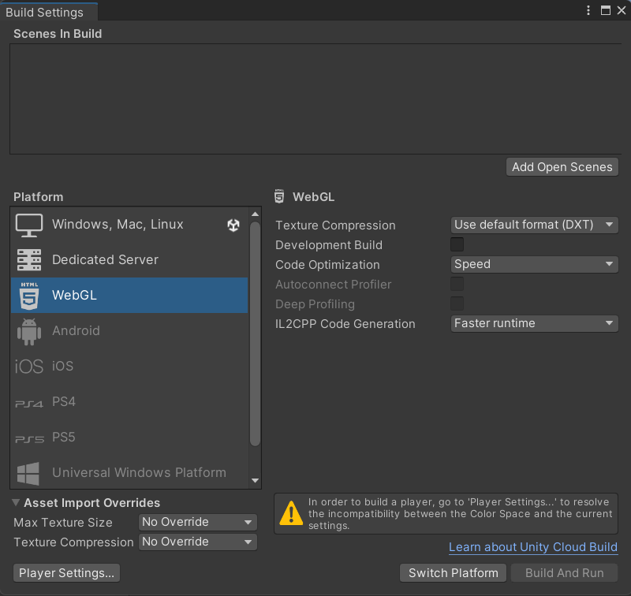

Next, click `Player Settings...` (bottom left corner) and set the `WebGL Template` under `Resolution and Presentation` to `Thirdweb`:

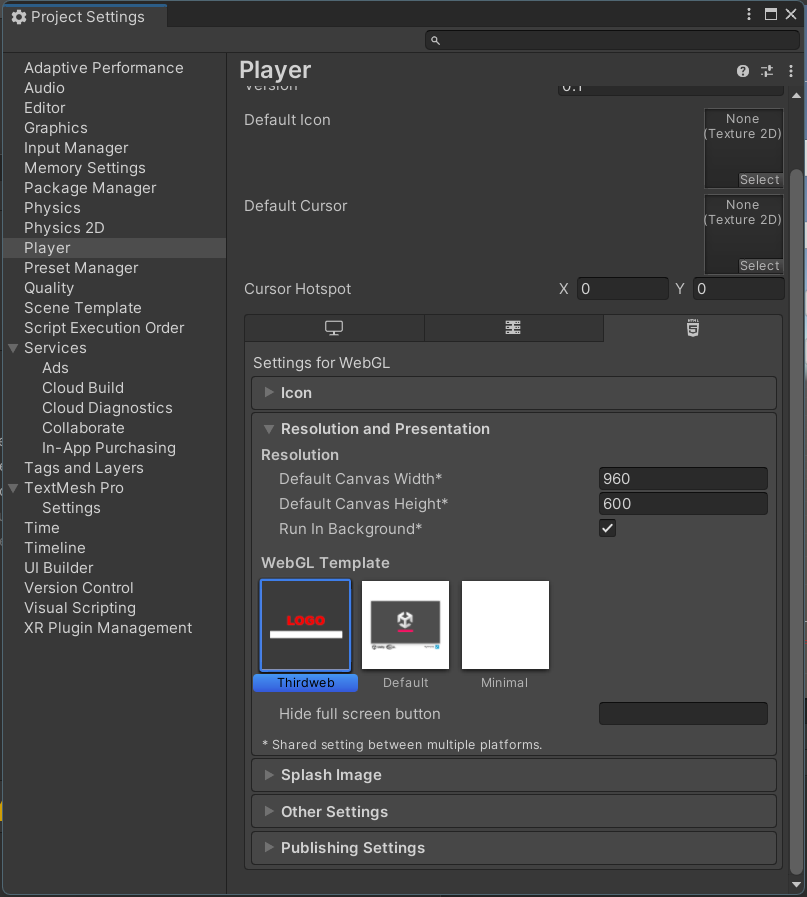

You may also need to disable `Auto Graphics API` in order to build your project:

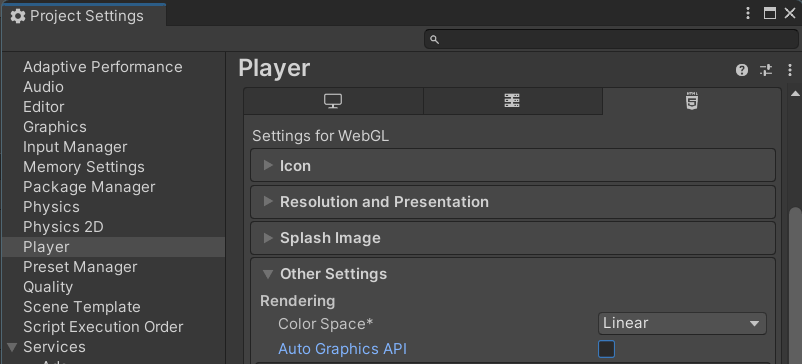

Ensure you add your scenes to the `Scenes In Build` by clicking `Add Open Scenes`:

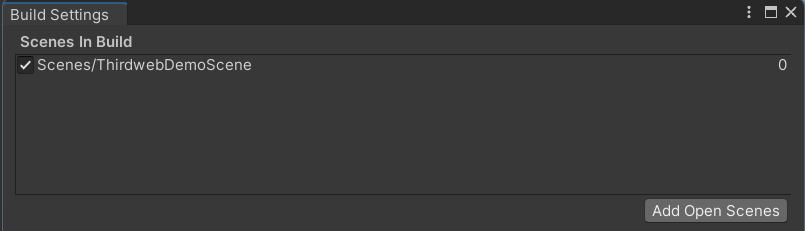

Finally, click `Build And Run`, and create a new `build` folder in your project as the directory.

This will trigger the build process for you to test your game:

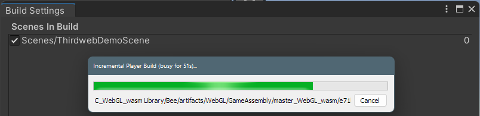

Voilà! Our game is built and we can test it out in the browser!

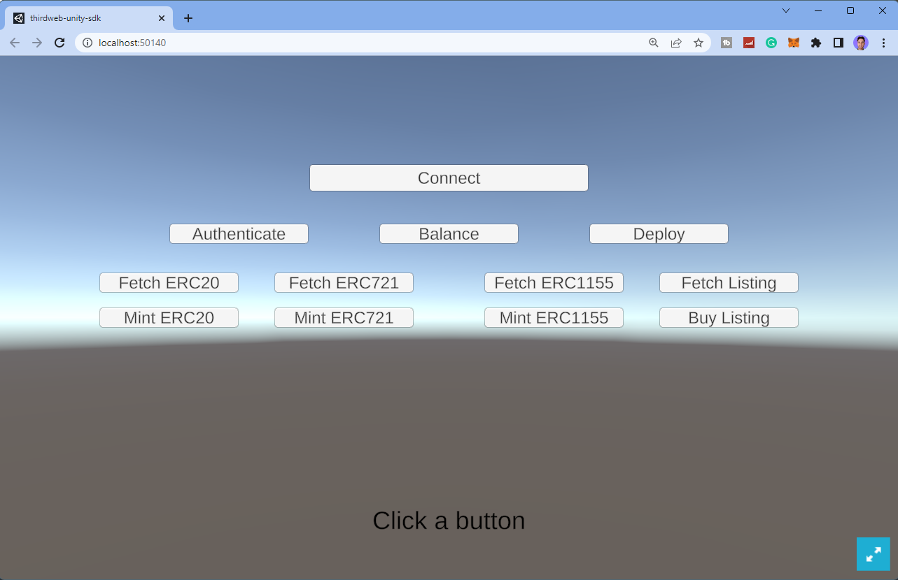

Now we can connect our wallet and start reading and writing transactions to the blockchain:
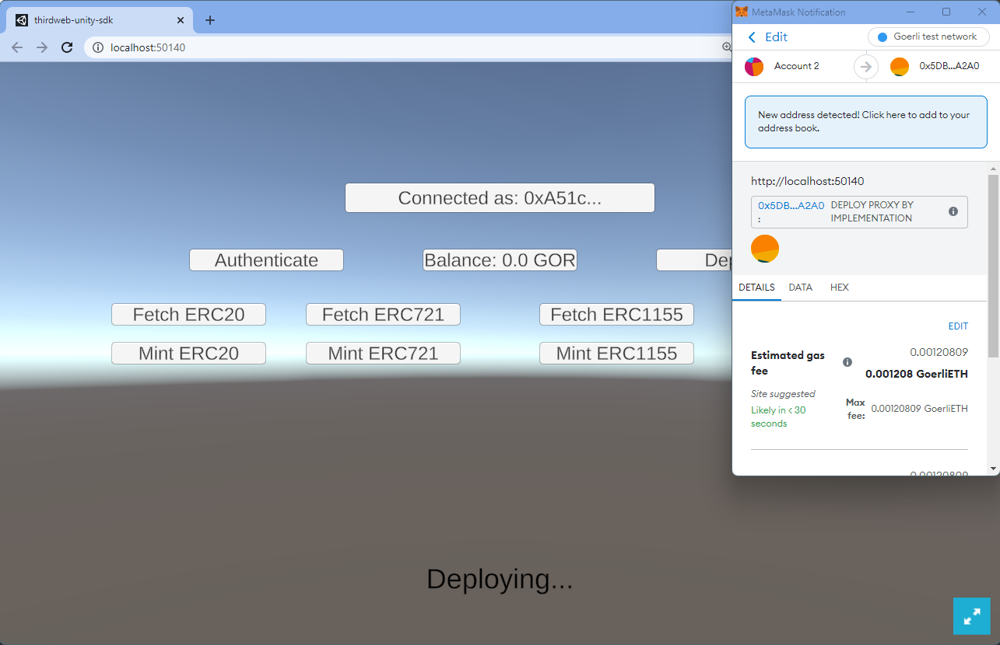

## Deploying Your Game

To deploy your game to the web, from within the `Player Settings...` section, set the `Compression Format` under `Publishing Settings` to be **Disabled**.

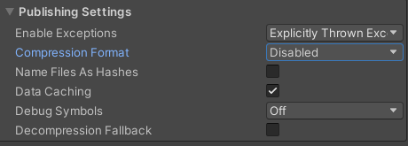

Re-build your game with these settings, and open the `build` folder _(the directory you selected your build to be output to)_ in your terminal:

```bash
cd <path-to-build-folder-here>
```

We can then use [Storage](https://portal.thirdweb.com/storage) to upload and deploy our application to IPFS, by running the following command:

```bash
npx thirdweb@latest@latest upload .
```

This command uploads your build directory to HTML and prints a link where your app is deployed:

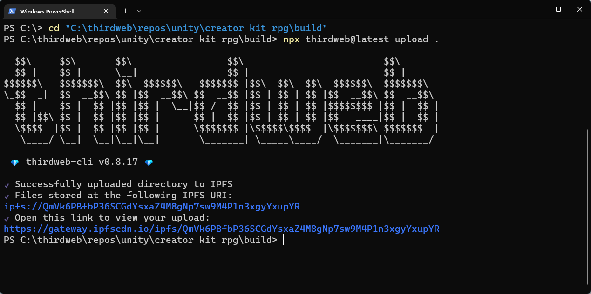
