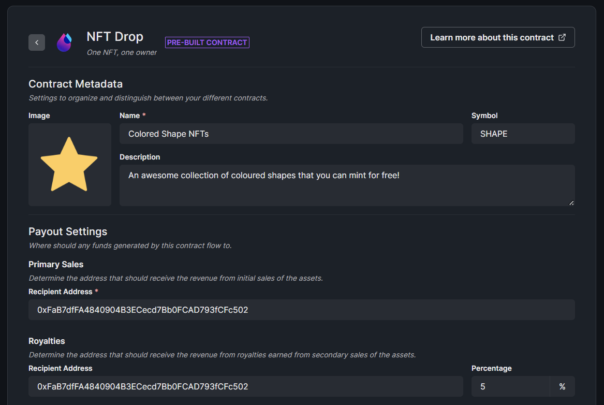
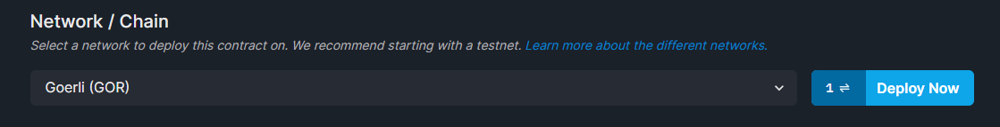

import DeployingContractsCodeTabs from "@components/DeployingContractsCodeTabs";
import InstallingThirdwebCodeTabs from "@components/InstallingThirdwebCodeTabs.tsx";
import InitializingThirdwebCodeTabs from "@components/InitializingThirdwebCodeTabs.tsx";
import DeployThisContractButton from "@components/DeployThisContractButton";
import QuickstartCard from "@components/QuickstartCard";

# Deploying a Prebuilt Contract

[Pre-built contracts](/pre-built-contracts) are the quickest way to start building.

This page will show you how to deploy the [NFT Drop](/sdk/interacting-with-contracts/nft-drop#create-an-nft-drop-contract) contract onto the Goerli test network.

Click the button below to go to the dashboard, where you can create and deploy your smart contract.

  <DeployThisContractButton
    link={"https://thirdweb.com/contracts/new/pre-built/drop/nft-drop"}
    contractType="nft-drop"
  />

## Connecting Your Wallet

If this is your first time building in web3, you'll need a **wallet** to interact with the blockchain.

You can also get free **test funds** from a **faucet** to pay for the gas fees for your transactions.

Learn how to set up a wallet with test funds, and how test networks work below:

  <QuickstartCard
    name="Create A MetaMask Wallet"
    link="https://blog.thirdweb.com/guides/create-a-metamask-wallet"
    image="/assets/icons/vote.png"
  />

  <QuickstartCard
    name="What Are Testnets?"
    link="https://blog.thirdweb.com/guides/which-network-should-you-use#what-is-a-testnet"
    image="/assets/icons/education.png"
  />

## Creating Your Contract

Before you deploy, you can set up your contract metadata such as the name, description, and image!

Beneath your contract metadata, select the `Goerli (GOR)` test network, and click `Deploy Now`!

:::tip Deploying Contracts with Code

You can deploy and interact with smart contracts using code via our [SDK](/sdk) too!

  

    <QuickstartCard
      name="Deploy An NFT Drop Contract With Code"
      link="/pre-built-contracts/nft-drop#create-an-nft-drop-contract"
      image="/assets/icons/education.png"
    />
  

:::

## Next Up

You just deployed your very own smart contract!

Next, let's learn how to get it ready for production; by adding team members, configuring royalties, and more!

  

    <QuickstartCard
      name="Configuring Smart Contracts"
      link="/getting-started/configuring-contracts"
      image="/assets/icons/education.png"
    />
  

