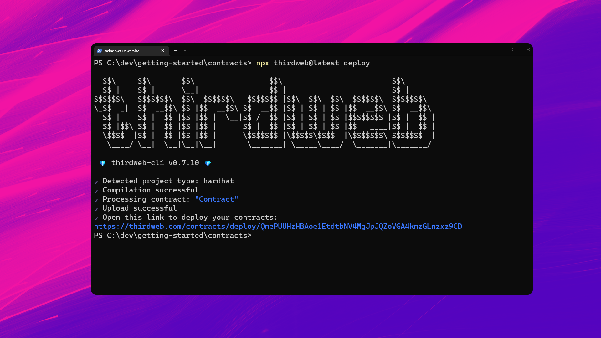
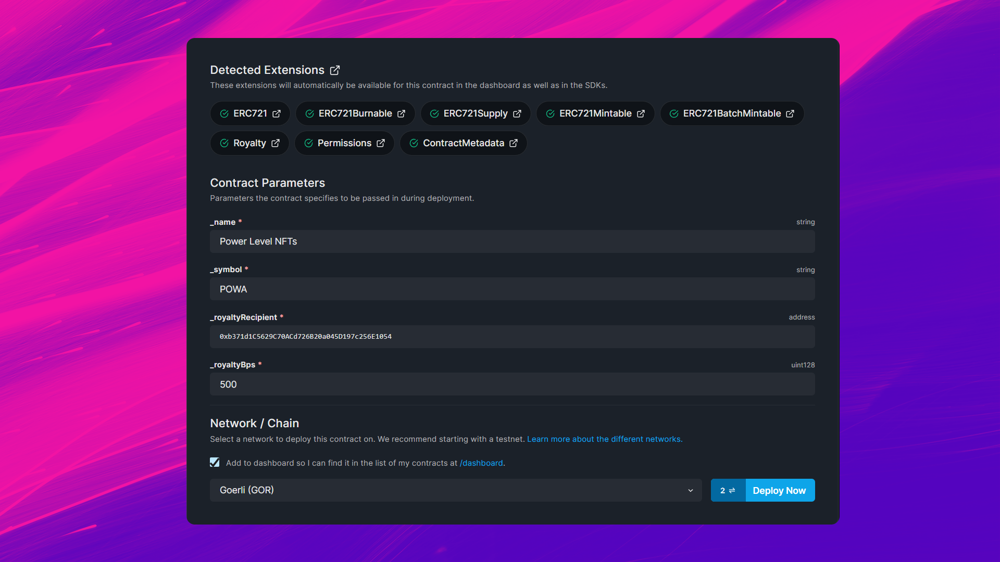

import QuickstartCard from "@components/QuickstartCard";
import TwitterCard from "@components/ShareOnTwitterCard";

# Build A Contract

Let's see what you can do with thirdweb! In this quickstart, we'll show you how to:

1. Build & deploy a smart contract
2. Create an application to interact with the contract
3. Release your contract to the world!

have an introduction page

change this to be about the final project (link to a replit of a working demo)

## Creating A Project

First, we can use the [CLI](https://github.com/thirdweb-dev/thirdweb-cli) to create a new project with a smart contract inside, and [Extensions](/extensions) installed for us.

```bash
npx thirdweb create --contract
```

Let's name our project `contracts` and select `Hardhat` as our framework.

Next, select the [ERC721 Base](/extensions/base-contracts/erc-721/erc721base) contract as our starting point,
which gives us an implementation of the [ERC721A](/extensions/erc-721/standard) NFT standard that we can modify and extend.


Open up the project in your text editor - let's see what's inside 👀.

### Exploring the project

Inside the `contracts` folder, you'll find a `Contract.sol` file; this is our smart contract written in Solidity!

If we take a look at the code, you can see that our contract is inheriting the functionality of the [ERC721Base](/extensions/base-contracts/erc-721/erc721base),
by:

1. Importing the contract.
2. [Inheriting](https://docs.soliditylang.org/en/v0.8.12/contracts.html#inheritance) the contract, by declaring that our contract `is ERC721Base`.
3. Implementing any [required methods](/extensions/base-contracts/erc-721/erc721base#implementing-the-contract) such as the `constructor`.

```solidity title="contracts/Contract.sol"
// SPDX-License-Identifier: MIT
pragma solidity ^0.8.0;

import "@thirdweb-dev/contracts/base/ERC721Base.sol";

contract Contract is ERC721Base {
      constructor(
        string memory _name,
        string memory _symbol,
        address _royaltyRecipient,
        uint128 _royaltyBps
    )
        ERC721Base(
            _name,
            _symbol,
            _royaltyRecipient,
            _royaltyBps
        )
    {}
}
```

This pattern lets us incorporate functionality from other contracts inside of ours, modify it, and add our own custom logic on top.
For example, our contract currently implements all of the logic inside
the [ERC721Base.sol](https://github.com/thirdweb-dev/contracts/blob/main/contracts/base/ERC721Base.sol) contract.

## Adding Functionality

Base contracts work out of the box without any additional code required, but you might want to add additional functionality.
Let's see how we can both _override_ and _extend_ the base contract.

### Adding A Feature

Features are a great way to add individual pieces of functionality to your contract, such as [Permissions](/extensions/features/permissions).

You can follow the same pattern as we did with the base contract:

1. Import it

```solidity
import "@thirdweb-dev/contracts/extension/PermissionsEnumerable.sol";
```

2. Inherit it

```solidity
contract Contract is ERC721Base, PermissionsEnumerable {
    // ...
}
```

3. Implement it

```solidity
contract Contract is ERC721Base, PermissionsEnumerable {
      constructor(
        string memory _name,
        string memory _symbol,
        address _royaltyRecipient,
        uint128 _royaltyBps
    )
        ERC721Base(
            _name,
            _symbol,
            _royaltyRecipient,
            _royaltyBps
        )
    {
        // Give the contract deployer the "admin" role when the contract is deployed.
        _setupRole(DEFAULT_ADMIN_ROLE, msg.sender);
    }
}
```

That's it! We can now restrict who can call certain functions on our contract.

### Adding Custom Logic

Let's combine our new feature with some custom logic to create a new function that only the `admin` role can call.

Above the constructor, let's add a `powerLevel` mapping that stores a power level for each NFT.

```solidity
// A mapping is a key-value store that lets us keep data in our contract.
// Here, the key is the token ID, and the value is the power level for that NFT.
mapping(uint256 => uint256) public powerLevel;
```

Next, let's add a function that lets the `admin` role set the power level of an NFT:

```solidity
function setPowerLevel(uint256 _tokenId, uint256 _powerLevel) external onlyRole(DEFAULT_ADMIN_ROLE) {
    powerLevel[_tokenId] = _powerLevel;
}
```

Great! Now the admin wallet (the contract deployer) can set the power level for any NFT.

### Override An Inherited Method

Finally, let's see how we can override a method in the base contract.

Let's say we want to add a power level to the NFT when it's minted.

We can override the `mintTo` method from the base contract, and add our custom logic inside.

```solidity
function mintTo(address _to, string memory _tokenURI) public virtual override {
    // Grab the next token ID being minted using an inherited view.
    uint256 tokenId = nextTokenIdToMint();

    // Here, "super" refers to the base contract.
    // We are saying "run the mintTo method from the base contract".
    super.mintTo(_to, _tokenURI);

    // *then* we can add our custom logic on top:
    powerLevel[tokenId] = tokenId;
}
```

## Deploying

We're ready for liftoff! 🚀 Let's [deploy](/deploy) our contract to the blockchain, by running:

```bash
npx thirdweb deploy
```

That's it! 🥳 This command does the following:

- Compiles your contract.
- Uploads your contract source code ([ABI](https://docs.soliditylang.org/en/v0.8.17/abi-spec.html)) to IPFS.
- Opens the [dashboard](/dashboard) for you to select one of our [supported networks](https://blog.thirdweb.com/guides/which-network-should-you-use/) to deploy to.



From the dashboard, we can see all of the [Extensions](/extensions) that our contract implements.

For each extension, we unlock capabilities in the [dashboard](/dashboard) and the [SDK](/sdk). _We'll learn more about that in the next section_.

First, we need to enter the parameters for our contract:

- `_name`: The name of our contract
- `_symbol`: The symbol or "ticker" given to our contracts tokens
- `_royaltyRecipient`: The address of the account that will receive the royalties from secondary sales
- `_royaltyBps`: The **basis points** (_bps_) that will be given to the royalty recipient for each secondary sale, e.g. 500 = 5%

Finally, select the [network](https://blog.thirdweb.com/guides/which-network-should-you-use/)
you want to deploy to _(we recommend the Goerli test network)_, and click "Deploy Now".



### Your Contract Dashboard

Welcome to your very own contract dashboard! 🎉

Here, you'll find all of the information you need to interact with and manage your contract, including:

- [`Explorer`](/dashboard/view-and-interact-with-contracts): call any function on your contract, and view the results.
- [`Events`](/dashboard/activity-feed): a live-updating feed of all [events](https://docs.soliditylang.org/en/v0.8.15/contracts.html#events) emitted by your contract.

As well as tabs for each [extension](/extensions) that your contract implements:

- `NFTs`: since you implemented the [ERC721 Standard](/extensions/base-contracts/erc-721/erc721base).
- `Permissions`: since you implemented the [Permissions](/extensions/features/permissions#permissions-enumerable-contract) feature.
- `Settings`: since you implemented the [Contract Metadata](/extensions/features/contract-metadata) and [Royalty](/extensions/features/royalty) features.

<TwitterCard
  text={`I just deployed a contract on @thirdweb_ 🚀 Check it out here: <share your dashboard url to the world!>`}
/>
