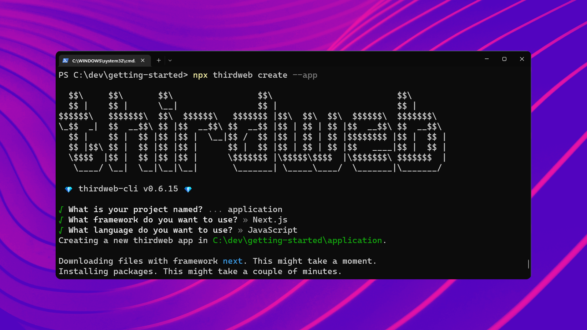
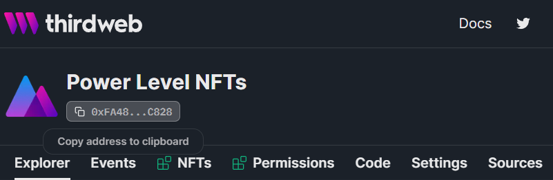

import QuickstartCard from "@components/QuickstartCard";
import TwitterCard from "@components/ShareOnTwitterCard";

# Create An Application

You just [built and deployed](/getting-started/creating-custom-contracts) a smart contract to the blockchain. Congratulations!

Now, let's see how we can build an application that interacts with it.

## Creating A Project

Run the following command to create a web application with the [React](/react) and [JavaScript](/typescript) SDKs installed for us.

```bash
npx thirdweb create --app
```

Select `Next.js` as the framework and `JavaScript` as the language.



Open up the project in your text editor - let's see what we're working with!

### Exploring the project

Inside the [`_app.jsx`](https://github.com/thirdweb-example/next-javascript-starter/blob/main/pages/_app.js#L8-L10) file,
you'll find the [`ThirdwebProvider`](/sdk/set-up-the-sdk/frontend#manual-installation) wrapping the entire application.

This allows us to use all of the [React SDK](/react) hooks and components in our application, and configure a `desiredChainId`;
which declares [which blockchain & network](https://blog.thirdweb.com/guides/which-network-should-you-use/) our smart contracts live on.

Since we deployed our smart contract to the `Goerli` network, we'll set the `desiredChainId` to `ChainId.Goerli`.

```jsx title="pages/_app.jsx"
import { ThirdwebProvider, ChainId } from "@thirdweb-dev/react";

// Here we can specify the chainId our app should run on
// In this example, we'll use the Ethereum Goerli Testnet
const desiredChainId = ChainId.Goerli;

export const MyApp = () => {
  return (
    <ThirdwebProvider desiredChainId={desiredChainId}>
      <Component {...pageProps} />
    </ThirdwebProvider>
  );
};
```

On the [`index.jsx`](https://github.com/thirdweb-example/next-javascript-starter/blob/main/pages/index.js#L5)
you'll find a [Connect Wallet button](/sdk/ui-components/connectwalletbutton) that allows users to connect their wallet to our application.

```jsx title="pages/index.jsx"
import { ConnectWallet } from "@thirdweb-dev/react";

export default function Home() {
  return <ConnectWallet accentColor="#f213a4" colorMode="light" />;
}
```

## Building the App

Now that we have a project set up, let's start interacting with our smart contract.

### Connecting

First, let's connect to our smart contract.

To do that, we'll need our contract address; which you can get from the dashboard:



Then, pass that value into the [`useContract`](/sdk/interacting-with-contracts/custom-contracts/getting-a-contract#connect-to-a-contract)
hook like so:

```jsx title="pages/index.jsx"
import { ConnectWallet } from "@thirdweb-dev/react";

export default function Home() {
  const { contract } = useContract("<CONTRACT_ADDRESS>");

  // Now you can use the contract in the rest of the component!
}
```

### Reading Data

Now that we have a connection to our smart contract, let's see how we can read data from it using our React hooks.

The [`useContractRead`](/sdk/interacting-with-contracts/custom-contracts/using-contracts) let's you read any data from your smart contract.

We can do better than that though! 😉 For each of the [extensions](/extensions) you've added to your smart contract,
you unlock specialized functionality to use that

### Calling Functions

hey

<TwitterCard
  text={`I just built an NFT minting dapp with @thirdweb_ 🔥 Check out the NFT I made: <share your dashboard url to the world!>`}
/>
