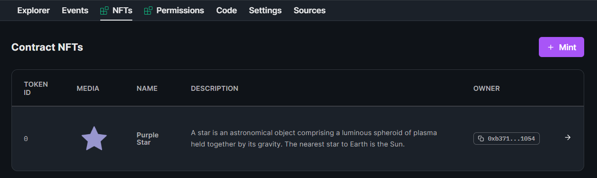
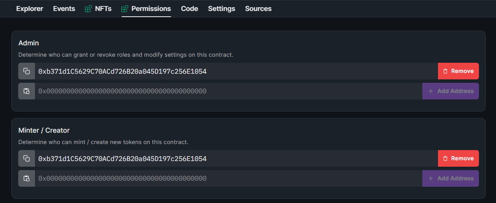

import QuickstartCard from "@components/QuickstartCard";
import TwitterCard from "@components/ShareOnTwitterCard";

# Manage Your Contract

The [dashboard](/dashboard) is a central location where you and your team can manage and analyze your smart contract,
with tools that allow you to perform common admin operations, with features such as:

- **Contract Explorer**: Execute any function on your contract, and see the results in real-time.
- **Events**: View A live-updating feed of [events](https://docs.soliditylang.org/en/v0.8.17/contracts.html#events) emitted by your contract.
- **Settings**: Update contract metadata, royalty and platform fees, and more.
- **Sources**: View all of your contract's source code, and verify your contract on Etherscan.
- **Code**: Learn how to use the [SDK](/sdk) to interact with your contract.

Each [extension](/contractkit/extensions) you implement also unlocks additional features in the dashboard. For example,
the contract you deployed in the previous step has the `NFTs` and `Permissions` tabs unlocked.

### Contract Explorer

Connect your wallet and execute any available function on your smart contract directly from the dashboard.

### NFTs

Since our contract implements the [ERC721](/contractkit/interfaces/erc721) standard, we unlock the `NFTs` tab in the dashboard.

Here, we can see all of the NFTs minted by our contract, and even mint new ones.

### Permissions

As our contract also implements the [Permissions](/contractkit/extension-contracts/permissions) extension, we unlock the `Permissions` tab in the dashboard.

Easily invite members of your team with tiered permission levels, and manage their access to your contract.

### Code

The Code tab provides the steps to creating a new application with our [SDK](/sdk), and interacting with your contract.

Let's take a look at how we can use the SDK to build a web application next:

  

    <QuickstartCard
      name="Next Up: Build An Application with the SDK"
      link="/getting-started/apps"
      image="/assets/product/sdk.png"
    />
  

