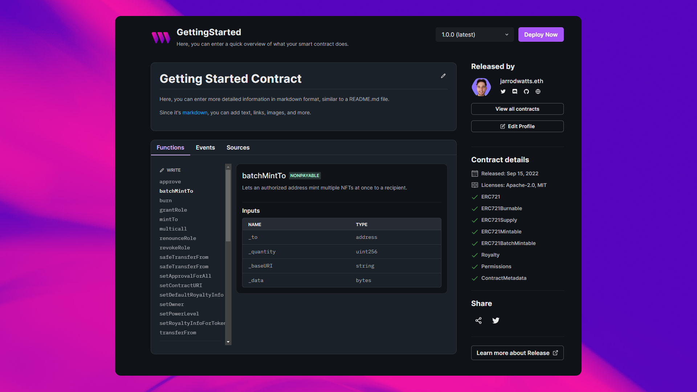
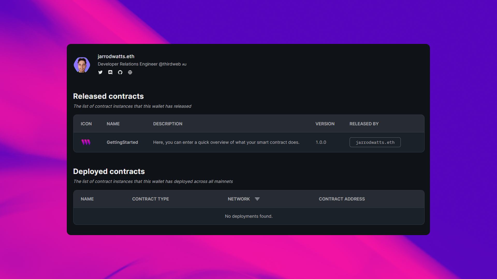

import QuickstartCard from "@components/QuickstartCard";
import TwitterCard from "@components/ShareOnTwitterCard";

# Release A Contract

In a traditional software development workflow, you improve your code over time,
and _release_ incremented versions of your software that other people can use; typically
through a registry such as [npm](https://docs.npmjs.com/about-the-public-npm-registry).

**[Release](/release) brings this workflow to your smart contracts**, allowing you to release iterations
of your contract to the world and have other users deploy them, view the source code, and more.

Let's see how we can release the contract we wrote in the [previous section](/getting-started/creating-custom-contracts)!

From within the `contracts` folder, run the following command using the [CLI](/cli):

```bash
npx thirdweb release
```

This command, _similar to `deploy`_, does the following:

- Compiles your contract.
- Uploads your contract source code ([ABI](https://docs.soliditylang.org/en/v0.8.17/abi-spec.html)) to [IPFS](https://docs.ipfs.tech/concepts/what-is-ipfs/).
- Opens the [dashboard](/dashboard) for you to release your contract onto the registry.


From the dashboard, you can enter information about your smart contract, as well as release notes for this version.


Click **Create Release** and accept the [gasless transaction](/sdk/advanced-features/gasless-transactions) from your wallet to release your contract.

## Your Contract Landing Page

After you release your contract, you'll have a landing page for it on the thirdweb website.

From this page, anybody can view all of the information about your contract, including:

- The contract's name, description, and version.
- The source code and all of the functions available in the contract.
- Release date, license, and any [extensions](/contract-kit/features) you implemented.
- Any release notes you added.

Most importantly, anybody can now deploy this contract in one click, by clicking **Deploy Now** from this page!



## Your Profile Page

Your wallet address is tied to your on-chain profile, and each release you make is associated with your address.

Other users can view your profile to see all of the contracts you've released,
as well as any other information you've added; such as your name, profile picture, and social media links.

If you have an [ENS Domain](https://ens.domains/) set up in your wallet,
it is automatically detected and set as your [profile's URL](https://thirdweb.com/jarrodwatts.eth); giving you an easy way to verify your identity and prove ownership of your contracts.



Congratulations! Your contract is ready for the world to use. 🎉

Let us know what you release by tagging us on Twitter:

<TwitterCard
  text={`I just uploaded my contract to @thirdweb_'s on-chain smart contract registry 🔥 Check out my contract <share your release url to the world!>`}
/>

## What's Next?

Amazing work completing the getting started guide. 🎉

If you're looking for fun project ideas to take your skills to the next level, check out our templates:

<div className="row" style={{ marginBottom: 24 }}>
  <div className="col col--12" style={{ marginTop: 8 }}>
    <QuickstartCard
      name="Templates - Build Anything!"
      link="/templates"
      image="/assets/icons/education.png"
    />
  </div>
</div>
