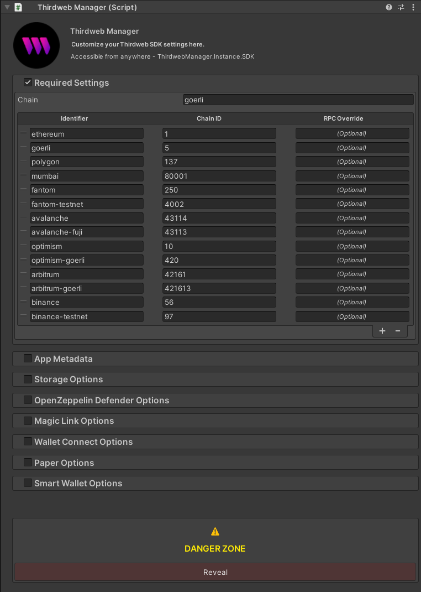

The `ThirdwebManager` is a MonoBehaviour that provides a convenient and customizable way to instantiate and manage the [ThirdwebSDK](/unity/thirdwebsdk). Add the prefab to your scene and the SDK will persist throughout your game's lifecycle. It can be found at `Thirdweb/Core/Prefabs/ThirdwebManager`.



## Configuration

Configure `ThirdwebManager` through the Unity Inspector window. Here are the sections and their respective settings:

### General Settings

This section involves the basic blockchain configurations. Adjust the following settings:

- `Active Chain`: The identifier for the default blockchain to use.
- `Supported Chains`: A list of all blockchains your game supports. For each chain, provide an identifier, a chain ID, and optionally, an RPC override.
- `Client ID`: Thirdweb [API Key](https://thirdweb.com/api-key). Used for default thirdweb services such as Storage and Account Abstraction.
- `Bundle ID Override`: Optional override for the bundle ID used by thirdweb services. Defaults to Application Identifier and can be fetched using `Utils.GetBundleId()`.
- `Initialize On Awake`: Whether the SDK should initialize on awake or not. If not, you can call `ThirdwebManager.Instance.Initialize("chain-identifier")` to initialize it manually.
- `Show Debug Logs`: Whether to show thirdweb sdk debug logs.
- `Thirdweb Config`: SciptableObject for additional Thirdweb configuration. Generated automatically. Mainly used to set custom schemes for google login.

### App Metadata

This section lets you define how your app appears in wallet providers like Metamask, WalletConnect, etc. Modify the following fields:

- `App Name`: The name of your application.
- `App Description`: A brief description of your app.
- `App Icons`: Your app's icons.
- `App URL`: The URL for your app.

### Storage Options

Here, you can specify the URL for your IPFS gateway, which stores your assets in a decentralized way. Edit the following:

- `Storage IPFS Gateway Url`: The URL for your IPFS gateway.

### OpenZeppelin Defender Options

In this section, configure settings for OpenZeppelin Defender, a service that handles gasless transactions for your users. Adjust the following:

- `Relayer Url`: The URL for your relayer service.
- `Forwarder Address`: The address of your forwarder contract.
- `Forwarder Domain Override` and `Forwarder Version Override`: Optional settings if you want to override the defaults for OpenZeppelin Defender.

### Wallet Connect Options

Here, provide your project ID for WalletConnect:

- `WalletConnect Project ID`: Your project ID for WalletConnect.
- `WalletConnect Explorer RecommendedWallet Ids`: Wallets to show in the WalletConnect Modal in WebGL (https://walletconnect.com/explorer)

### Smart Wallet Options

These settings are required to set up a smart wallet. Adjust the following:

- `Factory Contract Address`: The address of your smart wallet factory contract.
- `Thirdweb API Key`: Your API key for Thirdweb.
- `Gasless`: Whether or not you want to use gasless transactions.
- `Bundler Url`, `Paymaster Url`, `EntryPoint Address`: Optional overrides for setting up your smart wallet.

### Native Prefabs (Danger Zone)

This section allows you to provide GameObject prefabs for native wallet providers, which will be instantiated at runtime. Adjust the following:

- `WalletConnect Prefab`: The prefab for WalletConnect's customizeable UI/behavior.
- `Metamask Prefab`: The prefab for Metamask's customizeable UI/behavior.
- `EmbeddedWallet Prefab`: The prefab for EmbeddedWallet's customizeable UI/behavior.

## Accessing the SDK

Once `ThirdwebManager` is set up and the game starts, it will instantiate the Thirdweb SDK based on your settings. You can access the instantiated SDK from other scripts using:

```csharp
var sdk = ThirdwebManager.Instance.SDK;
```
