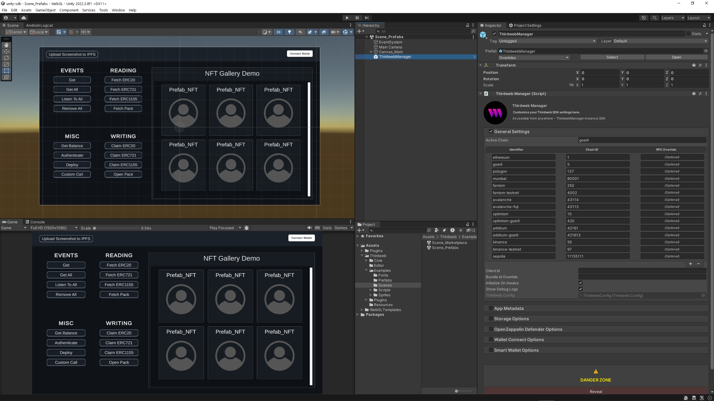
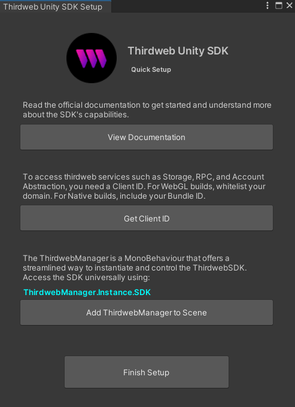

import Tabs from "@theme/Tabs";
import TabItem from "@theme/TabItem";
import GettingStartedLiveEditor from "@components/live-code/snippets/GettingStartedLiveEditor";

Before getting started, you'll need to
[download and install the Unity Hub and Unity Editor](https://learn.unity.com/tutorial/install-the-unity-hub-and-editor).

:::info API Key
We recommend using an API key to use thirdweb’s default infrastructure services with the SDK such as RPC, Storage and Account Abstraction. If you haven’t created a key yet you can do so for free from the [**thirdweb dashboard**](https://thirdweb.com/create-api-key).
:::

Import the thirdweb SDK, by downloading the `.unitypackage` file for the version of the SDK
you want to use (_usually you’ll want the latest version_) from the
[Releases page](https://github.com/thirdweb-dev/unity-sdk/releases) on the GitHub repository.

Drag and drop the package into your Unity project. Feel free to deselect common packages like Newtonsoft if you already have them.

Play around in our example `Scene_Prefabs` to test out the SDK!

Now you’re ready to use the SDK. In your `Project` window, navigate to `Thirdweb` > `Core` > `Prefabs` > `ThirdwebManager` drag it into your scene. This [ThirdwebManager](./ThirdwebManager) acts as a singleton manager class for your Thirdweb SDK, providing a convenient interface for setting up and controlling SDK parameters directly from the Unity inspector.

Alternatively, use our handy quickstart installer! Accessible from the top level `Tools > Thirdweb` menu.

All the configurable parameters are annotated with tooltips, just hover over them in the inspector to understand their purpose. After you have set up your [ThirdwebManager](./ThirdwebManager) according to your needs, you can access the SDK from any script using `ThirdwebManager.Instance.SDK`.

For help building your first scene, check out the Unity SDK [Build Settings](https://github.com/thirdweb-dev/unity-sdk#build)
