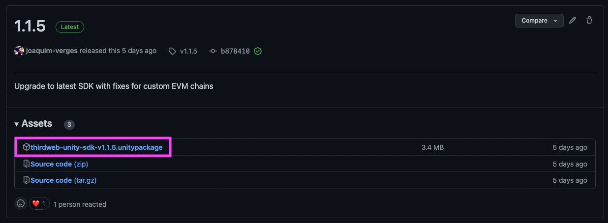
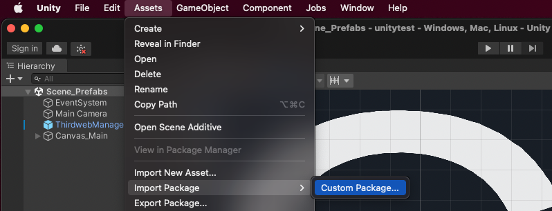
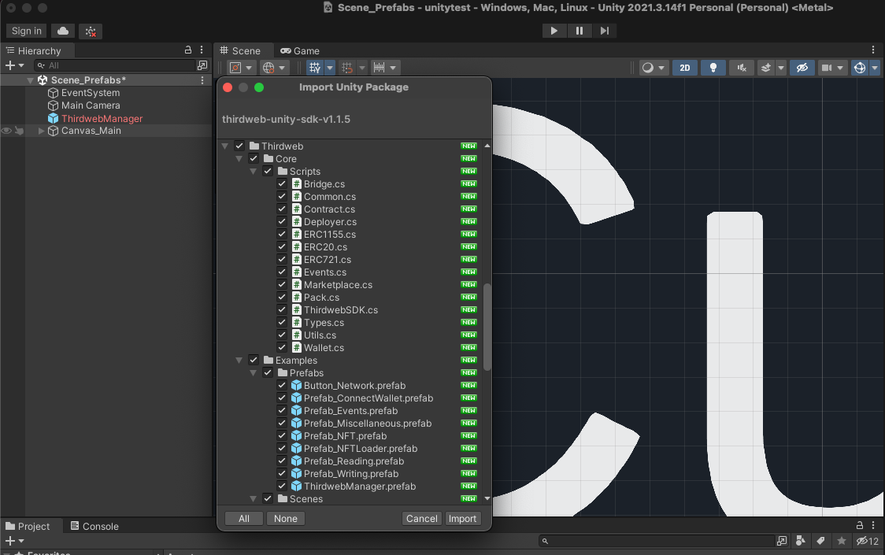
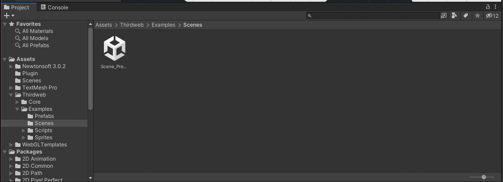

import Tabs from "@theme/Tabs";
import TabItem from "@theme/TabItem";
import GettingStartedLiveEditor from "@components/live-code/snippets/GettingStartedLiveEditor";

Before getting started, you'll need to
[download and install the Unity Hub and Unity Editor](https://learn.unity.com/tutorial/install-the-unity-hub-and-editor).

Import the thirdweb SDK, by downloading the `.unitypackage` file for the version of the SDK
you want to use (_usually you&rsquo;ll want the latest version_) from the
[Releases page](https://github.com/thirdweb-dev/unity-sdk/releases) on the GitHub repository:



Add the package to your Unity project by clicking `Assets` > `Import Package` > `Custom Package` like so:



Select the `.unitypackage` file you just downloaded from GitHub to open the `Import Unity Package` menu.

Leave the default files selected, and click `Import`:



In your `Project` window now, you'll be able to see all of the resources that were imported:



Now you&rsquo;re ready to use the SDK. Use any of the prefabs, scenes, or scripts that come within the `Examples` folder,
or create your own script and instantiate the SDK to get started. We recommend at least using the `ThirdwebManager` prefab.

```csharp
using UnityEngine;

// Import the Thirdweb SDK namespace
using Thirdweb;

public class ThirdwebSDKDemos : MonoBehaviour
{
    // Create a Thirdweb SDK instance to use throughout this class
    private ThirdwebSDK sdk;

    void Start()
    {
        // When the app starts, set up the Thirdweb SDK
        // Here, we're setting up a read-only instance on the "goerli" test network.
        sdk = new ThirdwebSDK("goerli");
    }
}
```

## Building Tips

### WebGL
- Open your `Build Settings`, select `WebGL` as the target platform.
- Open `Player Settings` > `Resolution and Presentation` and under WebGLTemplate choose `Thirdweb`.
- In Player Settings > Other Settings disable Auto Graphics API.
- Set `Compression Format` to `Disabled` in `Player Settings` > `Publishing Settings`.
- `Smaller (faster) Builds` in the B`uild Settings` is preferred.
- `Build and Run` to test out your game in a browser locally.

### Native platforms:
- Make sure there is a `ThirdwebManager` prefab in your scene.
- If using prefabs, use `Prefab_ConnectWalletNative` instead of `Prefab_ConnectWallet`.
- If using `WalletConnect`, make sure the `WalletConnect` prefab is also in your scene.
- Using the SDK in the editor (pressing `Play`) is an accurate reflection of what you can expect to see on native platforms.
- Use `IL2CPP` over `Mono` as your scripting backend in `Player Settings` > `Other Settings` when possible. Currently, this is not a requirement for Standalone platforms.

### Mobile
- Use `Smaller (faster) Builds` in the `Build Settings`.
- If building to mobile and running into RPC issues, it is best to run `Force Resolve` from the `Assets` menu > `External Dependency Manager` > `Android Resolver` > `Force Resolve` for example, and build again. The external dependency manager is included as part of our package.
- For more advanced users wanting to leverage more of Android's capabilities for one reason or another, feel free to edit the Resolver's settings and under `Player Settings` > `Publishing Settings` play around with custom gradle templates.
