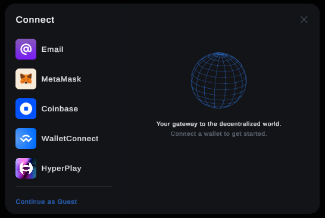

The `ConnectWallet` prefab allows users to connect their wallet to your game. It is intended
for use in [WebGL](https://docs.unity3d.com/Manual/webgl-building.html) based games, where a browser
environment is available; thus enabling the use of browser extensions such as [MetaMask](https://metamask.io/).

When a user clicks the button, a dropdown of [supported wallets](#supported-wallets) will appear. The user can then
select their preferred wallet to connect to the game; once connected, the button will show the user&rsquo;s balance and an option to
[switch networks](#support-switching-networks).

The prefab is located at: `Assets/Thirdweb/Examples/Prefabs/Prefab_ConnectWallet.prefab`.

## Configuration

From the `Inspector` window, you can configure the options for the `ConnectWallet` prefab.

### Supported Wallets

The list of wallets you want to support.
Each wallet you provide appears as a button in the dropdown.

Supports `Injected` (window.ethereum), `MetaMask`, `Coinbase Wallet`, `Wallet Connect`, `Magic Auth`.

### Support Switching Networks

The list of networks you want to support.

Once connected, user&rsquo;s can switch between networks,
each network you provide appears as an option.

Supports any of the default chains.

  
View default chains

  

    <ul>
      <li>
        <b>Ethereum</b>: <code>"ethereum"</code>
      </li>
      <li>
        <b>Goerli</b>: <code>"goerli"</code>
      </li>
      <li>
        <b>Polygon</b>: <code>"polygon"</code>
      </li>
      <li>
        <b>Mumbai</b>: <code>"mumbai"</code>
      </li>
      <li>
        <b>Arbitrum One</b>: <code>"arbitrum"</code>
      </li>
      <li>
        <b>Arbitrum Goerli</b>: <code>"arbitrum-goerli"</code>
      </li>
      <li>
        <b>Optimism</b>: <code>"optimism"</code>
      </li>
      <li>
        <b>Optimism Goerli Testnet</b>: <code>"optimism-goerli"</code>
      </li>
      <li>
        <b>Binance SmartChain</b>: <code>"binance"</code>
      </li>
      <li>
        <b>Binance SmartChain Testnet</b>: <code>"binance-testnet"</code>
      </li>
      <li>
        <b>Fantom Opera</b>: <code>"fantom"</code>
      </li>
      <li>
        <b>Fantom Testnet</b>: <code>"fantom-testnet"</code>
      </li>
      <li>
        <b>Avalanche C Chain</b>: <code>"avalanche-fuji"</code>
      </li>
      <li>
        <b>Avalanche Fuji Testnet</b>: <code>"avalanche-fuji-testnet"</code>
      </li>
      <li>
        <b>Localhost</b>: <code>"localhost"</code>
      </li>
    </ul>
  

### Custom Callbacks

Custom logic to run whenever an event occurs on the button, including:

- `OnConnected`: Triggered when the user connects their wallet successfully.
- `OnDisconnected`: Triggered when the user disconnects their wallet successfully.
- `OnSwitchNetwork`: Triggered when the user switches networks successfully.
- `OnFailedConnect`: Triggered when the user fails to connect their wallet.
- `OnFailedDisconnect`: Triggered when an error occurs after attempting to disconnect a wallet.
- `OnFailedSwitchNetwork`: Triggered when an error occurs after attempting to switch networks.
