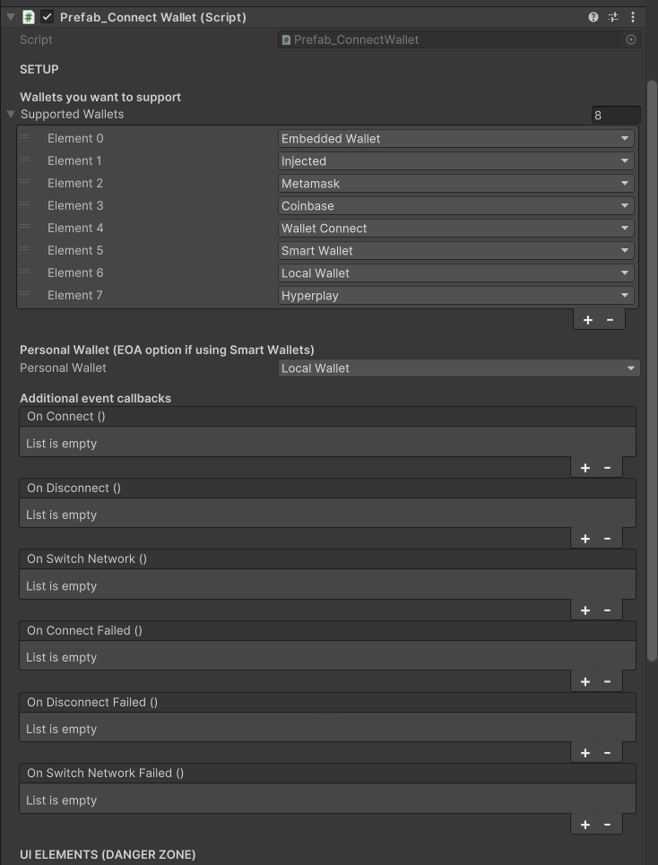

The `ConnectWallet` prefab allows users to connect their wallet to your game.

It uses the [ThirdwebManager](/unity/ThirdwebManager) to determine which networks to display as well as the secondary UI related to certain providers such as WalletConnect.

You can set up which wallets you want to support from the Prefab_ConnectWallet Inspector directly.

When a user clicks the button, a dropdown of [supported wallets](#supported-wallets) will appear. The user can then
select their preferred wallet to connect to the game; once connected, the button will show the user&rsquo;s balance and an option to
switch networks if multiple networks are set up through the ThirdwebManager.

The prefab is located at: `Assets/Thirdweb/Examples/Prefabs/Prefab_ConnectWallet.prefab`.

## Configuration

From the `Inspector` window, you can configure the options for the `ConnectWallet` prefab. The UI will update in Play mode, and it is fully customizable.

### Supported Wallets

The list of wallets you want to support.
Each wallet you provide appears as a button in the dropdown.

Supports `EmbeddedWallet`, `MetaMask`, `Coinbase`, `WalletConnect`, `LocalWallet`, `HyperPlay`, `Injected` (window.ethereum).

Some wallet providers may not be supported on some native platforms.

You can turn any of these wallets into a `SmartWallet` by checking the `Use Smart Wallets` checkbox.

### Use Smart Wallets

When checked, the wallet provider will be wrapped in a `SmartWallet` which will allow you to use [SmartWallet features](/unity/wallet/SmartWallet).

### Events

You can set up events to be triggered when the user connects, switches network or disconnects their wallet, from the inspector.
