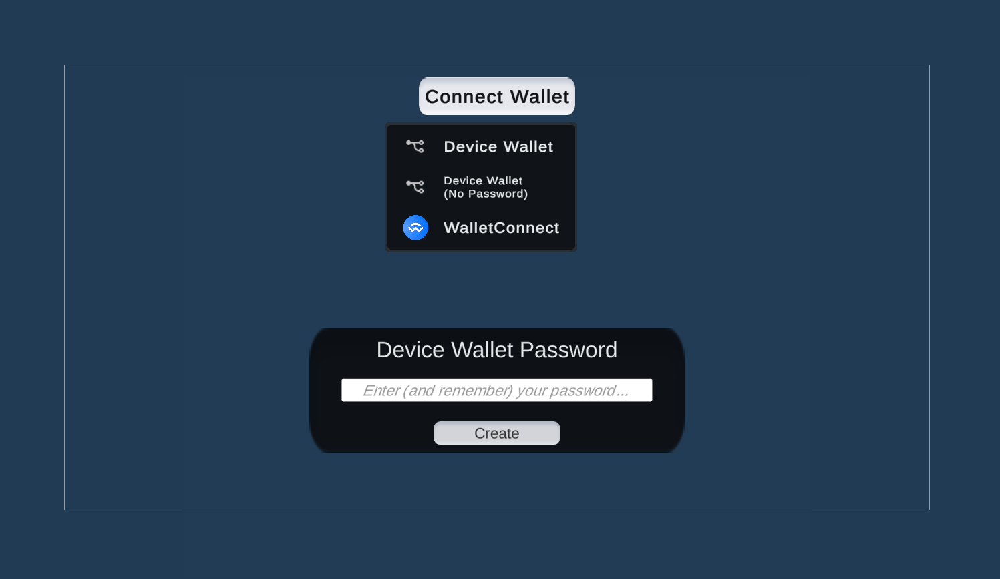

The `ConnectWalletNative` prefab allows users to connect their wallet to your game. It is intended
for use in "native" games, i.e. non-WebGL-based games, such as iOS, Android, console, etc. where a browser
environment is **not** available.

When a user clicks the button, a dropdown of [supported wallets](#supported-wallets) will appear. The user can then
select their preferred wallet to connect to the game.

The prefab is located at: `Assets/Thirdweb/Examples/Prefabs/Prefab_ConnectWalletNative.prefab`.

## Configuration

From the `Inspector` window, you can configure the options for the `ConnectWalletNative` prefab.

### Supported Wallets

The list of wallets you want to support.
Each wallet you provide appears as a button in the dropdown.

#### Device Wallet

Create a new wallet on behalf of the user and store the wallet&rsquo;s private key on the device.

The user must then enter a password that they will use to unlock the wallet in the future.

Subsequent connections from this device will use the same wallet, and require the same password in order to unlock it.

#### Device Wallet (No Password)

Create a new wallet on behalf of the user and store the wallet&rsquo;s private key on the device.

Subsequent attempts to connect with this wallet will use the same wallet, and will not require a password.

#### WalletConnect

Connect to a wallet using the [WalletConnect](https://walletconnect.org/) protocol.

On Standlone platforms, this shows the user a QR code that they can scan with their mobile device to connect their wallet to your game.
On Mobile, this opens a deep link to request a connection from their wallet app.

### Custom Callbacks

Custom logic to run whenever an event occurs on the button, including:

- `OnConnected`: Triggered when the user connects their wallet successfully.
- `OnDisconnected`: Triggered when the user disconnects their wallet successfully.
- `OnFailedConnect`: Triggered when the user fails to connect their wallet.
- `OnFailedDisconnect`: Triggered when an error occurs after attempting to disconnect a wallet.

### About Device Wallet
- Use one wallet option for native to keep things simple unless you know what you're doing
- Device Wallets are not meant to be exported (bad UX, allow crypto native users to transfer assets out instead)
- Device Wallets with the No Password option will use the [device unique identifier](https://docs.unity3d.com/ScriptReference/SystemInfo-deviceUniqueIdentifier.html) to auto-create it 
- Device Wallets are non-custodial - password is non-recoverable (unless you implement your own recovery system)
- If you must export a device wallet, you can find account.json under [Application.persistentDataPath](https://docs.unity3d.com/ScriptReference/Application-persistentDataPath.html) and use that to import into Metamask with your password, or delete it to create a new one.
