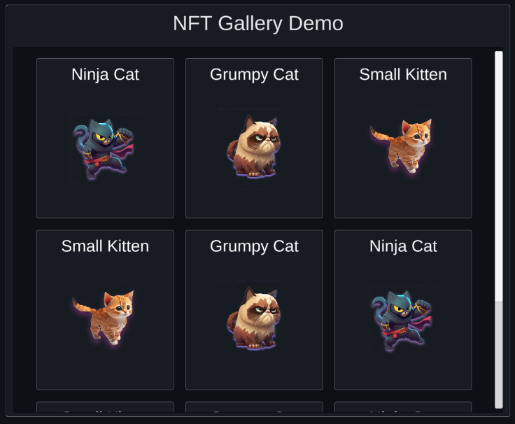

The `NFTLoader` prefab allows you to load metadata of NFTs and display them in your scene.

It supports loading one NFT, multiple different NFTs, or all the NFTs a user owns in their wallet from a collection.

Each NFT&rsquo;s metadata is loaded from the token&rsquo;s `uri` property and displayed on the UI.

The prefab is located at: `Assets/Thirdweb/Examples/Scripts/Prefabs/Prefab_NFTLoader.cs`.

## Configuration

From the `Inspector` window, configure what NFTs you want to display.

All NFTs loaded from the configuration will be displayed in the same gallery.

### Load One NFT

Provide a list of `SingleQuery` structs each containing a `contractAddress`, `tokenId`, and `type` field.

Using the [`Get`](/unity/erc721#get) method, each NFT&rsquo;s metadata is fetched individually and displayed on the UI.

  
Configuration

  

#### contractAddress

The smart contract address of the NFT collection.

#### tokenId

The token ID of the NFT to load.

#### type

The type of NFT to load. Either `ERC721` or `ERC1155`.

### Load Multiple NFTs

Provide a list of `MultiQuery` structs each containing a `contractAddress`, `startID`, `count`, and `type` field.

Using the [`GetAll`](/unity/erc721supply#getall) method, each NFT&rsquo;s metadata is fetched in bulk and displayed on the UI.

  
Configuration

  

#### contractAddress

The smart contract address of the NFT collection.

#### startID

The token ID to start loading NFTs from.

#### count

The number of NFTs to load (starting from `startID`).

#### type

The type of NFT to load. Either `ERC721` or `ERC1155`.

### Load Owned NFTs

Provide a list of `OwnedQuery` structs each containing a `contractAddress`, `owner`, and `type` field.

Using the [`GetOwned`](/unity/erc721enumerable#getowned) method, each NFT&rsquo;s metadata is fetched in bulk and displayed on the UI.

  
Configuration

  

#### contractAddress

The smart contract address of the NFT collection.

#### owner

The wallet address of the wallet to load NFTs for.

#### type

The type of NFT to load. Either `ERC721` or `ERC1155`.

