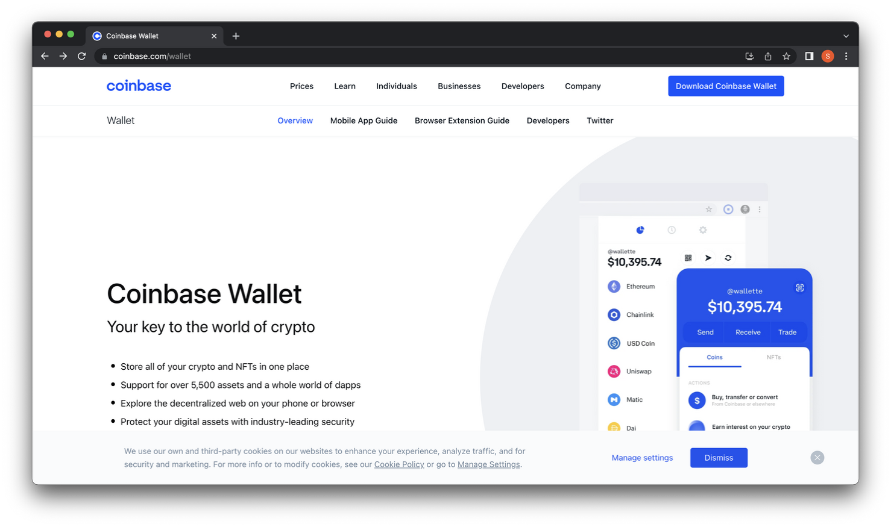
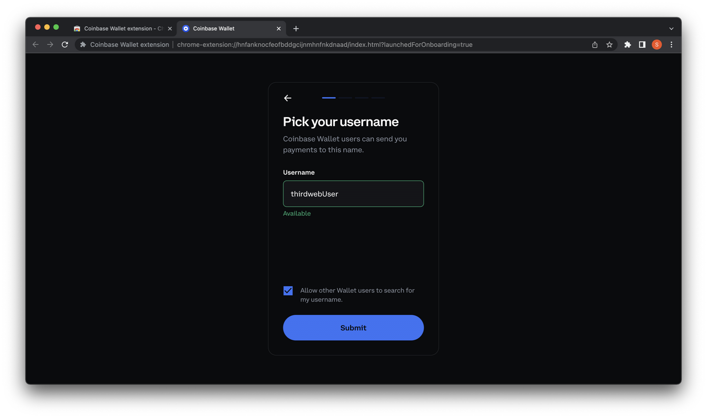
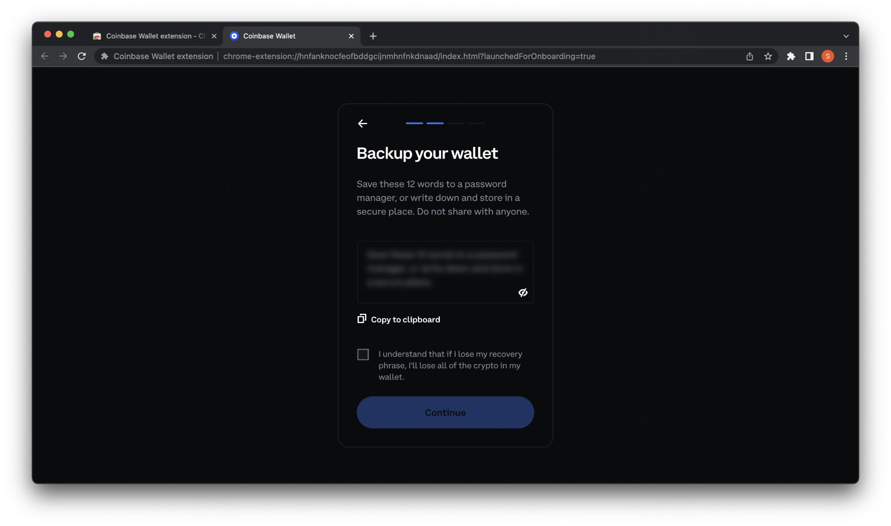
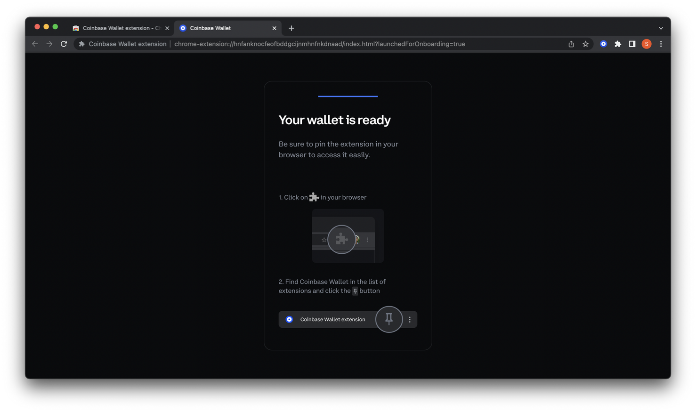

## Intro

To create a token, an NFT, or deploy any other sort of contract on a blockchain, you will need to have a crypto wallet.
In this guide, we will create a Coinbase Wallet using the Coinbase browser extension. 
 
## Download the Coinbase Wallet

Navigate to [Coinbase](https://coinbase.com/wallet) and click the blue ‘Download Coinbase Wallet’ button on the top right.

This will redirect you to the chrome web store. Click ‘Add to Chrome’ to add this to your extensions.

## Create a wallet

Once added this will automatically redirect you to the Coinbase Wallet setup page. Here, you can either import an existing wallet with a ‘Secret Recovery Phrase’ or ‘Create new wallet’. In this guide, we will create a new wallet.

Coinbase offers a neat feature that allows you to find other wallets via a username. Choose a unique username for your Coinbase wallet and check off the box if you want others to be able to search for your username.

Next, coinbase will prompt us to save our Secret Recovery Phrase. Be sure to store this somewhere safe and not reveal to anyone else, as it is the only way to recover your wallet.

<MdxAlert>
A secret recovery phrase is not the same as your private key. A Secret Recovery Phrase is used to login to your wallet from any device, and the private key is used to interact with your wallet when developing applications (think of it as admin access).
</MdxAlert>

Next, you will be prompted to verify you saved your seed phrase. Pick the first word and the last word from your Secret Recovery Phrase and click ‘Submit’ 

Create a password. The password should be at least eight characters. Make sure to add numbers, special signs and capital letters.

Finally, you can pin the Coinbase Wallet Extension so it appears at the top right corner of your browser for easy access. 
Congratulations! You have successfully created a Coinbase Wallet.

