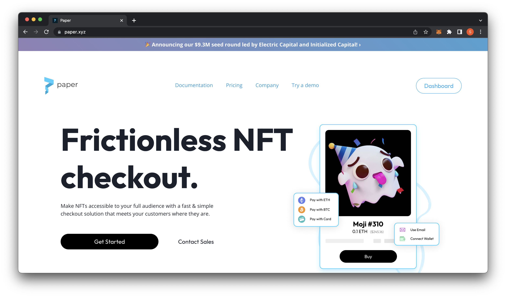
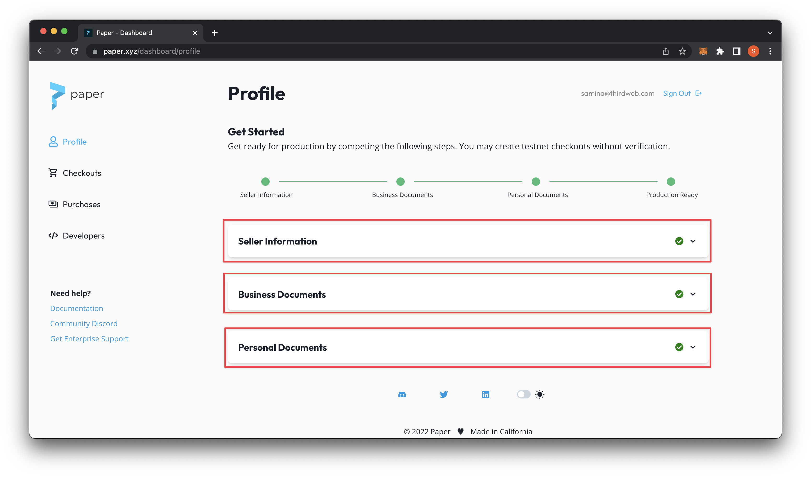
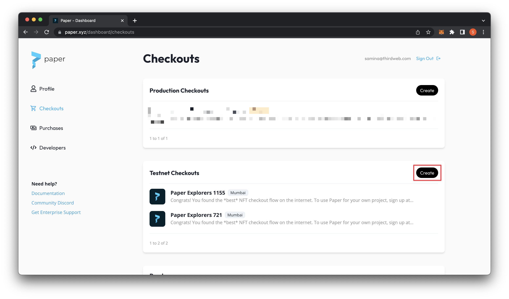
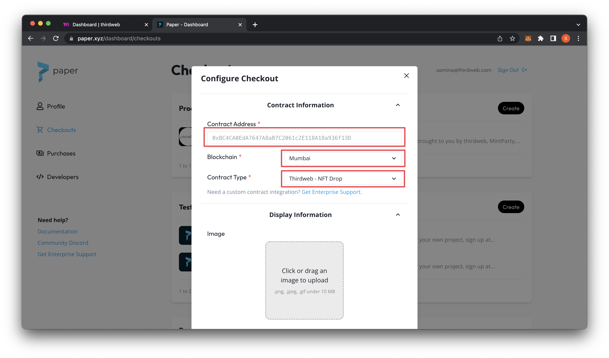
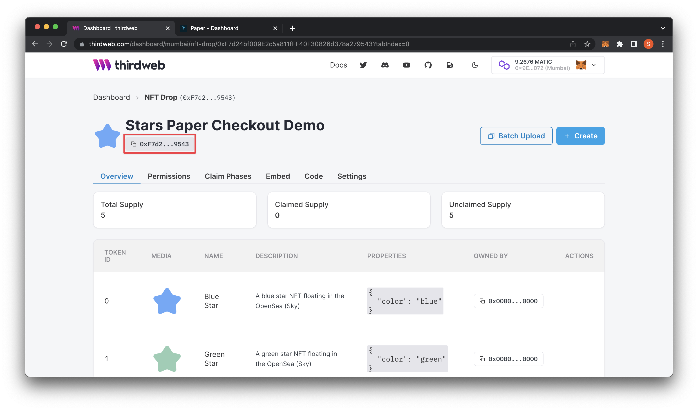
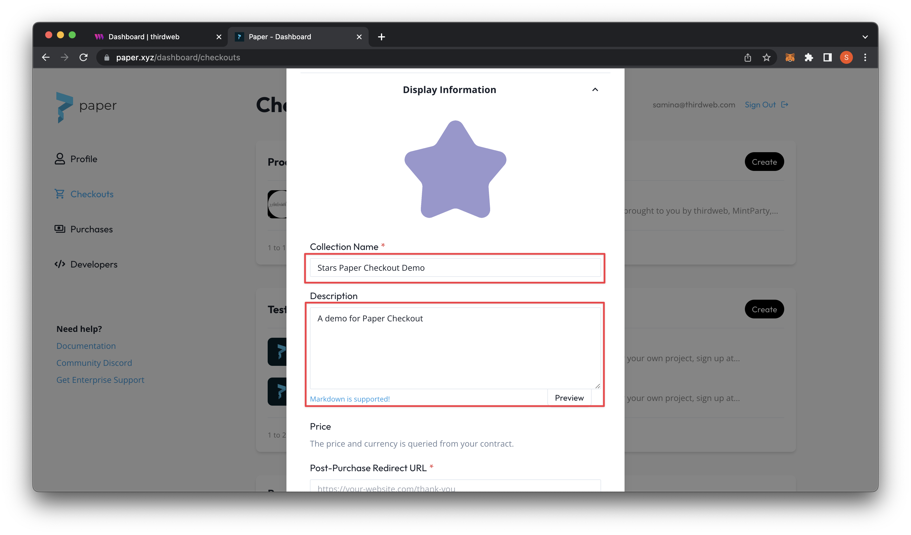
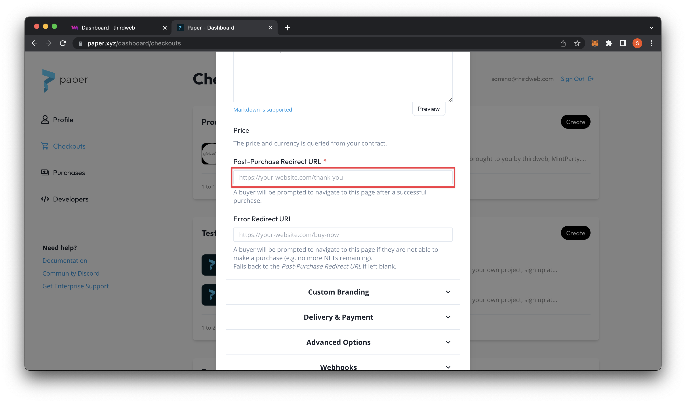
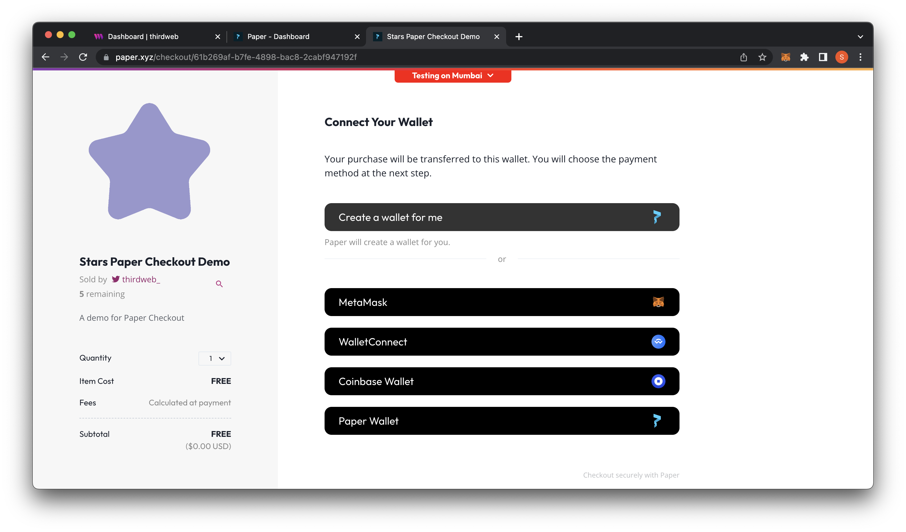

# How to accept credit card payments for your NFT drop

Integrate thirdweb and Paper checkout for easy fiat on-ramp and NFT credit card checkout.

<!--truncate-->

Up until recently, to purchase an NFT you would have to create a crypto wallet using MetaMask or Coinbase Wallet. In addition to creating and learning about wallets, you would need to purchase cryptocurrency, and then navigate the challenges of fiat on-ramps and bridges. 

One great tool to reduce the web3 onboarding friction is Paper, which allows you to purchase NFTs with a credit card. And the best part? You can integrate it directly with your thirdweb contracts.

Let’s create an NFT Drop on thirdweb that allows us to checkout via credit card using Paper.

Before you get started I will assume you have created an [NFT Drop](/pre-built-contracts/nft-drop), Edition Drop(pre-built-contracts/edition-drop), or [Marketplace](pre-built-contracts/marketplace) contract. If not, please refer to our [documentation to create an NFT Drop contract.](https://portal.thirdweb.com/templates/nft-drop/creating-the-nft-drop-contract) 

1. Begin by navigating to [https://paper.xyz](https://paper.xyz) and clicking on **Get Started**
    
    
    
2. Fill out your seller information, upload business documents (if you are a business entity), and/or personal documents. Please note: if you are uploading business documents, it may take a few days to verify your paperwork. 
    
    
    
3. In the meanwhile, we can test out Paper using a checkout experience on a Blockchain testnet until we are verified. Let’s try it out! Start by going to **Checkouts** on the left navigation panel and then click on **Create.** If you are creating a checkout with a smart contract deployed on main net- use the **Production Checkouts,** right above.
    
    
    
4. We have a couple fields to fill out starting with contract address, blockchain, and contract type.
    
    
    
5. For the contract address, let’s navigate to our contract on the thirdweb dashboard. Copy the contract address from here to paste in our Paper checkout. We can also fill in the Blockchain field with our corresponding network (’Mumbai’) and our contract type. For this demo, I am doing a thirdweb NFT Drop. You can check out my contract at this URL: [https://thirdweb.com/dashboard/mumbai/nft-drop/0xF7d24bf009E2c5a811fFF40F30826d378a279543?tabIndex=0](https://thirdweb.com/dashboard/mumbai/nft-drop/0xF7d24bf009E2c5a811fFF40F30826d378a279543?tabIndex=0)
    
    
    
6. Scroll down to add in the contract cover image as well as the collection name and description.
    
    
    
7. Lastly on these settings you can add a Post-Purchase Redirect URL that will allow you to redirect your buyers after purchase.
    
    
    
8. In addition to these settings, you can also explore Custom Branding, Delivery & Payment, Advanced Options, and Webhooks. For more information on these specific settings, check out the [Paper documentation](https://paperxyz.readme.io/reference/overview).
9. Scroll down and **submit** and it will redirect you to a modal with your Paper checkout link to copy on your website.
    
    
    
10. Let’s preview how it looks like to make sure everything looks how we want it!
    
    
    

That’s it! Now your NFT collection is available to all users with or without an existing crypto wallet. 

Happy minting!
