# Create a gasless NFT Drop with Biconomy

Let's assume you want to create an entirely free NFT Drop for your community; we can do so by paying the gas fees in place of the recipient.

<!-- truncate -->

We can accomplish this by combining the gasless relayer from Biconomy and using the thirdweb dashboard.

In this guide, I assume you have already created an NFT Drop or Edition Drop contract using thirdweb. If not, you can learn how to make one through our [NFT Drop documentation](./getting-started/deploying-contracts).

### Configure your smart contract relayer on Biconomy

1. Start by navigating to Biconomy.

   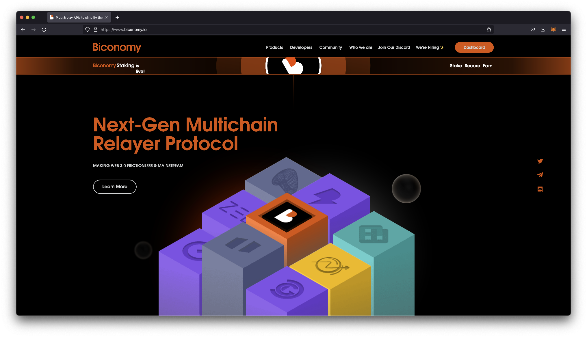

2. Create an account by navigating to the dashboard. This action will take you through a series of questions before you can get started.

   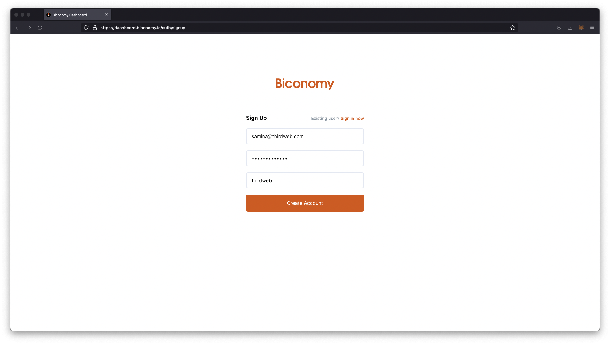

3. Once logged in, you will see the Biconomy dashboard, where we will start by creating a new project. Give your project a name under Dapp Name and select the network you deployed your contract. In this guide, I am deploying an app on Mumbai, so I chose Polygon Testnet

   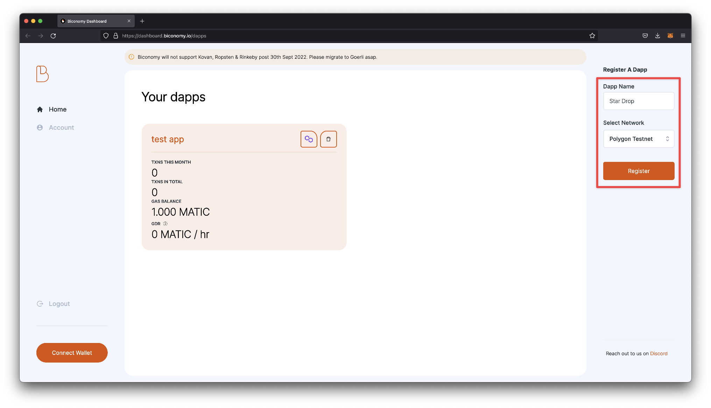

4. Once you click register, you should see a new project appear on your Biconomy dashboard. Click into the project.

   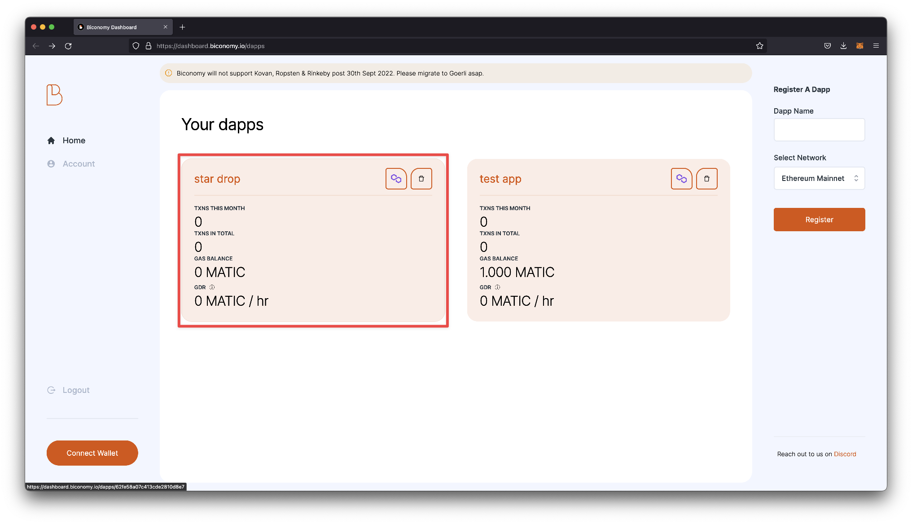

5. In the dapp settings, you should see a couple of different tabs that we will use to configure our gasless relayer. Let's start by navigating to the Smart Contract tab and passing in our a) smart contract name, b) our smart contract address, and c) our ABI.

   **Note:** you can find your contract's ABI if you scroll to the bottom of the Code tab on the thirdweb dashboard.

   After adding to the fields, click the orange Add button, and you should see your smart contract listed when you scroll down on this page.

   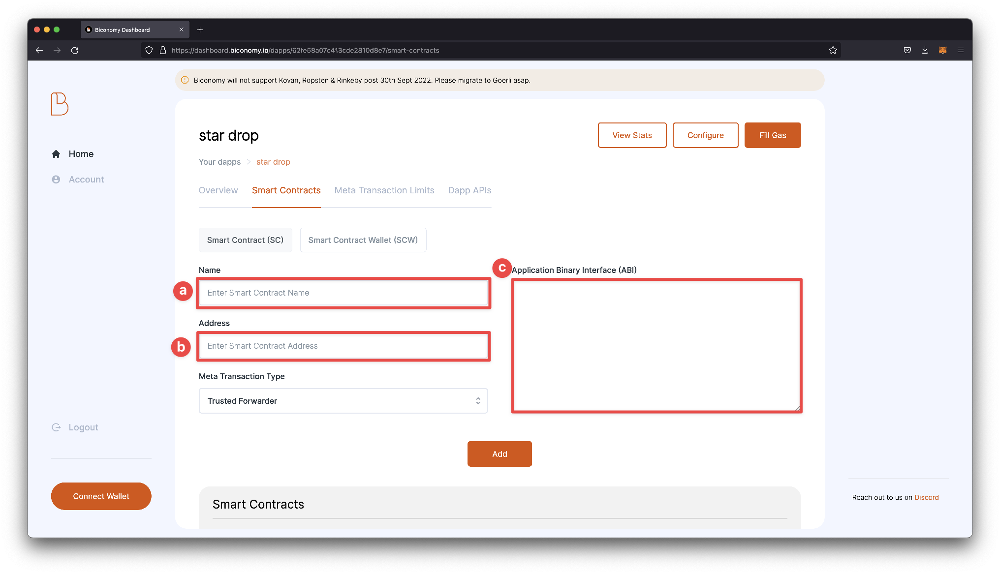

6. Next, we will want to configure a Dapp API that will allow us to call the claim function. Skip to the Dapp APIs tab and click the Add button.

   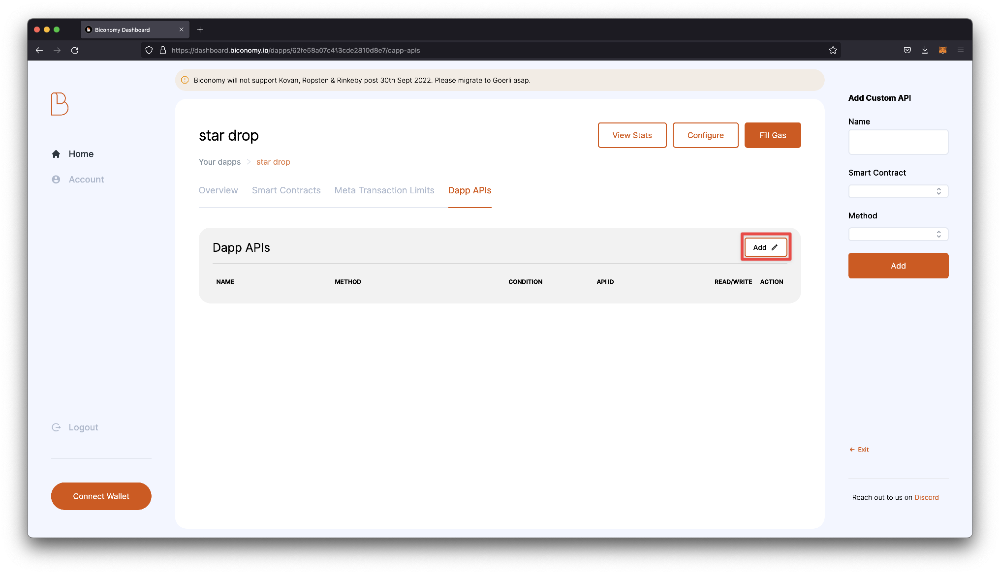

7. Call your API name, choose your smart contract from the dropdown, and select Claim for the method. Once entered, click Add to add your API to the app.

   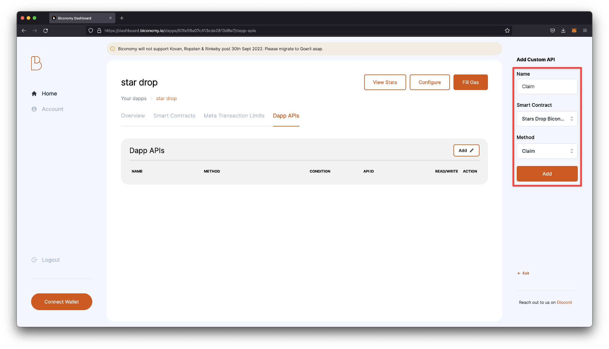

8. Next, we will fill the gas. Start by connecting the wallet you want to add funds to by navigating to the Connect Wallet button in the bottom left.

   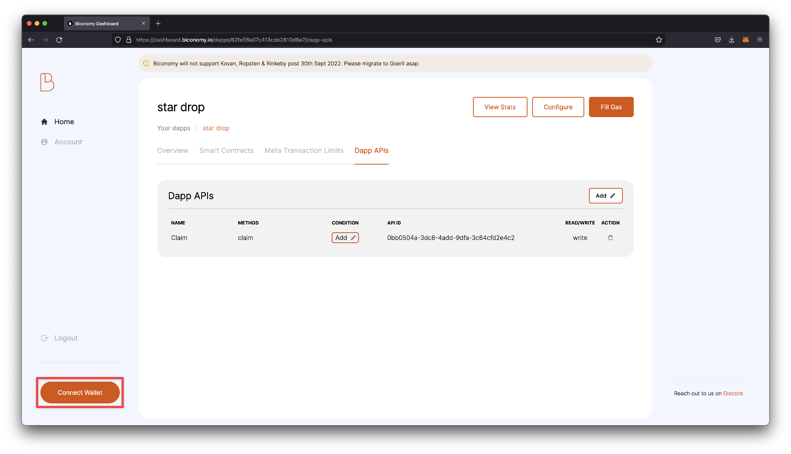

9. Click the Fill Gas button on the top of the dashboard. On the right panel, choose a Deposit amount and confirm the transaction. Note: On Mumbai testnet, the minimum amount you will need to deposit is 1.0 Matic.

   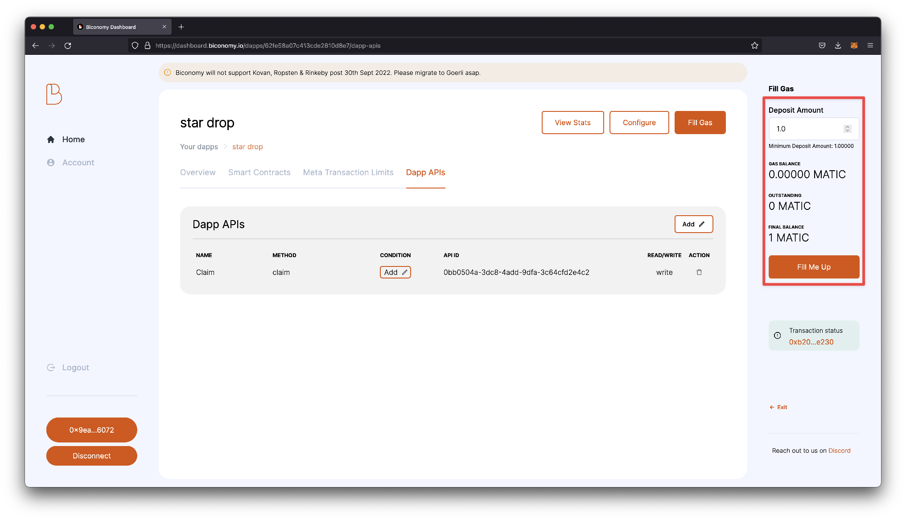

10. Lastly, go back to the overview tab and confirm that you have a Gas balance on your dapp.

    

Before moving back to our code, let's take note of the API key for our app and the API Id for our claim function.

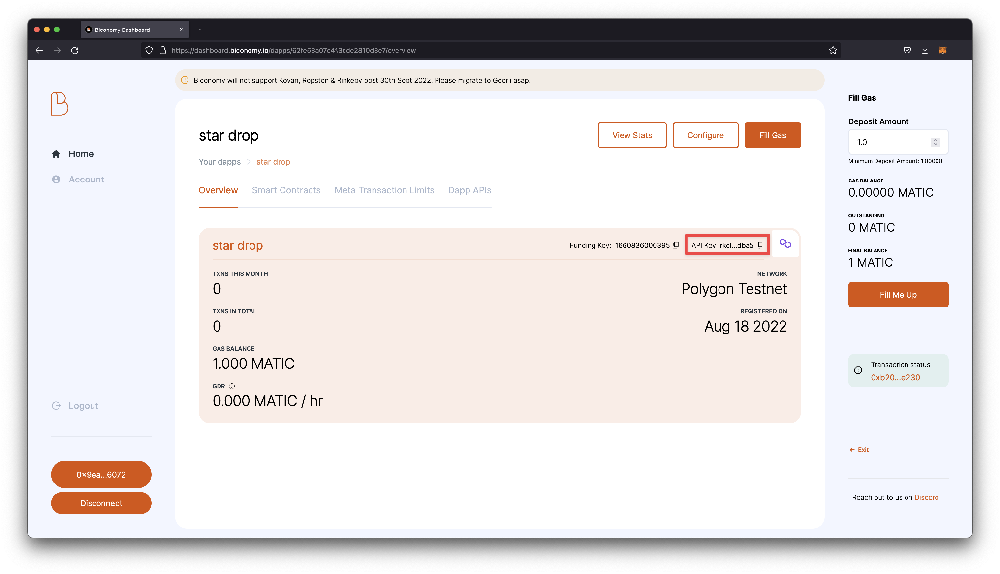

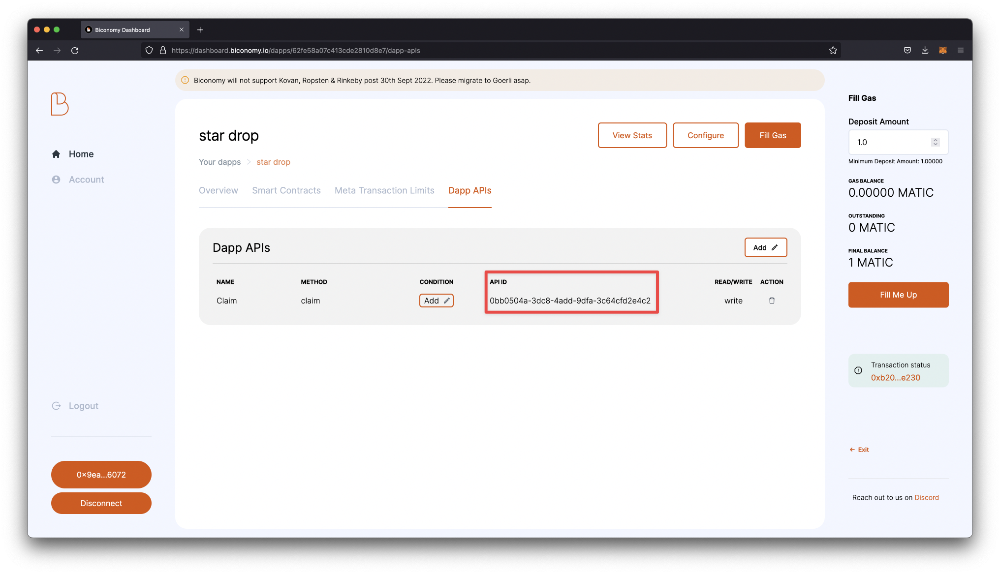

Now, let's add the relayer to our frontend application.

### Add the configured relayer to your frontend application (React SDK)

Let's start by creating a thirdweb app with a pre-configured minting component by running the following line in our terminal. This action will also install all the necessary dependencies needed for your app.

```jsx
npx thirdweb create --template nft-drop
```

You can run your app by running `yarn dev`

Open the project in Visual Studio Code or your preferred code editor.

1. First, we will modify our app to the correct network in our `_app.tsx` file. I am using Mumbai in this guide, but you can reference your preferred chain.

   ```jsx
   const activeChainId = ChainId.Mumbai;
   ```

2. We will pass our gasless configuration to the sdkOptions prop in the same file.

   ```jsx
   <ThirdwebProvider
     sdkOptions={{
       gasless: {
         biconomy: {
           apiKey: "<api-Key-from-Biconomy>",
           apiId: "<api-Id-from-Biconomy>",
         }
       },
     }}
     desiredChainId={desiredChainId}
   >
   ```

3. In your `index.tsx` file, we will assign our smart contract address to `myNFTDropContractAddress` instead of the one already configured.

   ```jsx
   const myNftDropContractAddress = "<Smart-Contract-Address";
   ```

4. We can now test our application by trying to mint an NFT from the locally running version of our app. If it works successfully, you will only sign a transaction without paying fees. You can also see the gas balance reduced on the Biconomy dashboard.

   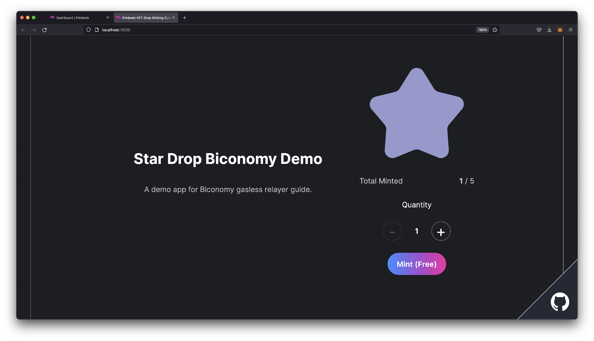

That's it! You have now successfully added a gasless relayer to your NFT Drop so your users can claim their NFT for free.

If you have any questions, don't hesitate to contact us via our discord.

Happy minting!
