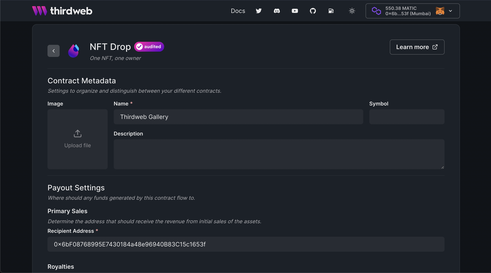
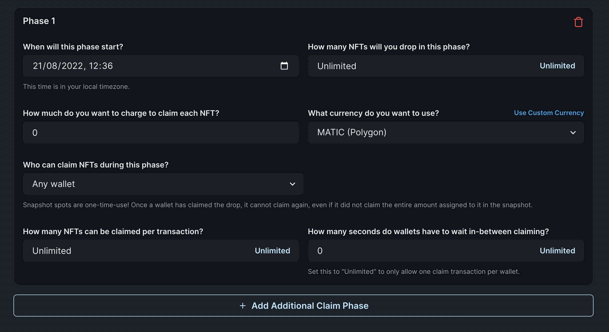
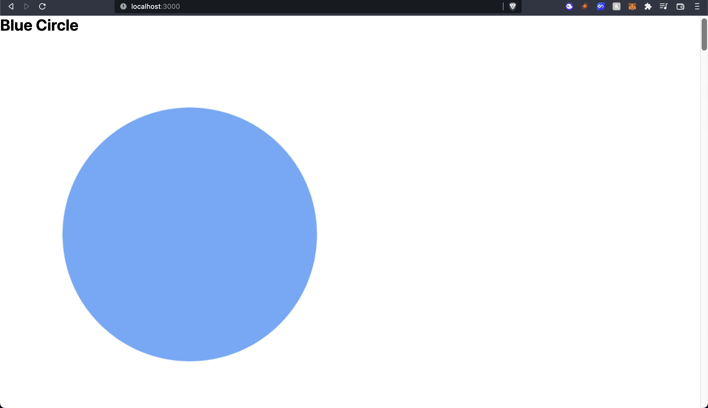
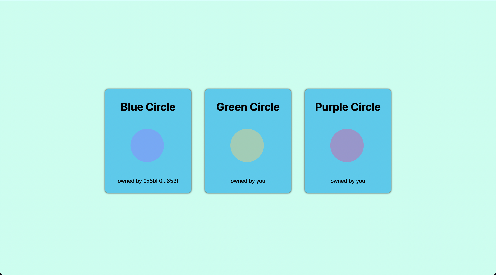

# Create a Gallery using Thirdweb and Next.js

Learn how to create simultaneous allowlists where different users can buy NFTs from the drop at a different price based on which allowlist they are in.

<!-- truncate -->

## Introduction

In this guide, we are going to create an NFT gallery where users
will be able to see all nfts from an NFT collection/NFT Drop/Signature drop! We will also let them connect their wallet and if they own the NFT we will show that this NFT is owned by you.

Before we get started, below are some helpful resources where you can learn more about the tools we're going to be using in this guide.

<div className="row" style={{marginBottom:24}}>
<div className="col col--6" style={{ marginTop: 8 }}>
  <QuickstartCard
    name="View Project Source Code"
    link="https://github.com/thirdweb-dev/examples/tree/main/typescript/gallery-example"
    image="/assets/icons/general.png"
    openInNewTab
  />
</div>

<div className="col col--6" style={{ marginTop: 8 }}>
  <QuickstartCard
    name="NFT Collection Contract"
    link="/pre-built-contracts/nft-drop"
    image="/assets/icons/drop.png"
    openInNewTab
  />
</div>
</div>

Let's get started.

## Setup

I am going to use the [Next typescript starter template](https://github.com/thirdweb-example/next-typescript-starter) for this guide.

If you are following along with the guide, you can create a project with the
[Next TypeScript template](https://github.com/thirdweb-example/next-typescript-starter) using the [thirdweb CLI](/cli):

```bash
npx thirdweb create --next --ts
```

If you already have a Next.js app you can simply follow these steps to get started:

- Install `@thirdweb-dev/react` and `@thirdweb-dev/sdk` and `ethers`
- Add MetaMask authentication to the site. You can follow this [guide](/guides/add-connectwallet-to-your-website) to do this.

By default the network in `_app.tsx` is Mainnet, we need to change it to Mumbai

```tsx title="_app.tsx"
import type { AppProps } from "next/app";
import { ChainId, ThirdwebProvider } from "@thirdweb-dev/react";

// This is the chainId your dApp will work on.
const activeChainId = ChainId.Mumbai;

function MyApp({ Component, pageProps }: AppProps) {
  return (
    <ThirdwebProvider desiredChainId={activeChainId}>
      <Component {...pageProps} />
    </ThirdwebProvider>
  );
}

export default MyApp;
```

## Creating a NFT Drop and batch Uploading NFTs

We also need to create a Signature Drop and upload a bunch of NFTs that users can claim.
So, go to the [thirdweb dashboard](https://thirdweb.com/dashboard) and create a signature drop!

Fill out the details and deploy the contract by clicking on `Deploy Now!`



Once the contract is deployed, we need to set up claim phases. So, click on the Claim Phases tab and create a new claim phase!



Now, let's batch upload some NFTs for the users to mint!
I am going to use the [Shapes batch upload example](https://github.com/saminacodes/tw-demo-assets/tree/main/Shapes).

Click on batch upload and upload the images and the CSV/JSON file.

Once they are uploaded you will be able to see the NFTs! To learn more about batch upload check out [this guide](/guides/how-to-batch-upload).


Once everything is done, go to the embed tab and claim some NFTs so we can see them in the gallery!

## Start building website

### Getting the NFTs

In the `pages/index.tsx` page we will now use the `useContract` hook provided to use by the thirdweb's react sdk to get access to the contract like this:

```tsx title="pages/index.tsx"
const { contract } = useContract("0x05B8aab3fd77580C29c6510d8C54D9E6be4262d2");
```

Make sure to update the contract address to the address of the NFT Drop contract you created. After doing this, to get the nfts from this contract we need to use another hook that will give us the nfts called `useNFTs`:

```tsx title="pages/index.tsx"
const { data: nfts, isLoading: loading } = useNFTs(contract?.nft, {
  start: 0,
  count: 10,
});
```

Here, we are adding a start and count to the query to get the first 10 nfts. You can update these values as per your needs!
These hooks can be imported from the `@thirdweb-dev/react` package like this:

```tsx title="pages/index.tsx"
import {
  useAddress,
  useContract,
  useMetamask,
  useNFTs,
} from "@thirdweb-dev/react";
```

### Rendering the NFTs

Delete everything inside the main div and let's render our NFTs! To render the nfts we need to map through them and render them:

```tsx title="pages/index.tsx"
<div>
  {nfts && nfts?.length > 0 && (
    <div>
      {nfts.map((nft) => (
        <div key={nft.metadata.id.toString()}>
          <h1>{nft.metadata.name}</h1>
          <ThirdwebNftMedia metadata={nft.metadata} />
          <p>owned by {truncateAddress(nft.owner)}</p>
        </div>
      ))}
    </div>
  )}
</div>
```

As you can see we are using a function for truncating the address. Add this function:

```ts title="pages/index.tsx"
const truncateAddress = (address: string) => {
  return (
    address.substring(0, 6) + "..." + address.substring(address.length - 4)
  );
};
```

Now you would be able to see all the NFTs but the images are huge and the cards are not at all styled!



So let's style the images and the cards using css modules. Create a new folder called `styles` and create a `globals.css` file inside it. Finally, add the following

```css title="styles/globals.css"
html,
body {
  padding: 0;
  margin: 0;
  font-family: -apple-system, BlinkMacSystemFont, Segoe UI, Roboto, Oxygen, Ubuntu,
    Cantarell, Fira Sans, Droid Sans, Helvetica Neue, sans-serif;
}

a {
  color: inherit;
  text-decoration: none;
}

* {
  box-sizing: border-box;
}
```

Now, import it in `_app.tsx` like this:

```tsx title="_app.tsx"
import "../styles/globals.css";
```

Let's now create `Home.module.css` inside the `styles` folder and add the following:

```css title="styles/Home.module.css"
.container {
  display: flex;
  flex-direction: column;
  align-items: center;
  justify-content: center;
  width: 100vw;
  min-height: 100vh;
  background-color: #c0ffee;
}

.cards {
  display: flex;
  flex-wrap: wrap;
  justify-content: center;
  align-items: center;
  margin-top: 20px;
  gap: 20px;
  width: 80vw;
}

.card {
  display: flex;
  flex-direction: column;
  align-items: center;
  justify-content: center;
  border-radius: 10px;
  margin: 10px;
  box-shadow: 0px 0px 5px #000000;
  min-width: 250px;
  padding: 10px;
  background: #1ce;
}

.image {
  min-width: 100px;
  max-width: 150px;
  min-height: 100px;
  max-height: 150px;
  position: relative;
}
```

This is some basic styling for the cards, container, and the image. Finally, let's use them in our `pages/index.tsx` page:

```tsx title="pages/index.tsx"
<div className={styles.container}>
  {!address && <button onClick={connectWithMetamask}>Connect Wallet</button>}

  {nfts && nfts?.length > 0 && (
    <div className={styles.cards}>
      {nfts.map((nft) => (
        <div key={nft.metadata.id.toString()} className={styles.card}>
          <h1>{nft.metadata.name}</h1>
          <ThirdwebNftMedia metadata={nft.metadata} className={styles.image} />
          <p>owned by {truncateAddress(nft.owner)}</p>
        </div>
      ))}
    </div>
  )}
</div>
```

Now our home page looks pretty nice!

### Some improvements

**Not showing nfts owned by null address**

You might have seen that the NFTs that are owned by `0x0000000000000000000000000000000000000000` are also being shown but we probably won't want to show those because they haven't been minted yet or have been burned. So we can add a simple filter to do this before our map function:

```tsx title="pages/index.tsx"
{
  nfts
    .filter((nft) => nft.owner !== "0x0000000000000000000000000000000000000000")
    .map((nft) => <>{/* rest of the code */}</>);
}
```

This will make sure that only the NFTs that have an owner will be shown.

**Adding a loading screen**

The NFTs take quite some time to load so before the first return statement we will add this loading screen:

```tsx title="pages/index.tsx"
if (loading) {
  return <div className={styles.container}>Loading...</div>;
}
```

**Showing special text if NFT is owned by you**
If you remember we had these two hooks present when we created our template:

```tsx title="pages/index.tsx"
const address = useAddress();
const connectWithMetamask = useMetamask();
```

If you have removed them add them back because we are going to need them now!

Now, just before the map function we can add this:

```tsx title="pages/index.tsx"
{
  !address && <button onClick={connectWithMetamask}>Connect Wallet</button>;
}
```

Finally, in the p tag where we show the owner address we can add this:

```tsx title="pages/index.tsx"
<p>
  owned by{" "}
  {address && nft.owner === address ? "you" : truncateAddress(nft.owner)}
</p>
```

Now, we have got an amazing gallery of our NFTs!



## Conclusion

Hope you could integrate your own NFT gallery and if you did share it with the community!
If you want to have a look at the code, check out the [GitHub Repository](https://github.com/thirdweb-dev/examples/tree/main/typescript/gallery-example).
