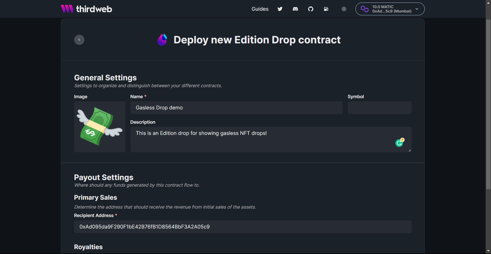
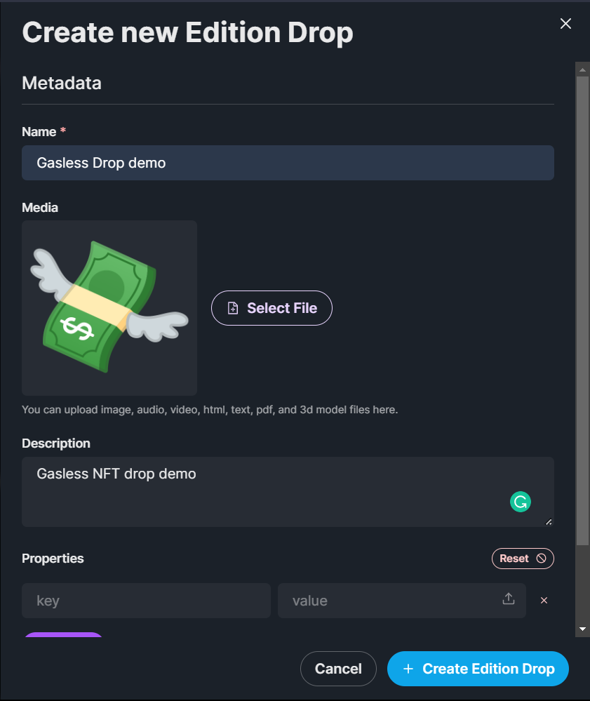
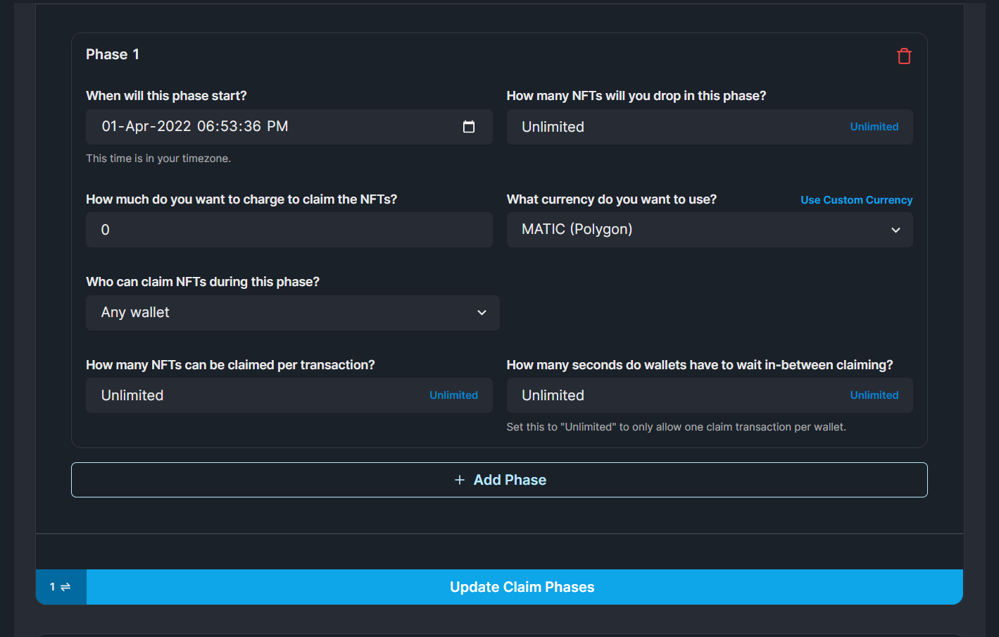
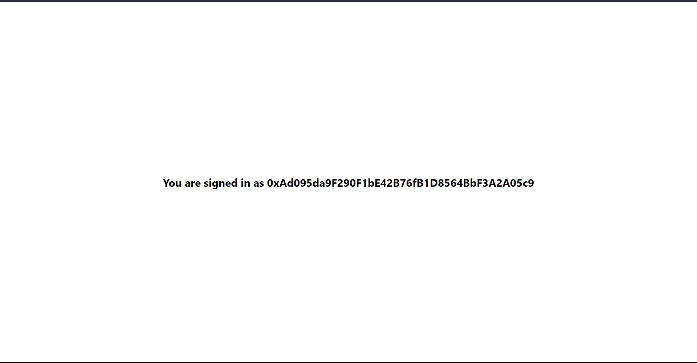
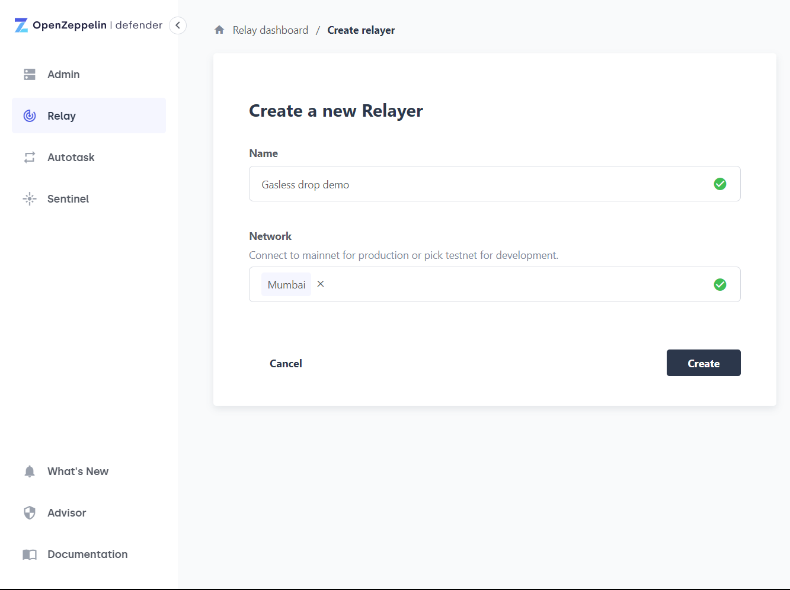
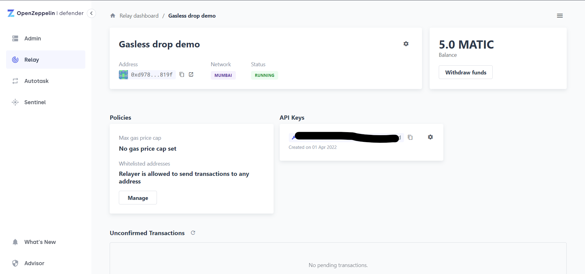
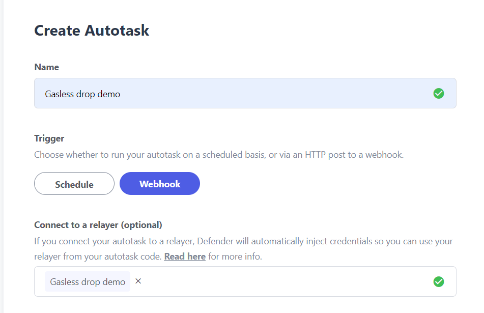
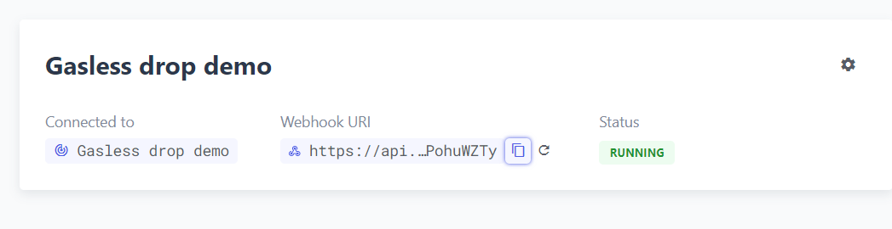

# Create a gasless NFT drop with Next.js and OpenZeppelin

Learn how to create an NFT Drop in which you pay the gas for your users, using OpenZeppelin, Next.js and thirdweb.

<!-- truncate -->

In some cases, you might want to pay the gas for NFT drops like early access drops or when you are accepting payments in some other forms.

In this guide, we are going to see how to create a gasless NFT drop that everyone can claim.

I am going to use an ERC1155 so multiple people can hold the same NFT but you can do it any way you like! [Check out our NFT contracts](https://portal.thirdweb.com/pre-built-contracts).

If you want to directly jump into the code, here is the finished [code](https://github.com/thirdweb-dev/examples/tree/main/javascript/gasless-nft-drop).

## Creating an NFT drop

Go to the [thirdweb dashboard](https://thirdweb.com/dashboard) and click on "Deploy new contract".

From the prebuilt contracts, hit **Deploy Now** on the **Edition Drop** contract.

Fill out the details and hit deploy!



After the drop is created, create a new NFT inside of the drop like this-



Finally, let’s add a claim phase! Click on the **Claim Phases** tab, update the details based on what you need, and hit update.

You will be asked to confirm a small transaction to cover the gas fees.



## Building the website

We will now build a website where users will be able to come and claim the NFT!

### Setup

Create a new Next.js app by running:

```bash
npx create-next-app gasless-drop
```

Install the dependencies we need to integrate thirdweb:

```bash
npm i @thirdweb-dev/react @thirdweb-dev/sdk ethers # npm

yarn add @thirdweb-dev/react @thirdweb-dev/sdk ethers # yarn
```

### Connect Wallets with MetaMask

For users to be able to sign transactions, they'll need to have their wallet connected!

Wrap the whole app in the `ThirdwebProvider` like the following:

```jsx
import { ThirdwebProvider, ChainId } from "@thirdweb-dev/react";
import "../styles/globals.css";

function MyApp({ Component, pageProps }) {
  return (
    <ThirdwebProvider desiredChainId={ChainId.Mumbai}>
      <Component {...pageProps} />
    </ThirdwebProvider>
  );
}

export default MyApp;
```

The desiredChainId is the chain id that you want to build upon. You can use the `ChainId` object provided by the SDK to pass it to the `ThirdwebProvider`,
in this case, we are using the Polygon `Mumbai` testnet.

To add wallet connection, we are going to use the `useMetamask` hook that thirdweb provides, so add the following to your `index.js` page:

Then

```jsx
const connectWithMetamask = useMetamask();
```

Import it from the package we installed:

```jsx
import { useMetamask } from "@thirdweb-dev/react";
```

Finally, let’s create a button and use it:

```jsx
<button onClick={connectWithMetamask}>Sign in with MetaMask</button>
```

Now that we can authenticate users on our site, let’s check if the user is authenticated and show a mint button if a user is there.

thirdweb provides another hook to get the user’s wallet address, so get the address from the hook:

```jsx
const address = useAddress();
```

The `useAddress` hook will be imported from `@thirdweb-dev/react` as well-

```jsx
import { useMetamask, useAddress } from "@thirdweb-dev/react";
```

Now, if the user is authenticated then show their address otherwise the sign-in button:

```jsx
<div className={styles.container}>
  {address ? (
    <h2>You are signed in as {address}</h2>
  ) : (
    <button onClick={connectWithMetamask}>Sign in with metamask</button>
  )}
</div>
```

Once, you sign in it should now show you your address! 🔥



## Building the mint functionality

We will use the `useEditionDrop` for accessing the edition and calling functions with it-

```jsx
const editionDrop = useEditionDrop("EDITION_DROP_ADDRESS");
```

Copy the edition drop address from the dashboard and replace it with `EDITION_ADDRESS`


Once again, import the hook-

```jsx
import { useMetamask, useAddress, useEditionDrop } from "@thirdweb-dev/react";
```

We will create a new function to claim the NFT:

```jsx
const tokenId = 0;
const quantity = 1;

const claimNFT = async () => {
  try {
    await editionDrop?.claimTo(address, tokenId, quantity);
    console.log("🎉 NFT claimed successfully!");
  } catch (err) {
    console.log("💩 Error claiming NFT: ", err);
  }
};
```

The edition drop has a method called `claimTo` that we can use to claim the NFT to a specific wallet address.

I have created two variables for the `tokenId` and `quantity` for better readability of code. The second argument is `tokenId` and the third is `quantity` as seen below:

Let’s now try minting the NFT!

<div style={{ position: "relative", paddingBottom: "56.25%", height: 0 }}>
  <iframe
    src="https://www.loom.com/embed/7a1d9a37c90e4829abe7887b490ab006"
    frameborder="0"
    webkitallowfullscreen
    mozallowfullscreen
    allowfullscreen
    style={{
      position: "absolute",
      top: "0",
      left: "0",
      height: "100%",
      width: "100%",
    }}
  ></iframe>
</div>

And the minting works! But we have to pay for the gas in the transaction, so let’s relay the gas so that we pay the gas and user can mint their NFTs for free!

## Making transactions gasless

thirdweb supports [Biconomy](https://www.biconomy.io/) and OpenZeppelin for relaying the gas.

For this demo we are going to use [OpenZeppelin](https://defender.openzeppelin.com/) to relay the gas, so head over to OpenZeppelin and sign up for an account if you haven’t already.

Create a new relayer in OpenZeppelin:



Choose the network that you are building upon and give the relayer a name!

After the relayer has been created, copy the address and transfer some funds into it in the network you created the relayer.

You should be able to see the amount you transferred on your dashboard



Now go ahead and create a new autotask, you will be asked to fill some data-



You can get the code from [here](https://raw.githubusercontent.com/thirdweb-dev/ozdefender-autotask/main/src/forwarder_handler.js) and paste it into the code section of autotask. After you are done hit create. Once it is done creating, copy the webhook uri



Head back to the Next.js application, and create a new `.env.local` file in the root of the folder. We will use this to store our environment variables! Create a new variable `NEXT_PUBLIC_OPENZEPPELIN_URL` like this-

```jsx
NEXT_PUBLIC_OPENZEPPELIN_URL=https://api.defender.openzeppelin.com/autotasks/secret-stuff
```

Since we have changed env variables, you need to restart your development server.

Finally, add the OpenZeppelin Uri in the `ThirdwebProvider`:

```jsx
<ThirdwebProvider
  sdkOptions={{
    gasless: {
      openzeppelin: {
        relayerUrl: process.env.NEXT_PUBLIC_OPENZEPPELIN_URL,
      },
    },
  }}
  desiredChainId={desiredChainId}
>
```

Now the gas fees are being relayed and the users don’t have to pay any gas!

<div style={{ position: "relative", paddingBottom: "56.25%", height: 0 }}>
  <iframe
    src="https://www.loom.com/embed/0b1a961b538146678c29a1fa26f17799"
    frameborder="0"
    webkitallowfullscreen
    mozallowfullscreen
    allowfullscreen
    style={{
      position: "absolute",
      top: "0",
      left: "0",
      height: "100%",
      width: "100%",
    }}
  ></iframe>
</div>

Want to have a look at the code? [We got you!](https://github.com/thirdweb-dev/examples/tree/main/javascript/gasless-nft-drop)
