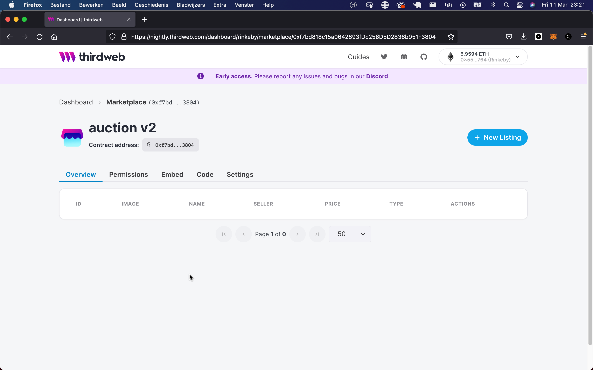

# Create your own auction with TypeScript

Create your own marketplace to sell your own NFTs with TypeScript!

<!-- truncate -->

## Intro

In this guide, we'll create an **auction** on our own **marketplace** with the TypeScript SDK!

In a **marketplace** you can list your tokens (such as your NFTs) for sale. OpenSea is an example of a **marketplace**.

If you don't have any NFTs minted, check out our guide on [Minting an NFT Collection using TypeScript](/guides/mint-nft-collection-using-typescript-sdk).

Alright without further ado, let's create our **marketplace**!

## Dashboard setup

The first thing we need to do is head over to the [dashboard](https://thirdweb.com/dashboard) and create a **Marketplace** contract.

- Head to the thirdweb [dashboard](https://thirdweb.com/dashboard)
- Connect your Wallet
- Click **Deploy New Contract**
- Click **Deploy Now** on the Marketplace contract
- Configure your contract metadata, and deploy!



Once you've created the contract, it's time to list our first NFT, but we don't need the dashboard for that! I mean we _could_, but why use GUI if we can use TypeScript!?

## Create a TypeScript file

Go ahead and create a new TypeScript file. Create a new folder called `my-auction`, and within it,
create a file called `index.ts`.

Install the required dependencies to get started with thirdweb, by running the following command inside
your `my-auction` folder:

```bash
npm install @thirdweb-dev/sdk dotenv
```

## Listing an NFT

First, we define a variable `marketplaceAddress` and store our marketplace contract address.

To create a listing from your wallet, you'll first need to export your wallet's private key and add it to an environment variable in this project.

:::info How to export your private key

Learn how to [export your private key](/guides/create-a-metamask-wallet#export-your-private-key) from your wallet.

:::

To do this, create a file called `.env` in your `my-auction` folder, and add the following to it:

```
PRIVATE_KEY=your-private-key-here
```

:::warning

Ensure you store and access your private key securely.

- **Never** commit any file that may contain your private key to your source control.

:::

Now we're ready to create some listings!

First, let's initialize the SDK and connect to our marketplace contract.

```tsx title="index.ts"
import { NATIVE_TOKEN_ADDRESS, ThirdwebSDK } from "@thirdweb-dev/sdk";
// Declaring the Marketplace contract address
const marketplaceAddress = "0xC06adC34097afa2085324D4192fbE9206059f8e0"; // your contract address here

const sdk = ThirdwebSDK.fromPrivateKey(
  process.env.PRIVATE_KEY, // Your wallet private key
  "mumbai", // configure this to your network
);

// Initialize Marketplace contract by passing in contract address
const marketplace = sdk.getMarketplace(marketplaceAddress);
```

Each NFT has a unique combination of `tokenId` and `contractAddress`
that we can use to specify the NFT we want to list.

We'll call the `.auction.createListing` to create an auction-type listing on the marketplace.

```tsx title="index.ts"
// Data of the auction you want to create
const auction = {
  // address of the contract the asset you want to list is on
  assetContractAddress: "0x...",
  // token ID of the asset you want to list
  tokenId: "0",
  // when should the listing open up for offers
  startTimestamp: new Date(),
  // how long the listing will be open for
  listingDurationInSeconds: 86400,
  // how many of the asset you want to list
  quantity: 1,
  // address of the currency contract that will be used to pay for the listing
  currencyContractAddress: NATIVE_TOKEN_ADDRESS,
  // how much people would have to bid to instantly buy the asset
  buyoutPricePerToken: "10",
  // the minimum bid that will be accepted for the token
  reservePricePerToken: "1.5",
};

const tx = await contract.auction.createListing(auction);
```

So the only thing left is to run our code! Open a terminal and paste the following:

```bash
# Runs the typescript file
npx ts-node index.ts
```

## Make a bid

Now that you've placed your first auction on your marketplace, someone can make a bid on it!
Check out the method below, that allows a user to make a bid!

```tsx title="index.ts"
// The listing ID of the asset you want to bid on
const listingId = 0;
// The price you are willing to bid for a single token of the listing
const pricePerToken = 1;

await contract.auction.makeBid(listingId, pricePerToken);
```

## That's it!

Congratulations! You have created your very own marketplace and listed an NFT for auction!

Check out what else you can do with the Marketplace on our [pre-built contract](/pre-built-contracts/marketplace) page!
