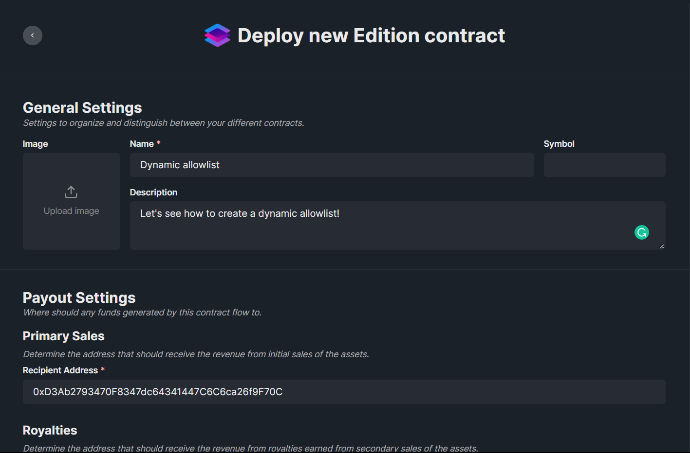
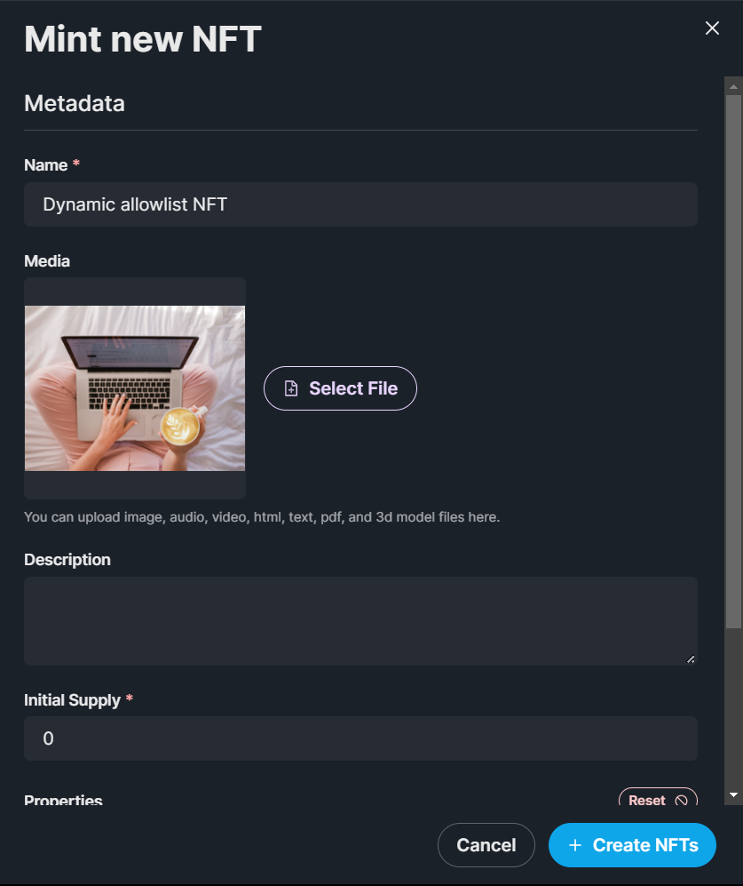
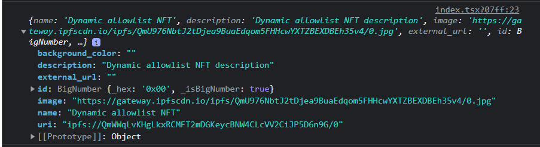
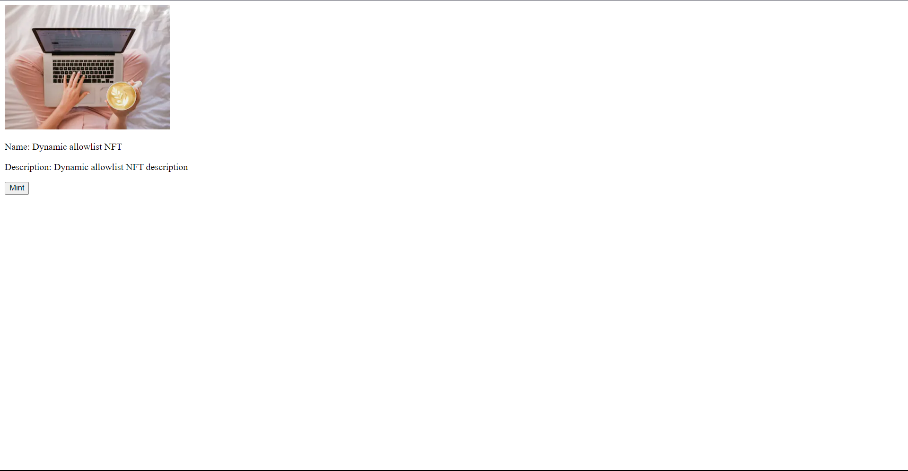
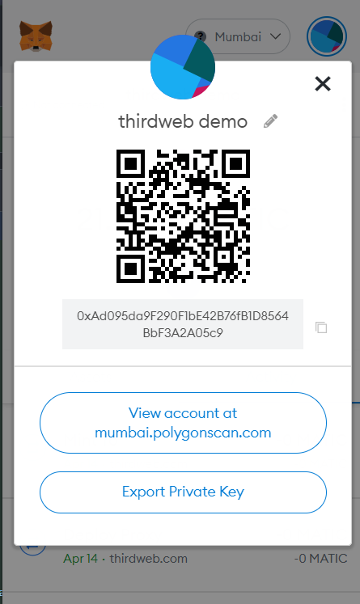
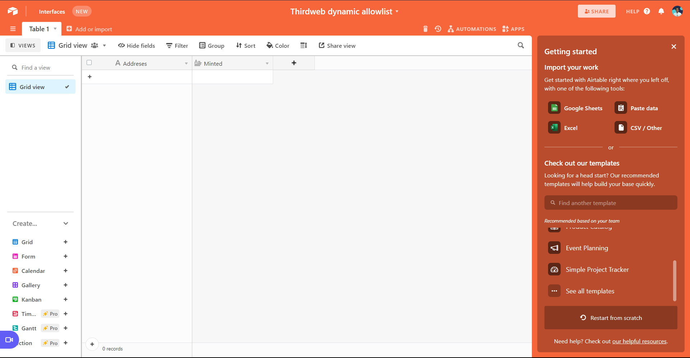
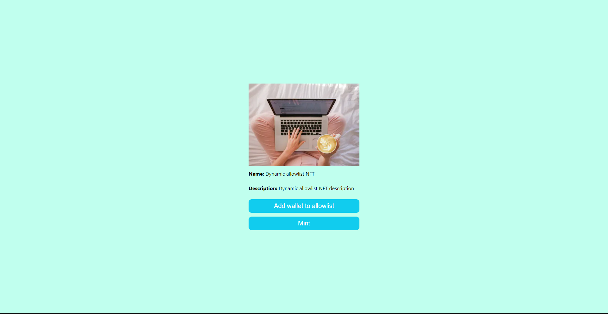

# Create a dynamic allowlist with Airtable and Next.js

Learn how to create a dynamic allowlist where specific wallets can mint 1 token from your ERC-1155 NFT collection!

<!-- truncate -->

## Introduction

In this guide, we are going to create an [Edition](/pre-built-contracts/edition) where users
will be able to connect their wallets to an allowlist and those wallets can later mint the NFT!

## Setup

I am going to use the [Next typescript starter template](https://github.com/thirdweb-example/next-typescript-starter) for this guide.

If you are following along with the guide, you can create a project with the [Next TypeScript template](https://github.com/thirdweb-example/next-typescript-starter) using the `create-tw-app` CLI:

```bash
npx thirdweb create --next --ts
```

If you already have a Next.js app you can simply follow these steps to get started:

- Install `@thirdweb-dev/react` and `@thirdweb-dev/sdk`
- Add MetaMask authentication to the site. You can follow this [guide](/guides/add-connectwallet-to-your-website) to do this
- You all are set to go now!

By default the network in `_app.tsx` is Mainnet, we need to change it to Mumbai

```tsx title="_app.tsx"
import type { AppProps } from "next/app";
import { ChainId, ThirdwebProvider } from "@thirdweb-dev/react";

// This is the chainId your dApp will work on.
const activeChainId = ChainId.Mumbai;

function MyApp({ Component, pageProps }: AppProps) {
  return (
    <ThirdwebProvider desiredChainId={activeChainId}>
      <Component {...pageProps} />
    </ThirdwebProvider>
  );
}

export default MyApp;
```

## Creating an edition and NFT

We also need to create an edition and an NFT inside of the edition to be able to mint them to the users. So, go to the [thirdweb dashboard](https://thirdweb.com/dashboard) and create an edition. I am doing it with an [Edition](/pre-built-contracts/edition) contract for this demo but it can be also done with [one of one NFTs](/pre-built-contracts) (ERC-721).

Fill out the details and deploy the contract!



Now, let's create and mint a new NFT inside of it. Fill out the details and make sure to set the initial supply to 0.



## Making the website

### Creating an nft card

To showcase our nft, we are going to create a simple card and we will get the data from the edition contract itself! So, inside `index.tsx` add the useEdition hook like this:

```tsx
const edition = useEdition("EDITION_CONTRACT_ADDRESS");
```

We need to import it from the thirdweb sdk:

```tsx
import { useEdition } from "@thirdweb-dev/react";
```

We'll use the `useNFT` hook to get the metadata of the NFT we just minted:

Firstly, import it:

```jsx
import { useNFT } from "@thirdweb-dev/react";
```

Then grab tokenId `0`'s metadata:

```jsx
const { data: nft } = useNFT(edition, "0");
```

If you `console.log` the NFT metadata you will get something like this:



Now let's render this NFT.

Import the `ThirdwebNftMedia` component to render the media asset of our NFT:

```jsx
import { ThirdwebNftMedia } from "@thirdweb-dev/react";
```

If the user is logged in we will show them this NFT instead of their address, so replace the fragment `(<>)` with this:

```tsx
<div>
  {nft && (
    <>
      <ThirdwebNftMedia metadata={nft.metadata} style={{ maxWidth: 240 }} />
      <p>
        <span>Name:</span> {nft?.metadata.name}
      </p>
      <p>
        <span> Description:</span> {nft?.metadata.description}
      </p>
    </>
  )}
  <button>Mint</button>
</div>
```



### Creating the mint API

We are going to use the signature minting on our backend to ensure that the address is present in the airtable, but first, let's get the signature minting working.

Create a new folder `api` in the pages folder and `generate-mint-sig.ts` inside it.

We will now build a basic API that will output "gm wagmi"

```ts title="api/generate-mint-sig.ts"
import type { NextApiRequest, NextApiResponse } from "next";

const generateMintSignature = async (
  req: NextApiRequest,
  res: NextApiResponse,
) => {
  res.send("gm wagmi");
};

export default generateMintSignature;
```

This creates a basic api for us, if you now go to the [`api/generate-mint-sig`](http://localhost:3000/api/generate-mint-sig) endpoint you will get a response of `Gm wagmi`.


Let's now initialize the thirdweb sdk!

```ts
const sdk = ThirdwebSDK.fromPrivateKey(
  process.env.PRIVATE_KEY as string,
  "mumbai",
);
```

As you can see, we are using an environment variable to initialize the sdk.
The variable is called `PRIVATE_KEY` which is the private key of the wallet.
Create a new file `.env.local` and add your private key.

```bash title=".env.local"
PRIVATE_KEY=<private_key>
```

Let's see how to get this private key value.

**Getting the wallet private key**

In your metamask wallet, click on the three dots, then click account details. You will see an option to export private key there. Export your private key and paste it into the `PRIVATE_KEY` variable.



This will give full access to your wallet to make sure to keep it secret!

Finally, paste this in the `.env.local` file. Since we have changed the env variables we need to restart the server. So, cut the terminal and run `yarn dev` again.

We also need to import the `ThirdwebSDK`:

```tsx
import { ThirdwebSDK } from "@thirdweb-dev/sdk";
```

**Generating the siganture mint**

In the api we are going to use the sdk to get access to the edition contract and generate a mint signature:

```ts
const edition = sdk.getEdition("EDITION_CONTRACT_ADDRESS");
try {
  const signedPayload = await edition.signature.generateFromTokenId({
    tokenId: 0,
    quantity: "1",
    to: address,
  });

  res.status(200).json({
    signedPayload: signedPayload,
  });
} catch (err) {
  res.status(500).json({
    error: err,
  });
}
```

We will get the address from the frontend so, add this:

```ts
const { address } = JSON.parse(req.body);
```

Let's now mint the api on the frontend by calling this api:

```tsx
const mintWithSignature = async () => {
  const signedPayloadReq = await fetch(`/api/generate-mint-sig`, {
    method: "POST",
    body: JSON.stringify({ address }),
  });

  const signedPayload = await signedPayloadReq.json();

  try {
    const nft = await edition?.signature.mint(signedPayload.signedPayload);
    return nft;
  } catch (err) {
    console.error(err);
    return null;
  }
};
```

This function will request the api that we just built with the address. It will give us a signed payload that we can use to mint the nft via our edition contract. So, let's attach it to the button:

```tsx
<button onClick={() => mintWithSignature()}>Mint</button>
```

Now our mint works! But wait, everyone can mint now so let's create an airtable database to store the addresses that can mint.

## Creating an allowlist with airtable

Go to [Airtable](https://airtable.com/) and create a new base.

After you create a new base, give a name to your base and add two columns: `Address` and `Minted` like this:



**Getting airtable api keys and id**

We now need to get some API keys and ids to interact with the base. So, go to [your Airtable account](https://airtable.com/account) and generate an api key


Store this api key somewhere safe as we are going to need it.

Now to get the base id go to the [Airtable API](https://airtable.com/api) and click on the base that you just created. When you open the page, at the top itself you would see "Your base id is app......".

Inside `.env.local` add three new variables:

```bash title=".env.local"
AIRTABLE_API_KEY=
AIRTABLE_BASE_ID=
AIRTABLE_TABLE_NAME=
```

### Creating a utility function for accessing the table

To keep our code clean we are going to create a file where we initialize the airtable with the api key, name, and id. So, create a new folder `utils` and `Airtable.ts` inside it. Now, add in the following in `Airtable.ts`:

```ts
import Airtable from "airtable";

// Authenticate
Airtable.configure({
  apiKey: process.env.AIRTABLE_API_KEY,
});

// Initialize a base
const base = Airtable.base(process.env.AIRTABLE_BASE_ID!);

// Reference a table
const table = base(process.env.AIRTABLE_TABLE_NAME!);

export { table };
```

As you can see we are going to need to install a new package called `airtable`:

```bash
npm i airtable # npm

yarn add airtable # yarn
```

Now, we need to update the api to first check if the wallet is present in the table. So, in `api/generate-mint-sig.ts` add the following:

```ts
const record = await table
  .select({
    fields: ["Addresses", "minted"],
    filterByFormula: `NOT({Addresses} != '${address}')`,
  })
  .all();

if (record.length === 0) {
  res.status(404).json({
    error: "User isn't in allowlist",
  });
}
```

So, this queries the airtable to get the records of the address present in the addresses column and we are checking if the length record is 0. If it is 0, then we are not allowing the user to mint and send an error. We will also wrap the part where we send the response in an else block. The api should now look similar to this:

```ts title="api/generate-mint-sig.ts"
import type { NextApiRequest, NextApiResponse } from "next";
import { ThirdwebSDK } from "@thirdweb-dev/sdk";
import { table } from "../../utils/Airtable";

const generateMintSignature = async (
  req: NextApiRequest,
  res: NextApiResponse,
) => {
  const { address } = JSON.parse(req.body);

  const record = await table
    .select({
      fields: ["Addresses", "minted"],
      filterByFormula: `NOT({Addresses} != '${address}')`,
    })
    .all();

  if (record.length === 0) {
    res.status(404).json({
      error: "User isn't in allowlist",
    });
  } else {
    const sdk = ThirdwebSDK.fromPrivateKey(
      process.env.PRIVATE_KEY as string,
      "mumbai",
    );

    const edition = sdk.getEdition(
      "0x62C84CC051544c43d05a5Ff0E8Da596fBdB15032",
    );
    try {
      const signedPayload = await edition.signature.generateFromTokenId({
        tokenId: 0,
        quantity: "1",
        to: address,
      });

      res.status(200).json({
        signedPayload: signedPayload,
      });
    } catch (err) {
      res.status(500).json({
        error: err,
      });
    }
  }
};

export default generateMintSignature;
```

In the `mintWithSignature` function, we will now add a simple alert to show the error if the user is not in the allowlist.

```tsx
const mintWithSignature = async () => {
  const signedPayloadReq = await fetch(`/api/generate-mint-sig`, {
    method: "POST",
    body: JSON.stringify({ address }),
  });

  const signedPayload = await signedPayloadReq.json();

  if (signedPayload.error) {
    alert(signedPayload.error);
    return;
  }

  try {
    const nft = await edition?.signature.mint(signedPayload.signedPayload);
    return nft;
  } catch (err) {
    console.error(err);
    return null;
  }
};
```

Now if you try minting you should now see an error that you are not in the allowlist. But if you add the address you are using to mint to the address column, it would allow you to mint!

### Setting the minted to true when the address mints

We will create another api to not expose the api keys, so in the `api` folder create a new file `set-minted.ts` and add the following:

```ts title="set-minted.ts"
import type { NextApiRequest, NextApiResponse } from "next";
import { table } from "../../utils/Airtable";

const generateMintSignature = async (
  req: NextApiRequest,
  res: NextApiResponse,
) => {
  const { address } = JSON.parse(req.body);

  const record = await table
    .select({
      fields: ["Addresses", "minted"],
      filterByFormula: `NOT({Addresses} != '${address}')`,
    })
    .all();

  try {
    record[0].updateFields({
      minted: "true",
    });
    res.status(200).json({
      success: true,
    });
  } catch (err) {
    res.status(500).json({
      error: err,
    });
  }
};

export default generateMintSignature;
```

Basically what this code block is doing is getting the record of the address and then updating the minted column to true. And for basic error handling if there is an error we will return the error. Now, in the mintSignature function I will add the fetch request to the `set-minted` api if the nft was minted successful like this:

```ts
if (nft) {
  await fetch(`/api/set-minted`, {
    method: "POST",
    body: JSON.stringify({ address }),
  });
}
```

If you try minting again and check the airtable it would now set the minted column to true! If you get an error like the column name not found then make sure that the names are same.

## Adding users to allowlist

I am going to add a simple button for adding users to allowlist. You can even create an early access form or something similar. So, create a button in `index.tsx`:

```tsx
<button>Add wallet to allowlist</button>
```

Now, let's create an api to add the wallet to the allowlist. So, create a new file `add-to-allowlist.ts` and add the following:

```ts title="add-to-allowlist.ts"
import type { NextApiRequest, NextApiResponse } from "next";
import { table } from "../../utils/Airtable";

const addToAllowlist = async (req: NextApiRequest, res: NextApiResponse) => {
  const { address } = JSON.parse(req.body);

  const record = await table
    .select({
      fields: ["Addresses", "minted"],
      filterByFormula: `NOT({Addresses} != '${address}')`,
    })
    .all();

  if (record.length > 0) {
    res.status(400).json({
      success: false,
      error: "User is already in allowlist",
    });
  }

  if (record.length === 0) {
    try {
      await table.create([
        {
          fields: {
            Addresses: address,
          },
        },
      ]);
      res.status(200).json({
        success: true,
        message: "User added to allowlist",
      });
    } catch (err) {
      res.status(500).json({
        success: false,
        error: err,
      });
    }
  }
};

export default addToAllowlist;
```

Here, we are first checking if the user already exists and if it exists we will return an error saying that the user is already in the allowlist. If the user doesn't exist we will create the user in the allowlist. Now, let's head back to the frontend code and create a function to call this api:

```tsx
const addWallet = async () => {
  const payload = await fetch(`/api/add-to-allowlist`, {
    method: "POST",
    body: JSON.stringify({ address }),
  });

  const payloadJson = await payload.json();
  console.log(payloadJson);

  if (payloadJson.success) {
    alert(payloadJson.message);
  } else {
    alert(payloadJson.error);
  }
};
```

Finally, add an onClick event to the button:

```tsx
<button onClick={addWallet}>Add wallet to allowlist</button>
```

If you try switching the connected wallet or removing the wallet from the database you will see that the user's wallet address is being added to the base!

## Minor improvements (Optional)

Let's just add some minor improvements to our app!

### Styling

Currently the site looks pretty boring, so let's add some simple styling. Create a new file `globals.css` in the `styles` folder and add the following to reset the styles:

```css title="globals.css"
html,
body {
  padding: 0;
  margin: 0;
  font-family: -apple-system, BlinkMacSystemFont, Segoe UI, Roboto, Oxygen, Ubuntu,
    Cantarell, Fira Sans, Droid Sans, Helvetica Neue, sans-serif;
}

a {
  color: inherit;
  text-decoration: none;
}

* {
  box-sizing: border-box;
}
```

Import it in the \_app.tsx file:

```tsx
import "../styles/globals.css";
```

Now, create a new file `Home.module.css` in the `styles` folder and add these simple stylings:

```css title="Home.module.css"
.container {
  display: flex;
  flex-direction: column;
  align-items: center;
  justify-content: center;
  height: 100vh;
  background-color: #c0ffee;
}

.container > button,
.btn {
  background: #1ce;
  color: #fff;
  font-size: 1rem;
  padding: 0.5rem 1rem;
  border: none;
  border-radius: 0.5rem;
  cursor: pointer;
}

.btn {
  margin-top: 10px;
}

.NFT {
  display: flex;
  flex-direction: column;
  justify-content: center;
}

.nftDesc {
  margin: 10px 0px;
  font-size: 0.8rem;
  color: #000;
}

.nftDesc > span {
  font-weight: bold;
}
```

Now let's implement these stylings in `index.tsx` by adding the classNames:

```tsx title="index.tsx"
<div className={styles.container}>
  {address ? (
    <div className={styles.NFT}>
      {nftData?.image && (
        <Image
          src={nftData?.image}
          alt={nftData?.name}
          width="280"
          height="210"
          objectFit="contain"
        />
      )}
      <p className={styles.nftDesc}>
        <span>Name:</span> {nftData?.name}
      </p>
      <p className={styles.nftDesc}>
        <span> Description:</span> {nftData?.description}
      </p>

      <button className={styles.btn} onClick={addWallet}>
        Add wallet to allowlist
      </button>

      <button className={styles.btn} onClick={() => mintWithSignature()}>
        Mint
      </button>
    </div>
  ) : (
    <button onClick={connectWithMetamask}>Connect with Metamask</button>
  )}
</div>
```

Our website now looks much better!



### Loading

Currently if you click the mint button or add to allowlist button nothing happens for a while, so let's add a loading text to tell the user that something is happening. So, create 2 states in the `Home.tsx` file:

```tsx title="Home.tsx"
const [addWalletLoading, setAddWalletLoading] = useState(false);
const [mintLoading, setMintLoading] = useState(false);
```

Add this ternary operator for changing the text of the buttons and disable the button if it is loading:

```tsx
 <button
   className={styles.btn}
   disabled={addWalletLoading}
   onClick={addWallet}
>
  {addWalletLoading ? "loading..." : "Add wallet to allowlist"}
</button>

 <button
   className={styles.btn}
   disabled={mintLoading}
   onClick={() => mintWithSignature()}
>
  {mintLoading ? "loading..." : "Mint"}
</button>
```

Nothing happens yet because we aren't changing the states so, in the functions we need to change the loading states:

```tsx
const mintWithSignature = async () => {
  setMintLoading(true);
  const signedPayloadReq = await fetch(`/api/generate-mint-sig`, {
    method: "POST",
    body: JSON.stringify({ address }),
  });

  const signedPayload = await signedPayloadReq.json();

  if (signedPayload.error) {
    alert(signedPayload.error);
    return;
  }

  try {
    const nft = await edition?.signature.mint(signedPayload.signedPayload);
    if (nft) {
      await fetch(`/api/set-minted`, {
        method: "POST",
        body: JSON.stringify({ address }),
      });
    }
    return nft;
  } catch (err) {
    console.error(err);
    return null;
  } finally {
    setMintLoading(false);
  }
};

const addWallet = async () => {
  setAddWalletLoading(true);
  const payload = await fetch(`/api/add-to-allowlist`, {
    method: "POST",
    body: JSON.stringify({ address }),
  });

  const payloadJson = await payload.json();
  setAddWalletLoading(false);

  if (payloadJson.success) {
    alert(payloadJson.message);
  } else {
    alert(payloadJson.error);
  }
};
```

If you now try to click any of the buttons you would see the loading text for a second.

### Error handling

Currently, the user can be on the wrong network and get weird errors, so we will disable the button if the user is not on the correct network.

Get access to the network by using the `useNetwork` hook:

```tsx
const network = useNetwork();
```

It will be imported from the thirdweb sdk:

```tsx
import {
  useAddress,
  useEdition,
  useMetamask,
  useNetwork,
} from "@thirdweb-dev/react";
```

Now, in the mint button add the checks-

```tsx
<button
  className={styles.btn}
  disabled={mintLoading || network[0]?.data?.chain?.id !== ChainId.Mumbai}
  onClick={() => mintWithSignature()}
>
  {network[0]?.data?.chain?.id === ChainId.Mumbai
    ? mintLoading
      ? "loading..."
      : "Mint"
    : "Switch to Mumbai"}
</button>
```

I built this Dapp on the Mumbai network so I am checking for the Mumbai network but you need to do this for the network you built upon.

## Conclusion

This was a lot, now give yourself a pat on the back and share your amazing apps with us! If you want to have a look at the code, check out the [GitHub Repository](https://github.com/thirdweb-dev/examples/tree/main/typescript/claim-button-react).
