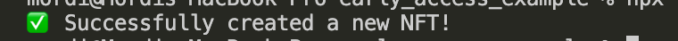
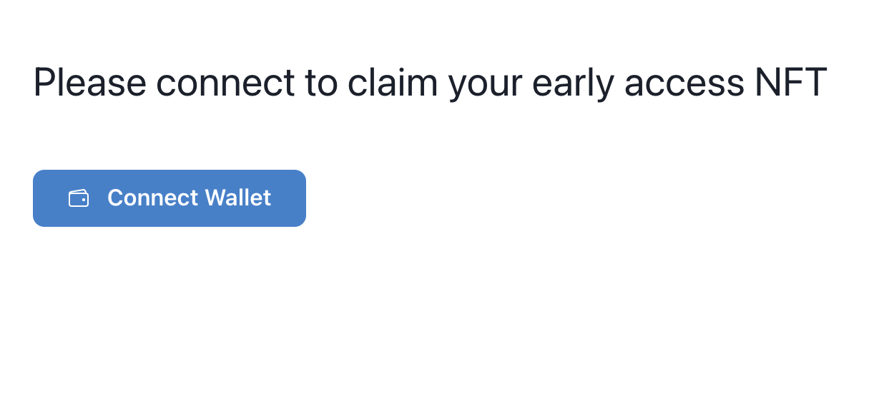

---
authors:
  name: Mordi Goldstein
  title: Contributor
  url: https://twitter.com/mordigoldstein
  image_url: /assets/authors/mordi.jpg

tags: [edition-drop, typescript, react, v2]
image: "./thumbnail.png"
date: "2022-02-10"
---

# Create an early access NFT with TypeScript and React

Easily create an early access NFT and a frontend for users to claim the NFT

<!-- truncate -->

## Introduction

In this guide, we are going to make our own early access NFTs using TypeScript.

We are going to create an NFT using an [Edition Drop](https://portal.thirdweb.com/pre-built-contracts/edition-drop) and also set the price and the number of claimable NFTs.

The edition drop allows us to create [ERC1155](https://eips.ethereum.org/EIPS/eip-1155) tokens, which means that each NFT in the collection can have more than one owner or more than one "copy".

Once we create the NFT and set up the claim condition, we will display the NFT alongside a "Connect Wallet" and a "Claim" buttons using React.

All the code for this guide is available on [this GitHub repository](https://github.com/thirdweb-dev/examples/tree/main/typescript/early-access-nft).

## Create Edition Drop

Our first step is to create an Edition Drop contract.

This can be done in the [dashboard](https://thirdweb.com/dashboard).

- Head to the thirdweb dashboard,
- Click "Deploy New Contract"
- Click "Deploy Now" on the Edition Drop pre-built contract.
- Configure the metadata for the contract, and deploy to the Rinkeby test network.

## Project Set-Up

Create a new TypeScript + React project using the thirdweb CLI, by running:

```bash
npx thirdweb create --cra --ts
```

## Instantiate the SDK

To create, configure and interact with our NFTs we will need to use the SDK.

Instead of initializing it each time we use it, let's make a function that initializes it and then can be called as needed.

Start by making a new folder called `scripts` at the root of your project and then make a file in that folder called `getContract.mjs`.

In `getContract.mjs`, follow these steps:

Import the libraries we'll need:

```jsx
// Importing libraries
import { ThirdwebSDK } from "@thirdweb-dev/sdk";
import {} from "dotenv/config";
```

Instantiate and connect to the contract using the contract address found in the dashboard. Then export the contract.

```jsx
// load your private key in a secure way (env variable, never commited to git)
const privateKey = process.env.PRIVATE_KEY;
// instantiate the SDK based on your private key, with the desired chain to connect to
const sdk = ThirdwebSDK.fromPrivateKey(privateKey, "rinkeby");

// Set variable for the edition drop contract address which can be found after creating an edition drop in the dashboard
const editionDropAddress = "your-edition-drop-contract-address";
// Initialize the edition drop module with the contract address
const editionDrop = sdk.getEditionDrop(editionDropAddress);

export default editionDrop;
```

You'll notice we are using the `process.env.PRIVATE_KEY` method to get the private key.

To sign transactions from your wallet, you'll first need to export your wallet's private key and add it to an environment variable in this project.

:::info How to export your private key

Learn how to [export your private key](/guides/create-a-metamask-wallet#export-your-private-key) from your wallet.

:::

To do this, create a file called `.env` file at the root of your project, and add the following to it:

```
PRIVATE_KEY=your-private-key-here
```

:::warning

Ensure you store and access your private key securely.

- **Never** commit any file that may contain your private key to your source control.

:::

## Create the NFT

Now that we can connect to the SDK, we can move to the exciting step of creating our NFT!

Make a new file in the `scripts` folder and call it `createNft.mjs`. In this file we can follow these steps:

Import our edition from our previous script:

```tsx
import editionDrop from "./getContractmjs";
```

Use the `createBatch` method to create our NFT. This method allows for the creation of multiple NFTs but we are only going to create one for now.

```tsx
const createNFT = async () => {
  try {
    await editionDrop.createBatch([
      {
        name: "Early Access",
        description: "This NFT will give you early access!",
        // Get the NFT from a file uploaded to IPFS
        image: "ipfs://<IPFS_FILE_CID>",
      },
    ]);
    console.log("✅ Successfully created a new NFT!");
  } catch (error) {
    console.error("Failed to create the new NFT. Error: ", error);
  }
};

createNFT();
```

In your root directory, run the code with this command in your console:

```bash
node ./scripts/createNft.mjs
```

And you should see the success message in your console:



Awesome! We have our early access NFT ☺️

## Set NFT Price and Supply

Now that we have our NFT, we need to set the start time, price, and supply. We can also set the number of NFTs that can be claimed in one transaction, create an allowlist and adjust other settings.

For our project, we are only going to set the start time, price, and supply. We can do this in a new file called `nftConfig.mjs`.

We create a function called `nftConfig` and add the code to adjust the config of our NFT.

```tsx
import editionDrop from "./getContract.mjs";

const nftConfig = async () => {
  const claimConditions = [
    {
      startTime: new Date(),
      maxQuantity: 1000,
      price: 0.01,
    },
  ];
  try {
    await editionDrop.claimConditions.set("0", claimConditions); // 0 refers to token ID - the ID of our NFT
    console.log("🎉 Successfully added the claim condition!");
  } catch (error) {
    console.log("Failed to set claim condition. Error: ", error);
  }
};

nftConfig();
```

In your root directory, run the code with this command in your console:

```bash
node scripts/nftConfig.mjs
```

And you should see the success message in your console:


Amazing! We now have 1000 claimable NFTs! We just need a frontend for our users to interact with. Let's do it☺️

## Display the NFT

We are going to display our NFT using the `get` method from the SDK with the token id as the param.

To do this, we will work in the `src` folder in our React app.

Our first step is to create a file called `Nft.tsx` which will be our component used to display the NFT.

We start off by installing the relevant library:

```bash
npm install @thirdweb-dev/react
```

Then we can import the libraries we will need to the component:

```tsx
import { useEffect, useState } from "react";
import { useEditionDrop } from "@thirdweb-dev/react";
```

Create the `Nft` component:

```tsx
import { ThirdwebNftMedia, useEditionDrop, useNFT } from "@thirdweb-dev/react";

const Nft = () => {
  const editionDrop = useEditionDrop("<CONTRACT_ADDRESS>");

  const { data: nft } = useNFT(editionDrop, 0); // 0 is the token id

  return (
    <div style={{ margin: "10vh" }}>
      <h1 style={{ fontSize: "28px", marginBottom: "10vh" }}>
        Claim your early access NFT!
      </h1>

      {nft && <ThirdwebNftMedia metadata={nft?.metadata} />}
    </div>
  );
};

export default Nft;
```

## Claim Button

Okay. We have our NFT displayed and all we need is a button for users to claim NFTs. Let's create a new component in a file called `ClaimButton.tsx`.

First, we import the libraries:

```tsx
import { useState } from "react";
import { useEditionDrop, useMetamask, useAddress } from "@thirdweb-dev/react";
```

We will use the `useMetamask` and `useAddress` thirdweb hooks to allow users to connect to their MetaMask wallets. We will check if the user is connected and if so, we will allow them to claim an NFT using the `claim` method with the token id and quantity as params.

```tsx
const ClaimButton = () => {
  const connectWithMetamask = useMetamask();

  const editionDrop = useEditionDrop("<CONTRACT_ADDRESS>");

  const address = useAddress();

  // State to track when a user is claiming an NFT
  const [claiming, setClaiming] = useState(false);

  // Claim our NFT with the claim method - (token id, quantity)
  const onClick = async () => {
    setClaiming(true);
    try {
      await editionDrop?.claim(0, 1);
      alert("Successfully Claimed!");
      setClaiming(false);
    } catch (error) {
      console.log("Failed to claim. Error: ", error);
      setClaiming(false);
    }
  };

  return (
    <div>
      {address ? (
        <button
          disabled={claiming}
          style={{
            padding: "10px 20px",
            textAlign: "center",
            backgroundColor: "#05A266",
            color: "white",
          }}
          className="btn"
          onClick={onClick}
        >
          {claiming ? "Claiming..." : "Claim Early Access NFT"}
        </button>
      ) : (
        <button onClick={connectWithMetamask}>Connect MetaMask Wallet</button>
      )}
    </div>
  );
};

export default ClaimButton;
```

## Wrap Up

We have created and configured our NFT. We are displaying it and we have a connect/claim button. All that is left to do is to display the NFT and button by adding the button to our NFT component and then adding the NFT component to our `App.tsx`.

After adding the button, `Nft.tsx` should look like this:

```tsx
import { useEffect, useState } from "react";
import { useEditionDrop } from "@thirdweb-dev/react";
import ClaimButton from "./ClaimButton";

const Nft = () => {
  const editionDrop = useEditionDrop("<CONTRACT_ADDRESS>");
  const [nft, setNft] = useState("");

  async function fetchNft() {
    try {
      const nft = await editionDrop?.get("0");
      if (nft?.metadata.image) {
        setNft(nft?.metadata.image);
      }
    } catch (error) {
      console.log("Failed to get NFT. Error: ", error);
    }
  }

  useEffect(() => {
    fetchNft();
  }, []);

  return (
    <div style={{ margin: "10vh" }}>
      <h1 style={{ fontSize: "28px", marginBottom: "10vh" }}>
        Claim your early access NFT!
      </h1>
      
      <ClaimButton />
    </div>
  );
};

export default Nft;
```

In `index.tsx` we need to start by importing the thirdweb provider and setting out desired chain. It should look like this:

```tsx
import React from "react";
import { createRoot } from "react-dom/client";
import reportWebVitals from "./reportWebVitals";
import { ChainId, ThirdwebProvider } from "@thirdweb-dev/react";
import Nft from "./Nft";

// This is the chainId your dApp will work on.
const activeChainId = ChainId.Rinkeby;

const container = document.getElementById("root");
const root = createRoot(container!);
root.render(
  <React.StrictMode>
    <ThirdwebProvider desiredChainId={activeChainId}>
      <Nft />
    </ThirdwebProvider>
  </React.StrictMode>,
);

// If you want to start measuring performance in your app, pass a function
// to log results (for example: reportWebVitals(console.log))
// or send to an analytics endpoint. Learn more: https://bit.ly/CRA-vitals
reportWebVitals();
```

## Next Steps

To preview your application, run:

```bash
npm run start
```

Congrats🥳 You've got a claimable early access NFT! Yours could like something like this:




And remember, you can check all the code for this guide on [this GitHub repository](https://github.com/thirdweb-dev/examples/tree/main/typescript/early-access-nft).
