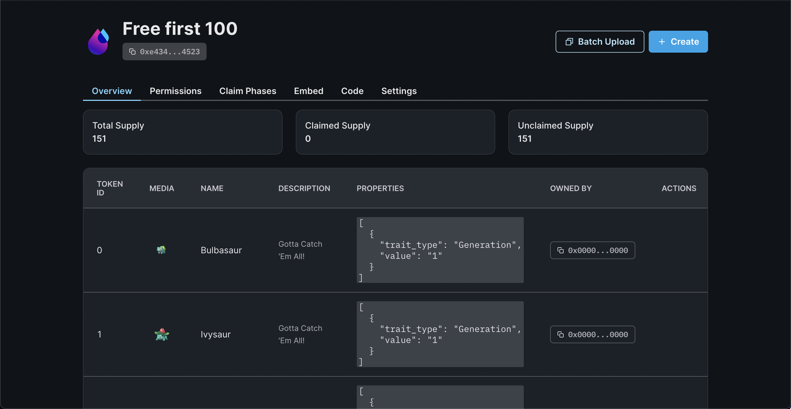
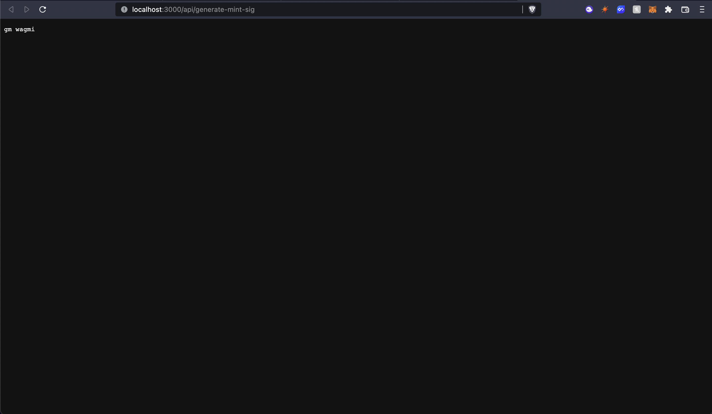
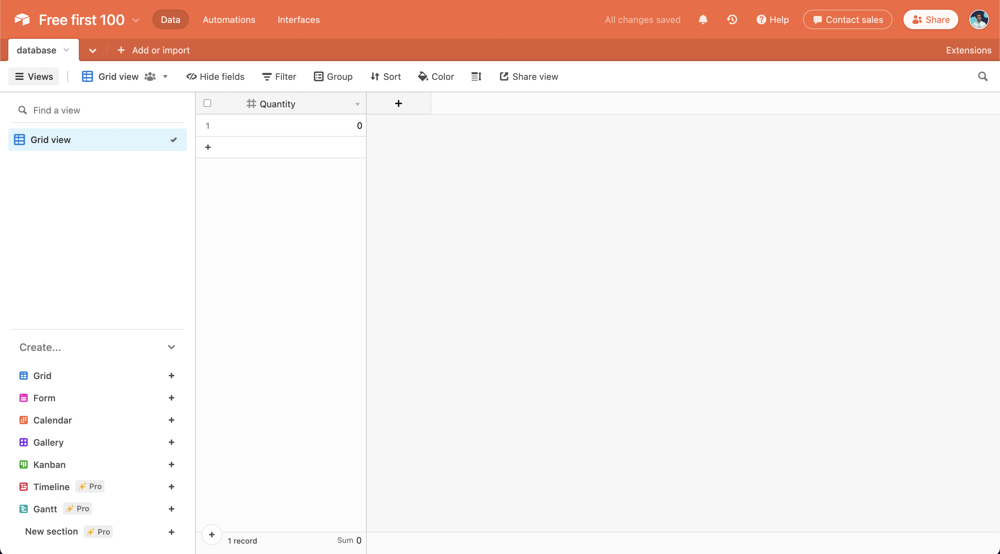
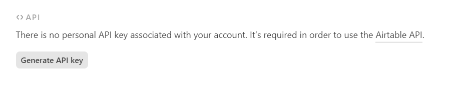

import QuickstartCard from "../../src/components/QuickstartCard";

# Make the first 100 NFTs free in a signature drop

Learn how to create a signature drop where the first 100 NFTs are free.

<!-- truncate -->

## Introduction

In this guide, we are going to create a [Signature Drop](/pre-built-contracts/signature-drop) where users
will be able to connect their wallets to the website and mint an NFT using a signature. We are going to store the amount of signatures generated in an airtable and check if it is less than 100. If it is less than 100, we will allow the user to mint a free NFT otherwise we will charge the user a fee.

Before we get started, below are some helpful resources where you can learn more about the tools we're going to be using in this guide.

<div className="row" style={{marginBottom:24}}>
<div className="col col--6" style={{ marginTop: 8 }}>
  <QuickstartCard
    name="View Project Source Code"
    link="https://github.com/thirdweb-dev/examples/tree/main/typescript/free-first-100"
    image="/assets/icons/general.png"
    openInNewTab
  />
</div>

<div className="col col--6" style={{ marginTop: 8 }}>
  <QuickstartCard
    name="Signature Drop Contract"
    link="/pre-built-contracts/signature-drop"
    image="/assets/icons/drop.png"
    openInNewTab
  />
</div>
</div>

Let's get started.

## Setup

I am going to use the [Next typescript starter template](https://github.com/thirdweb-example/next-typescript-starter) for this guide.

If you are following along with the guide, you can create a project with the
[Next TypeScript template](https://github.com/thirdweb-example/next-typescript-starter) using the [thirdweb CLI](/thirdweb-cli):

```bash
npx thirdweb create --next --ts
```

If you already have a Next.js app you can simply follow these steps to get started:

- Install `@thirdweb-dev/react` and `@thirdweb-dev/sdk` and `ethers`
- Add MetaMask authentication to the site. You can follow this [guide](/guides/add-connectwallet-to-your-website) to do this.

By default the network in `_app.tsx` is Mainnet, we need to change it to Mumbai

```tsx title="_app.tsx"
import type { AppProps } from "next/app";
import { ChainId, ThirdwebProvider } from "@thirdweb-dev/react";

// This is the chainId your dApp will work on.
const activeChainId = ChainId.Mumbai;

function MyApp({ Component, pageProps }: AppProps) {
  return (
    <ThirdwebProvider desiredChainId={activeChainId}>
      <Component {...pageProps} />
    </ThirdwebProvider>
  );
}

export default MyApp;
```

# Creating a Signature Drop and batch Uploading NFTs

We also need to create a Signature Drop and upload a bunch of NFTs that users can claim.
So, go to the [thirdweb dashboard](https://thirdweb.com/dashboard) and create a signature drop!

Fill out the details and deploy the contract!



Now, let's batch upload some NFTs for the users to mint!
I am going to use the [pokemon batch upload example](https://github.com/nachoiacovino/thirdweb-pokemon).

Click on batch upload and upload the images and the CSV/JSON file.

Once they are uploaded you will be able to see the NFTs! To learn more about batch upload check out [this guide](/guides/how-to-batch-upload).


## Creating an API for generating a signature

We are going to use the signature minting on our backend. You can also add different checks if you want like different price for different wallets, allowing users to mint only 1 pass, etc.

Create a new folder `api` in the pages folder and `generate-mint-sig.ts` inside it.

We will now build a basic API that will output "gm wagmi"

```ts title="api/generate-mint-sig.ts"
import type { NextApiRequest, NextApiResponse } from "next";

const generateMintSignature = async (
  req: NextApiRequest,
  res: NextApiResponse,
) => {
  res.send("gm wagmi");
};

export default generateMintSignature;
```

This creates a basic API for us, if you now go to the [`api/generate-mint-sig`](http://localhost:3000/api/generate-mint-sig)
endpoint, you will get a response of `gm wagmi`.



Let's now initialize the [thirdweb SDK](/building-web3-apps/setting-up-the-sdk)! To keep the code clean create a new file in the `utils` folder called `thirdweb.ts` and add the following

```ts title="utils/thirdweb.ts"
import { ThirdwebSDK } from "@thirdweb-dev/sdk";

const sdk = ThirdwebSDK.fromPrivateKey(
  process.env.PRIVATE_KEY as string,
  "mumbai",
);

export { sdk };
```

As you can see, we are using an environment variable to initialize the sdk.
The variable is called `PRIVATE_KEY` which is the private key of the wallet.
Create a new file `.env.local` and add your private key.

```bash title=".env.local"
PRIVATE_KEY=<private_key>
```

:::info How to export your private key

Learn how to [export your private key](/guides/create-a-metamask-wallet#export-your-private-key) from your wallet.

:::

To do this, create a file called `.env.local` at the root of your project, and add the following to it:

```
PRIVATE_KEY=your-private-key-here
```

:::warning

Ensure you store and access your private key securely.

- **Never** commit any file that may contain your private key to your source control.

:::

We also need to import the `ThirdwebSDK`:

```tsx
import { ThirdwebSDK } from "@thirdweb-dev/sdk";
```

### Generating the signature

Finally, we are going to access the NFT Collection using the sdk and generate a signature from it:

```ts title="api/generate-mint-sig.ts"
const { address, quantity } = JSON.parse(req.body);
let quantityToMint = parseInt(quantity);

const drop = sdk.getSignatureDrop("0x36020789F0530bF6f1Da1Aef74c80381ABD17c4c");

try {
  const signedPayload = await drop.signature.generate({
    to: address,
    quantity: quantityToMint,
  });

  return res.status(200).json({
    signedPayload,
  });
} catch (error) {
  console.log(error);
  return res.status(500).json({
    error,
  });
}
```

Here, we are just generating a signature and returning it but we aren't doing anything with the Airtable. So all the NFTs are free right now. So let's integrate it with Airtable!

## Integrating with Airtable

### Setup

Go to [Airtable](https://airtable.com/) and create a new base.

After you create a new base, give a name to your base and add one column called `Quantity` and set it's type to number.



**Getting airtable api keys and id**

We now need to get some API keys and ids to interact with the base. So, go to [your Airtable account](https://airtable.com/account) and generate an api key



Store this api key somewhere safe as we are going to need it.

Now to get the base id go to the [Airtable API](https://airtable.com/api) and click on the base that you just created. When you open the page, at the top itself you would see "Your base id is app......".

Inside `.env.local` add three new variables:

```bash title=".env.local"
AIRTABLE_API_KEY=
AIRTABLE_BASE_ID=
AIRTABLE_TABLE_NAME=
```

### Creating a utility function for accessing the table

To keep our code clean we are going to create a file where we initialize the airtable with the api key, name, and id. So, create a new folder `utils` and `Airtable.ts` inside it. Now, add in the following in `Airtable.ts`:

```ts
import Airtable from "airtable";

// Authenticate
Airtable.configure({
  apiKey: process.env.AIRTABLE_API_KEY,
});

// Initialize a base
const base = Airtable.base(process.env.AIRTABLE_BASE_ID!);

// Reference a table
const table = base(process.env.AIRTABLE_TABLE_NAME!);

export { table };
```

As you can see we are going to need to install a new package called `airtable`:

```bash
npm i airtable # npm

yarn add airtable # yarn
```

### Using Airtable in the API

Now, we need to update the api to update the quantity everytime a signature is generated and also check if the quantity is less than 100. So first we will update quantity after signature generation:

**Getting the record**
At the top of the try catch block, we are going to get the record from the table.

```ts title="api/generate-mint-sig.ts"
const records = await table
  .select({
    fields: ["Quantity"],
  })
  .all();

const amountMinted = records[0].get("Quantity") as number;
```

Now after the code where we are generating the signature, add the following:

```ts title="api/generate-mint-sig.ts"
records[0].updateFields({
  Quantity: amountMinted + quantityToMint,
});
```

**Checking if the quantity is less than 100**

I am going to create a variable to store the number of free NFTs as we are going to use it in multiple places.

```ts title="api/generate-mint-sig.ts"
const nftsForFree = 100;
```

We will create a new function called `determinePrice` that will determine the price of the NFT.

```ts title="api/generate-mint-sig.ts"
const determinePrice = () => {
  if (amountMinted < nftsForFree) {
    return 0;
  }
  return 1;
};
```

Update the signature generation code to include the price:

```ts title="api/generate-mint-sig.ts"
const signedPayload = await drop.signature.generate({
  to: address,
  price: determinePrice(),
  quantity: quantityToMint,
});
```

**Error handling**

We don't want any user to mint more than 5 NFTs at once so we will add a check to make sure that the quantity is less than 5 and another check to make sure that the quantity is greater than 0.

```ts title="api/generate-mint-sig.ts"
if (!quantityToMint) {
  return res.status(400).json({ error: "Missing quantity" });
}
if (quantityToMint > 5) {
  return res.status(400).json({ error: "Quantity too high" });
}
```

We also need to make sure that when there are less than 5 NFTs left for free mint a person doesn't generate a signature for more than the quantity alloted (in our case 100), so add a if statement to fix this problem:

```ts title="api/generate-mint-sig.ts"
if (amountMinted + quantityToMint > nftsForFree && amountMinted < nftsForFree) {
  quantityToMint = nftsForFree - amountMinted;
}
```

This will reduce the quantity to the amount of NFTs left for free.

The final code for the api looks like this:

```ts title="api/generate-mint-sig.ts"
import type { NextApiRequest, NextApiResponse } from "next";
import { table } from "../../utils/Airtable";
import { sdk } from "../../utils/thirdweb";

const nftsForFree = 100;

const handler = async (req: NextApiRequest, res: NextApiResponse) => {
  const { address, quantity } = JSON.parse(req.body);
  let quantityToMint = parseInt(quantity);

  if (!quantityToMint) {
    return res.status(400).json({ error: "Missing quantity" });
  }
  if (quantityToMint > 5) {
    return res.status(400).json({ error: "Quantity too high" });
  }

  try {
    const records = await table
      .select({
        fields: ["Quantity"],
      })
      .all();

    const amountMinted = records[0].get("Quantity") as number;

    if (
      amountMinted + quantityToMint > nftsForFree &&
      amountMinted < nftsForFree
    ) {
      quantityToMint = nftsForFree - amountMinted;
    }

    const determinePrice = () => {
      if (amountMinted < nftsForFree) {
        return 0;
      }
      return 1;
    };

    const drop = sdk.getSignatureDrop(
      "0x36020789F0530bF6f1Da1Aef74c80381ABD17c4c",
    );

    const signedPayload = await drop.signature.generate({
      to: address,
      price: determinePrice(),
      quantity: quantityToMint,
    });

    records[0].updateFields({
      Quantity: amountMinted + quantityToMint,
    });

    return res.status(200).json({
      signedPayload,
    });
  } catch (error) {
    return res.status(500).json({ error });
  }
};

export default handler;
```

## Building the frontend

In `index.tsx` update the address ternary and add the Mint button, and the input for quantity:

```tsx title="index.tsx"
<div>
  {address ? (
    <>
      <input
        placeholder="Quantity"
        value={quantity}
        onChange={(e) => setQuantity(e.target.value)}
        type="number"
      />

      <button onClick={mint}>Mint</button>
    </>
  ) : (
    <button onClick={connectWithMetamask}>Connect with Metamask</button>
  )}
</div>
```

We also need a `useState` to store the quantity.

```tsx title="index.tsx"
const [quantity, setQuantity] = useState<string>("1");
```

Now we will create the mint function that makes an api call to the backend and mints the NFT:

```tsx title="index.tsx"
const drop = useSignatureDrop("0x36020789F0530bF6f1Da1Aef74c80381ABD17c4c");

const mint = async () => {
  if (!quantity || parseInt(quantity) < 1) {
    return alert("Please enter a quantity");
  }

  if (parseInt(quantity) > 5) {
    return alert("Please enter a quantity less than 5");
  }

  const signedPayloadReq = await fetch("/api/generate-mint-sig", {
    method: "POST",
    body: JSON.stringify({ address, quantity }),
  });
  const signedPayload = await signedPayloadReq.json();

  try {
    const nft = await drop?.signature.mint(signedPayload.signedPayload);
    return nft;
  } catch (err) {
    console.error(err);
    return null;
  }
};
```

Here, first we are checking if the quantity is valid then we are making a request to the backend to generate the signature. Finally we are using the `useSignatureDrop` hook to mint the nft using the signature generated.

If we now try minting the NFT, we will be able to mint the NFT successfully! 🥳
