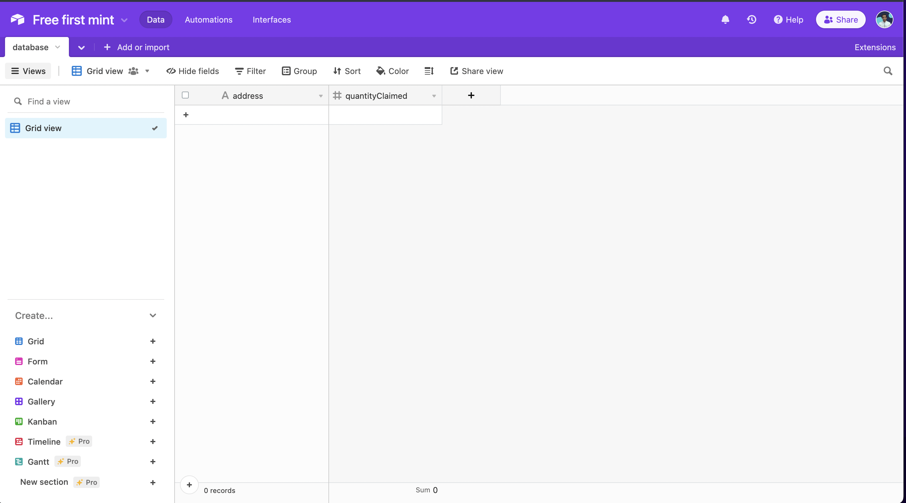
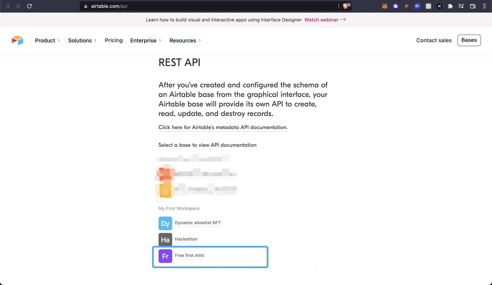

import QuickstartCard from "../../src/components/QuickstartCard";

# Make the first NFT per wallet free on an NFT Drop

Learn how to create an ERC-721A NFT drop where users can mint their first NFT for free, and then be charged a price for all the NFTs they mint after that!

<!-- truncate -->

## Introduction

In this guide, we are going to create:

- An ERC-721A [Signature Drop](/pre-built-contracts/signature-drop) contract.
- A web application where users will be able to connect their wallets and claim an NFT from the drop!

When a user clicks the `Mint` button, we will make an API request that will check if the user has already minted an NFT; and then determine the price based on that.
To do this, We'll be using [signature-based minting](/advanced-features/on-demand-minting) to generate mint signatures with a different price for each allowlist!

Before we get started, below are some helpful resources where you can learn more about the tools we're going to be using in this guide.

<div className="row" style={{marginBottom:24}}>
<div className="col col--6" style={{ marginTop: 8 }}>
  <QuickstartCard
    name="View Project Source Code"
    link="https://github.com/thirdweb-dev/examples/tree/main/typescript/simultaneous-allowlists"
    image="/assets/icons/general.png"
    openInNewTab
  />
</div>

<div className="col col--6" style={{ marginTop: 8 }}>
  <QuickstartCard
    name="Signature Drop Contract"
    link="/pre-built-contracts/signature-drop"
    image="/assets/icons/drop.png"
    openInNewTab
  />
</div>
</div>

Let's get started.

## Setup

I am going to use the [Next.js + TypeScript starter template](https://github.com/thirdweb-example/next-typescript-starter) for this guide.

If you are following along with the guide, you can create a project with the
[Next TypeScript template](https://github.com/thirdweb-example/next-typescript-starter) using the [thirdweb CLI](/thirdweb-cli):

```bash
npx thirdweb create --next --ts
```

If you already have a Next.js app you can simply follow these steps to get started:

- Install `@thirdweb-dev/react` and `@thirdweb-dev/sdk` and `ethers`
- Add MetaMask authentication to the site. You can follow this [guide](/guides/add-connectwallet-to-your-website) to do this.

By default the network in `_app.tsx` is Mainnet, we need to change it to Mumbai

```tsx title="_app.tsx"
import type { AppProps } from "next/app";
import { ChainId, ThirdwebProvider } from "@thirdweb-dev/react";

// This is the chainId your dApp will work on.
const activeChainId = ChainId.Mumbai;

function MyApp({ Component, pageProps }: AppProps) {
  return (
    <ThirdwebProvider desiredChainId={activeChainId}>
      <Component {...pageProps} />
    </ThirdwebProvider>
  );
}

export default MyApp;
```

## Creating a Signature Drop and batch Uploading NFTs

We also need to create a Signature Drop and upload a bunch of NFTs that users can claim.
So, go to the [thirdweb dashboard](https://thirdweb.com/dashboard) and create a signature drop!


You can use one of our guides below to learn how to set up your signature drop contract:

<div className="row" style={{marginBottom:24}}>
<div className="col col--6" style={{ marginTop: 8 }}>
  <QuickstartCard
    name="YouTube Tutorial"
    link="https://youtu.be/2ITg70MPFJ8?t=125"
    image="/assets/icons/education.png"
    openInNewTab
  />
</div>

<div className="col col--6" style={{ marginTop: 8 }}>
  <QuickstartCard
    name="Written Guide"
    link="/guides/signature-drop"
    image="/assets/icons/education.png"
    openInNewTab
  />
</div>
</div>

Now, let's batch upload some NFTs for the users to mint!
I am going to use the [pokemon batch upload example](https://github.com/nachoiacovino/thirdweb-pokemon).

Click on **batch upload** and upload the images and the CSV/JSON file.

Once they are uploaded you will be able to see the NFTs! To learn more about batch upload check out our guide on [how to batch upload NFT metadata](/guides/how-to-batch-upload).


## Creating a table in Airtable for checking who has claimed NFT

Go to [Airtable](https://airtable.com/) and create a new base.

After you create a new base, give a name to your base and add two columns: `address` and `hasClaimed` like this:



**Getting airtable api keys and id**

We now need to get some API keys and ids to interact with the base. So, go to [your Airtable account](https://airtable.com/account) and generate an API key.


Now to get the base id, go to the [Airtable API](https://airtable.com/api) and click on the base that you just created.



When you open the page, at the top itself you would see "Your base id is app......".

Create a new `.env.local` at the root of your project and add three new variables:

```bash title=".env.local"
AIRTABLE_API_KEY=
AIRTABLE_BASE_ID=
AIRTABLE_TABLE_NAME=
```

### Creating a utility function for accessing the table

To keep our code clean, we are going to create a file where we initialize the Airtable with the API key, name, and id.
So, create a new folder called `utils` and `Airtable.ts` inside it. Now, add in the following in `Airtable.ts`:

```ts
import Airtable from "airtable";

// Authenticate
Airtable.configure({
  apiKey: process.env.AIRTABLE_API_KEY,
});

// Initialize a base
const base = Airtable.base(process.env.AIRTABLE_BASE_ID!);

// Reference a table
const table = base(process.env.AIRTABLE_TABLE_NAME!);

export { table };
```

As you can see we are going to need to install a new package called `airtable`:

```bash
npm i airtable # npm

yarn add airtable # or yarn
```

## Making the website

Now we're set up with Airtable, let's continue building out the website.

### Creating an API for generating a signature

We are going to use signature-based minting on our backend to check the price at which this user will mint the NFT!

Create a new folder `api` in the pages folder and `generate-mint-sig.ts` inside it.

We will now build a basic API that will output "gm wagmi".

```ts title="api/generate-mint-sig.ts"
import type { NextApiRequest, NextApiResponse } from "next";

const generateMintSignature = async (
  req: NextApiRequest,
  res: NextApiResponse,
) => {
  res.send("gm wagmi");
};

export default generateMintSignature;
```

This creates a basic API for us, if you now go to the [`api/generate-mint-sig`](http://localhost:3000/api/generate-mint-sig)
endpoint, you will get a response of `Gm wagmi`.


Let's now initialize the [thirdweb SDK](/building-web3-apps/setting-up-the-sdk)!

```ts
const sdk = ThirdwebSDK.fromPrivateKey(
  process.env.PRIVATE_KEY as string,
  "mumbai",
);
```

As you can see, we are using an environment variable to initialize the SDK.

The variable is called `PRIVATE_KEY` which is the private key of the wallet.

To do this, we need to export our wallet's private key and add it to our `.env.local` file.

:::info How to export your private key

Learn how to [export your private key](/guides/create-a-metamask-wallet#export-your-private-key) from your wallet.

:::

```bash title=".env.local"
PRIVATE_KEY=<private_key>
```

:::warning

Ensure you store and access your private key securely.

- **Never** commit any file that may contain your private key to your source control.

:::

We also need to import the `ThirdwebSDK`:

```tsx
import { ThirdwebSDK } from "@thirdweb-dev/sdk";
```

**Determining the price of the NFT**
We will first get the record using the address from request body:

```ts title="api/generate-mint-sig.ts"
const { address } = JSON.parse(req.body);

const record = await table
  .select({
    fields: ["address", "hasClaimed"],
    filterByFormula: `NOT({address} != '${address}')`,
  })
  .all();
```

This will get the record with this address. Now we will use this address to determine the price of the NFT:

```ts title="api/generate-mint-sig.ts"
const pricePerNft = 2;

const determinePrice = (): number => {
  if (record[0]?.fields?.hasClaimed) {
    return pricePerNft;
  }
  return ((quantity - 1) * pricePerNft) / quantity;
};
```

**Generating the signature**
Finally, we are going to access the Signature Drop using the SDK and generate a mint signature from it:

```ts title="api/generate-mint-sig.ts"
const drop = sdk.getSignatureDrop("0x6d148a12f7c0ae693609F5a26E085646f8F73A53");
try {
  const signedPayload = await drop.signature.generate({
    to: address,
    price: determinePrice(),
  });

  return res.status(200).json({
    signedPayload,
  });
} catch (error) {
  console.log(error);
  return res.status(500).json({
    error,
  });
}
```

### Allowing users to select quantity of NFTs to mint

We are going to allow users to select the quantity of NFTs so let's create a number input.
In `index.tsx` update the address ternary and add the Mint button, and input:

```tsx title="index.tsx"
<div>
  {address ? (
    <>
      <button>Mint</button>
      <input
        value={quantity}
        onChange={(e) => setQuantity(parseInt(e.target.value))}
        placeholder="Quantity"
        type="number"
      />
    </>
  ) : (
    <button onClick={connectWithMetamask}>Connect with Metamask</button>
  )}
</div>
```

As you can see we are going to need a `useState` to store the quantity so add it on top:

```tsx
const [quantity, setQuantity] = useState<number>(1);
```

### Calling the API from the frontend

Now we will create a mint function that makes an API call to the backend and mints the NFT, using the signature that got generated.

```tsx title="index.tsx"
const drop = useSignatureDrop("0x6d148a12f7c0ae693609F5a26E085646f8F73A53");

const mint = async () => {
  const signedPayloadReq = await fetch("/api/generate-mint-sig", {
    method: "POST",
    body: JSON.stringify({ address, quantity }),
  });
  const signedPayload = await signedPayloadReq.json();

  try {
    const nft = await signatureDrop?.signature.mint(
      signedPayload.signedPayload,
    );
    return nft;
  } catch (err) {
    console.error(err);
    return null;
  }
};
```

We also need to link the mint function with `onClick` of the button:

```tsx
<button onClick={mint}>Mint</button>
```

If we now try minting the NFT, we will be able to mint! However, when we try and mint _again_ it will still be free;
as our Airtable doesn't know that we have minted.

Next, we need to add another API route to handle this logic.

### Checking Mint History

Create a new file called `set-claimed.ts` in the `api` folder and add the following:

```ts
import type { NextApiRequest, NextApiResponse } from "next";
import { table } from "../../utils/Airtable";
import sdk from "../../utils/thirdweb";

const generateMintSignature = async (
  req: NextApiRequest,
  res: NextApiResponse,
) => {
  const { address } = JSON.parse(req.body);

  const drop = sdk.getSignatureDrop(
    "0x6d148a12f7c0ae693609F5a26E085646f8F73A53",
  );
  const balance = await drop.balanceOf(address);

  if (balance.toNumber() > 0) {
    const record = await table
      .select({
        fields: ["address", "hasClaimed"],
        filterByFormula: `NOT({address} != '${address}')`,
      })
      .all();

    try {
      if (record.length > 0) {
        record[0].updateFields({
          hasClaimed: "true",
        });
      } else {
        await table.create({
          address: address,
          hasClaimed: "true",
        });
      }

      return res.status(200).json({
        success: true,
      });
    } catch (err) {
      res.status(500).json({
        error: err,
      });
    }
  }
  res.status(400).json({
    error: "The user hasn't claimed NFT yet.",
  });
};

export default generateMintSignature;
```

Here, we are first getting the record using the address. If the record exists, we will just update it with `hasClaimed` to `true`, otherwise we will create a new record.

We are also making sure that the address owns an NFT so someone can't make a false API call and mark an address as claimed even though it hasn't claimed any NFT yet.

In the mint function, we will fetch this API in the `try catch` block like this:

```tsx title="index.tsx"
try {
  const nft = await signatureDrop?.signature.mint(signedPayload.signedPayload);
  if (nft) {
    await fetch("/api/set-claimed", {
      method: "POST",
      body: JSON.stringify({ address }),
    });
  }
  return nft;
} catch (err) {
  console.error(err);
  return null;
}
```

Now our app works successfully! 🎉
