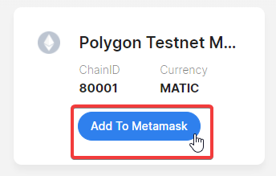
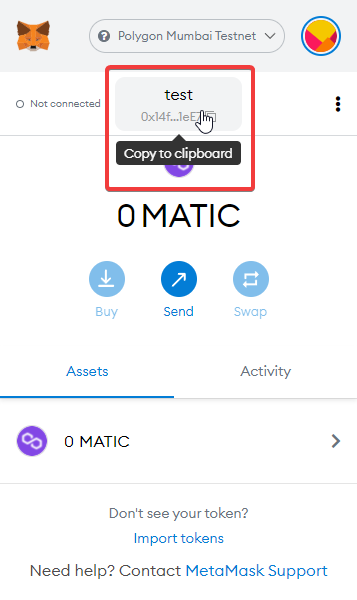
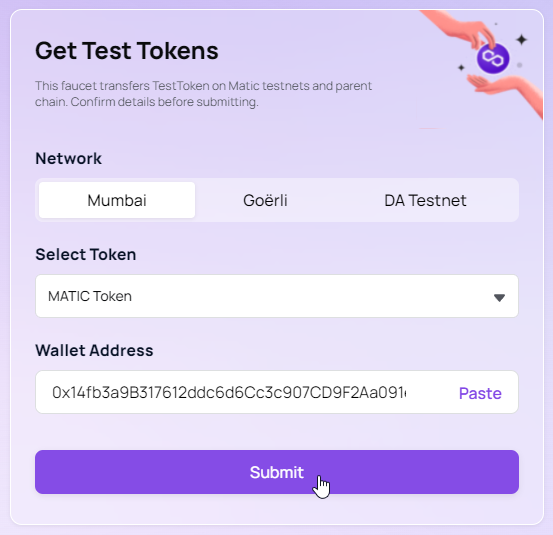
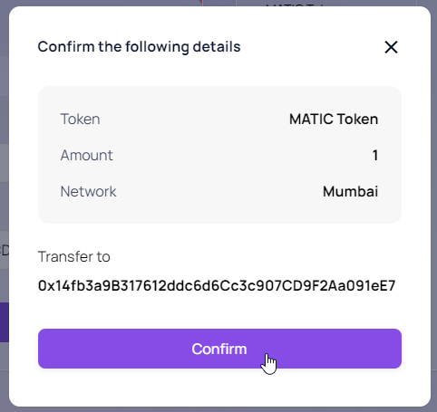
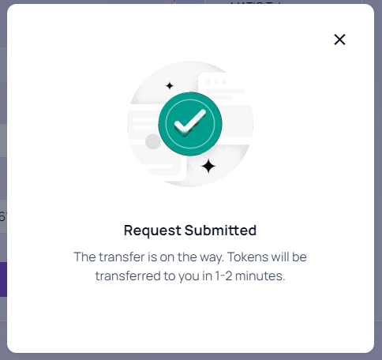
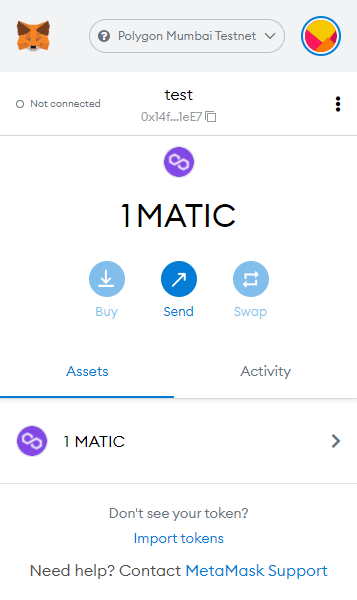

# Get MATIC on Polygon Mumbai Testnet official faucet

Get MATIC on Polygon Mumbai Testnet with the official Faucet from Polygon.

<!-- truncate -->

When using a testnet, you'll need some funds to cover the **gas** for transactions onto the blockchain.

If you're new to web3 development, check out our guide on [Which Blockchain & Network Should I Use](/guides/which-network-should-you-use)
to learn more about testnets and why you might want to use one.

## Get a Metamask Wallet

To store tokens and pay for transactions on the blockchain, you'll need a **wallet**.

A popular wallet is [Metamask](https://metamask.io/), which is a browser extension that allows you to interact with the blockchain, and approve transactions.

To get started with MetaMask, follow our [Create a MetaMask wallet guide](/guides/create-a-metamask-wallet).

## Add Polygon Mumbai Testnet to your Network list

We'll go to [chainlist.org](https://chainlist.org/), search "mumbai", and click **"Connect Wallet"**.

Then, our wallet will be connected and the button will change, click **"Add to Metamask"**.

This will open a confirmation on our Metamask browser extension, click **"Switch Network"**.

Great! You should see something like this when you open your Metamask. Click **"Copy to Clipboard"** on the address.

## Get MATIC from the official faucet

So let's get some MATIC, go to [https://faucet.polygon.technology/](https://faucet.polygon.technology/) which is the official Polygon Mumbai Testnet Faucet.

Paste the address you just copied and click **"Submit"**.

Click "Confirm" on the dialog that opens.

You should see something like this!

After a couple minutes, check your Metamask again, you'll see that you will have received 1 MATIC!

## You did it!

And voilà, you can now use that balance in [thirdweb dashboard](https://thirdweb.com/dashboard) to create test contracts and test our platform.

Remember, you can request funds once every minute!
