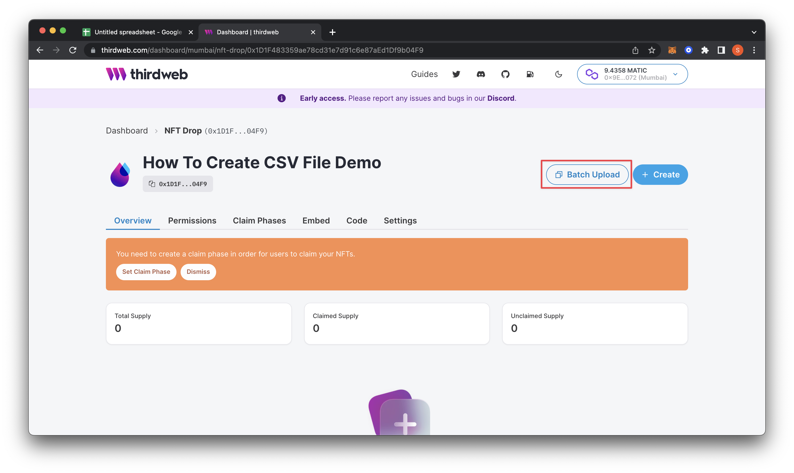
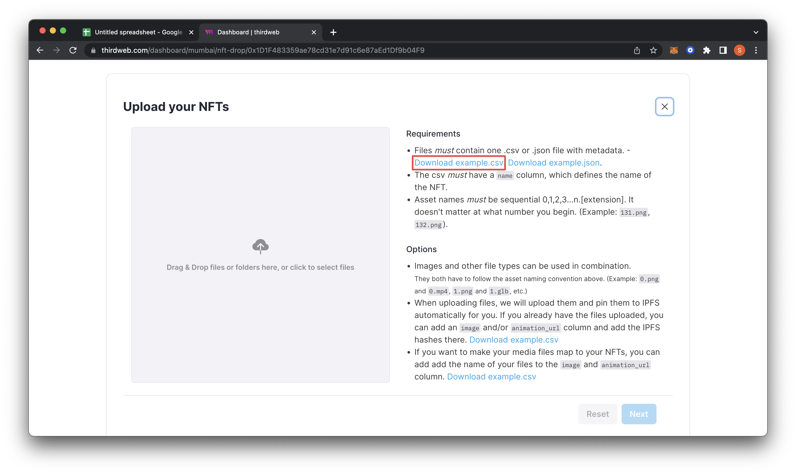
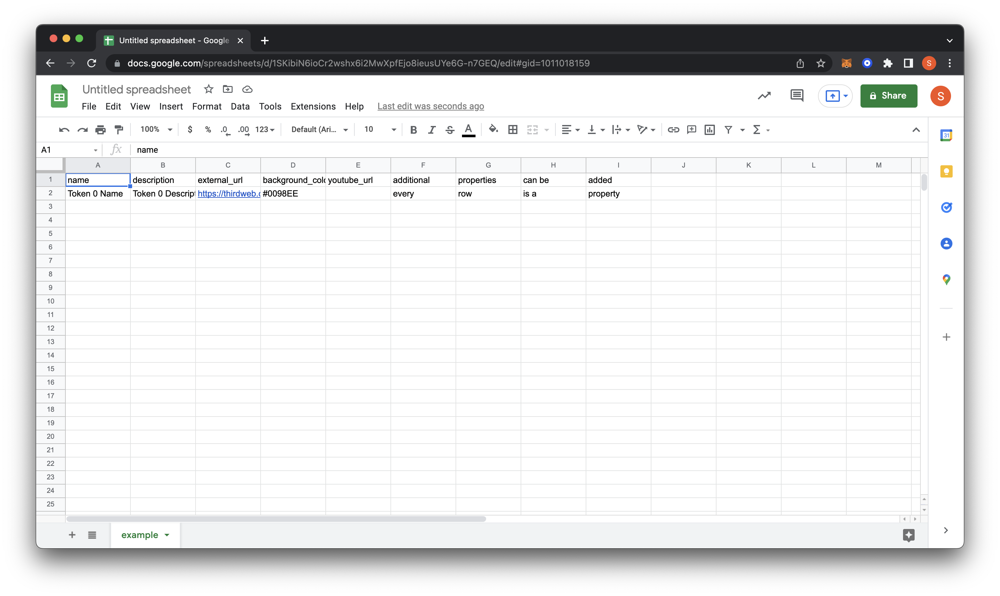
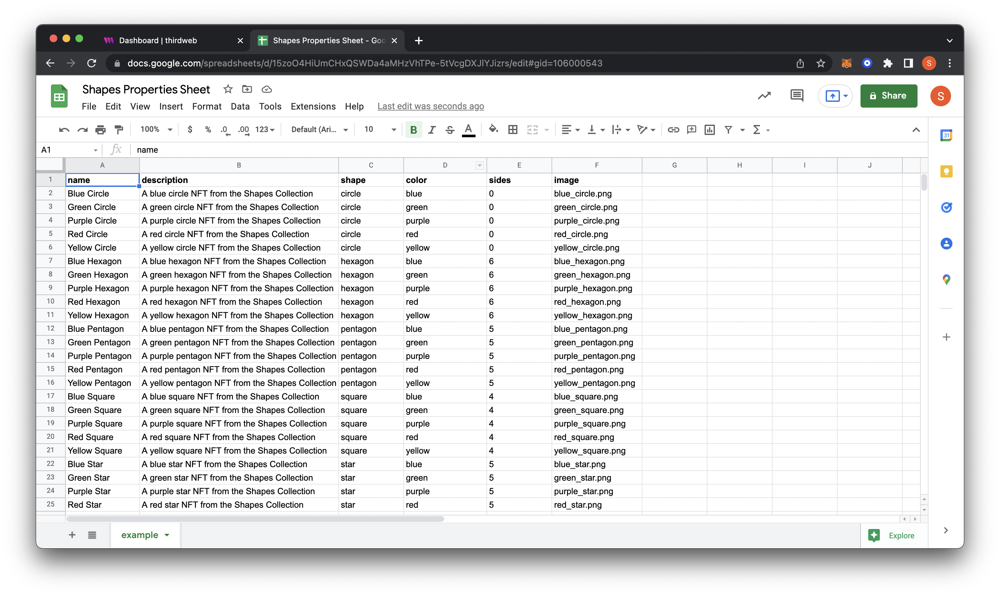
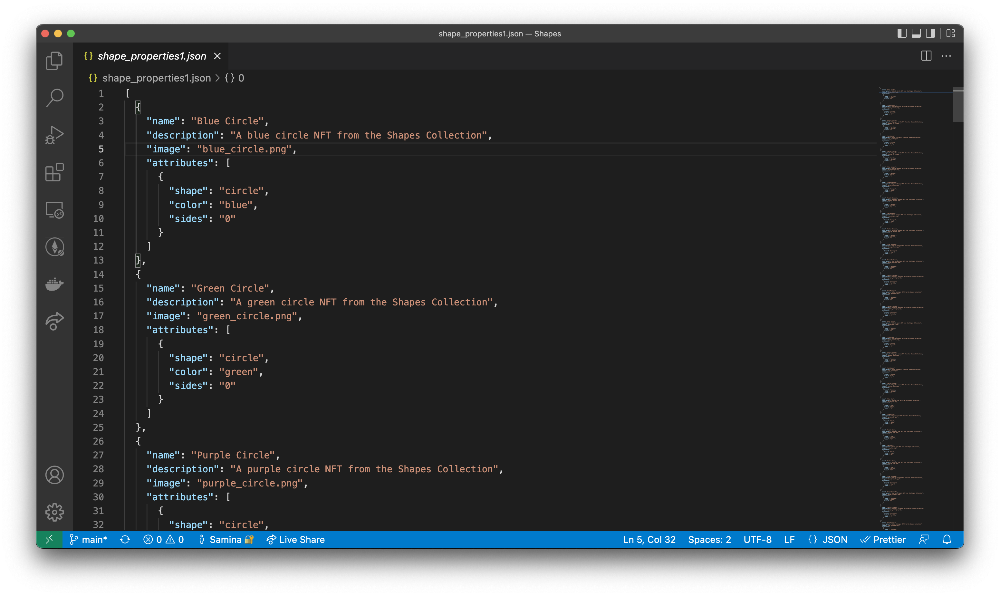
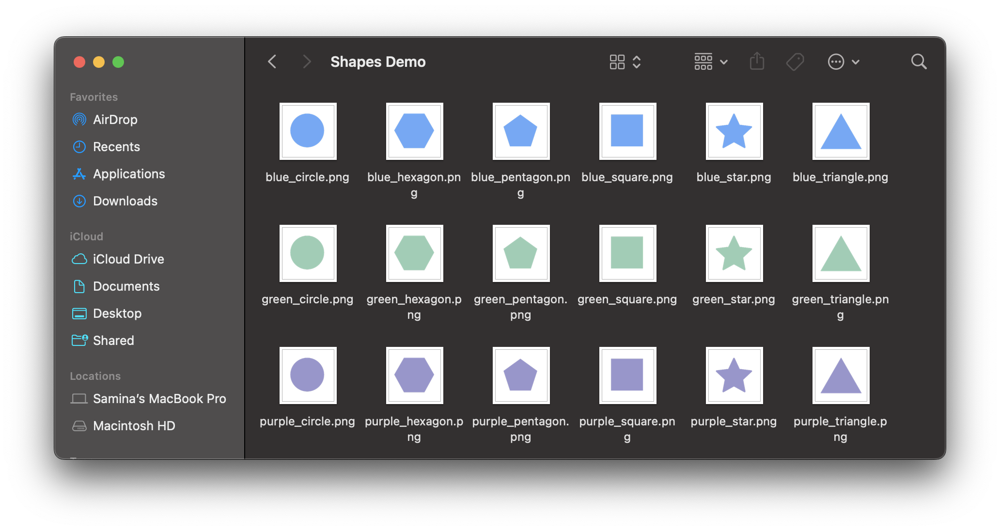

# How to use batch upload with an NFT drop

In this guide, we will go over how to set up a CSV or a JSON file to upload your NFTs in the batch upload feature.

<!-- truncate -->

Did you know that you can batch or bulk upload your NFT metadata and artwork using thirdweb’s batch upload feature? You can even use an NFT artwork generator to export a JSON file to be uploaded directly into thirdweb’s dashboard. This feature is a key component in helping you save time as you create large-scale NFT collections to drop for your community. The process is straightforward — let’s get started!

With an [NFT Drop](/pre-built-contracts/nft-drop) or [Edition Drop](/pre-built-contracts/edition-drop), you can batch upload NFTs through a CSV or JSON file.

### Create your drop and download the sample CSV or sample json

After creating your NFT Drop or Edition Drop, navigate to `batch upload` on the dashboard to upload your NFTs.

Download the sample CSV file (recommended) or JSON on the next screen, which holds an example of the expected structure.

## Batch upload CSV

### Edit the CSV file using CSV editor

After downloading, we want to open the sheet in a preferred CSV editor. You can use Microsoft Excel, Google Sheets, or any other software or text editor that supports editing CSV files.

:::info
Google Sheets is a great beginner option if you are unfamiliar with using spreadsheet software. It is free to use with a Google account, and you can use it on any browser- no need to download software.

:::

On Google sheets, you can click file > import to upload the sample CSV file for editing.

When you open the sample file, you will find a couple of column headers with the first property row filled out.

Overview of the different properties:

- **name:** The name of the NFT
- **description:** Description of the NFT
- **external_url:** This URL appears below the image on OpenSea and allow users to leave OpenSea and view the item on your site.
- **background_color:** An optional property available on OpenSea. Must use six digit hex (#) format.
- **youtube_url:** Similar to the external URL, this will allow users to see the YouTube channel or video behind the NFT

thirdweb allows you to upload a variety of different file types. We can use the CSV file to add our NFT file next to the properties, which will parse.

- **image:** A link to the image or file to be uploaded. The link can be a local image or a URL of an uploaded NFT on a service, such as IPFS. **Files supported:** png, jpg, jpeg, and gif
- **animation_url:** link to the animation that is to be uploaded. **Files supported:** any file that is not an image such as mp4, audio files, pdf, CSV, 3d models, etc.

<MdxAlert status="info">
You can use both image and animation_url to have an NFT with a cover image. When using both, the image will be the cover image, and the animation_url will be the NFT.

</MdxAlert>

In addition to these specific ones, you can also add your properties that may be unique to your collection. For example, I am creating a **Shapes Collection** NFT project with properties shape, color, and sides.

I decided not to add some of the properties that did not apply to my projects, such as external_url and youtube_url. The only required property is the name.

## Batch upload JSON

### Upload a JSON from an NFT generator

If you are using an NFT art generator, you can use the JSON file that is output with the generated art. Some generators that our community prefers using are [Hashlips](https://hashlips.online/HashLips) and [niftygenerator](https://www.niftygenerator.xyz/), but the upload feature is compatible with any generator.

### Create your JSON file

To create a JSON file, you can download the sample JSON file and change the values accordingly.

You don’t need any specific software to open a JSON file. In the following image I opened and edited the JSON file in Visual Studio Code.

## Upload your files

When populating the sheet is completed, we can save it and now upload it with our files to the batch upload. I created a folder that holds all of my NFTs and the CSV file within the same folder.

I will drag this folder to our dropbox on the batch upload screen. This action will immediately populate the NFTs with their corresponding data.

If everything looks correct, click next and you will be prompted to finish the rest of the settings on your NFT Drop or Edition Drop. You have now successfully added properties to your Drop using the CSV file. For any guidance past this step please refer to our **[Release an NFT drop on your own site without writing any code](/guides/release-an-nft-drop-with-no-code)** guide.

If you would like to test out these features using the assets and files in this guide, you can [download](https://github.com/saminacodes/tw-assets/tree/main/Shapes) them over on my GitHub.

Good luck and happy minting!
